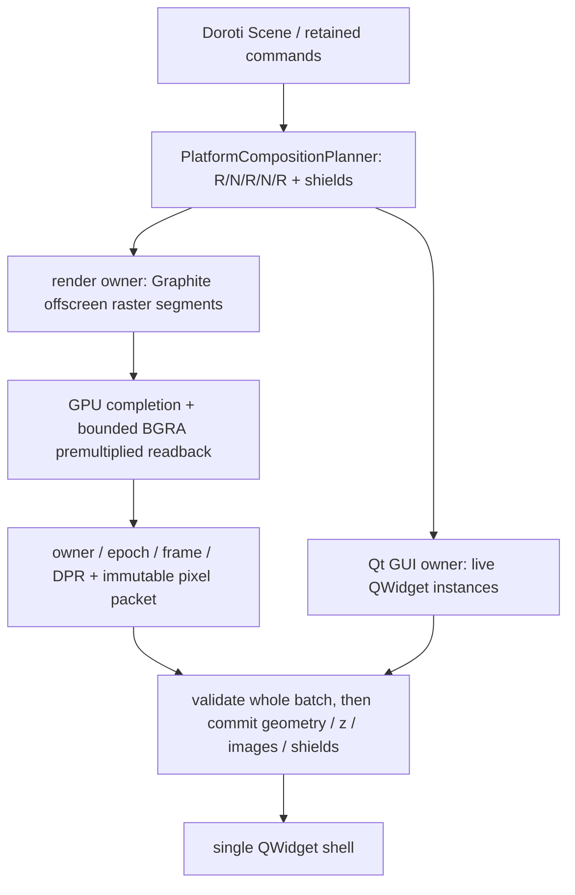

# Linux Qt 양방향 겹침: 검토와 실행 가능한 구성

검토일: 2026-09-14. **이 문서는 QWidget shell 비교 실험 당시의 검토 기록이다.**
후속 사용자 요청으로 [Qt Quick GPU 제품 경로](../linux-qt-quick/README.md)를 실제 실행기에 연결했다.
아래 readback 우선안과 제품 미연결 설명은 당시 시점의 기록이며 현재 기본 Testbed 경로는 Quick이다.
실제 Qt 버튼/입력창과 두 QWebEngineView를 이용한 독립 실험에서 가능성을 확인했다.
현재 Testbed의 Graphite/Vulkan 제품 경로는 여전히 제한형 NativeOverlay이며, 이 실험을
실행해도 제품의 InterleavedComposition 지원이 켜지지는 않는다.

## 1. 원인과 선택

현재 제품은 `DorotiSurface : QWindow`가 Vulkan swapchain을 표시하고,
`QtPlatformViewHost`가 별도의 native child window에 QWidget을 붙인다.
이 구조에 `raise/lower`만 추가하는 것으로 일반적인 양방향 겹침을 보장할 수 없다.
Qt도 `createWindowContainer()`에 대해 opaque stacking과 겹친 container 간 순서 제약을
명시한다. [Qt QWidget 공식 문서](https://doc.qt.io/qt-6/qwidget.html#createWindowContainer).

| 후보 | 장점 | 비용·제한 | 판단 |
|---|---|---|---|
| 기존 QWindow + native child window 확장 | 현재 Vulkan present 유지 | 투명 raster/native 교차 순서를 일반 Qt 계약으로 보장하기 어려움. X11/Wayland 별 surface·동기화·입력 구현 필요 | 일반 C의 우선안에서 제외 |
| **단일 QWidget shell + image raster siblings** | QPushButton/QLineEdit/QWebEngineView를 살아 있는 같은 객체로 유지. Qt가 순서·부분 가림을 처리 | Graphite 결과 readback 및 CPU 합성/업로드 비용. 별도 OS child window를 강제하는 뷰는 제외 | **우선 제품화 후보. 이번 실행 실험 통과** |
| 단일 Qt Quick scene + Graphite texture items | 같은 GPU scene에서 z/alpha/clip 구성. CPU readback 제거 가능성 | 기존 QWidget factory를 그대로 넣을 수 없음. Qt Quick Controls/WebEngine Quick adapter, Vulkan device/queue 공유와 texture 수명 설계 필요 | 후속 성능 후보, 이번에는 설계 검토만 수행 |
| QQuickWidget 여러 개를 투명 raster layer로 삽입 | 기존 QWidget shell과 일부 결합 가능 | 투명한 QQuickWidget 아래의 일반 QWidget 투시 제약. AlwaysStackOnTop은 반대쪽 stacking을 깨뜨림 | 일반 R/N/R/N/R 해법으로 선택하지 않음 |
| native view snapshot/가릴 때 hide | 단순한 그림 합성 | live native 입력·동작과 전체 가림 중 상태 유지 요구를 충분히 충족하지 않음 | 이번 해법에서 제외 |

Qt 일반 child QWidget은 별도 OS window handle 없이 동작할 수 있다. 이 구성에서
“native”는 **실제 Qt 컨트롤/실제 WebEngine 객체**를 뜻한다. 임의의 X11 window,
Wayland surface, `createWindowContainer()`까지 지원한다는 뜻은 아니다.
[Qt의 native/alien widget 설명](https://doc.qt.io/qt-6/qwidget.html#native-widgets-vs-alien-widgets).

QQuickWidget은 container의 일반 stacking 제약을 줄이지만 투명 합성에는 별도 제한이 있다.
`winId()` 호출과 서로 다른 graphics API를 한 top-level에 혼합하는 것도 피해야 한다.
[QQuickWidget 제한과 성능 설명](https://doc.qt.io/qt-6/qquickwidget.html#limitations).

## 2. 우선안의 실제 계층

```text
하나의 QWidget top-level / Qt window backing store
  R0: Doroti 배경 raster                 가장 뒤
  N0: 실제 QPushButton 또는 QWebEngineView A
  R1: Doroti 중간 raster                 alpha 보존
  N1: 실제 QLineEdit 또는 QWebEngineView B
  R2: Doroti 전경 raster                 alpha 보존
  S : 해당 paint order의 입력 shield     가장 앞인 경우
```

모든 part를 동일 parent의 sibling으로 만든다. 실험은 전경 shield 하나를 사용하며,
제품에서는 shield를 각 `PlatformShieldSegment.PaintOrder`에 맞게 배치해야 한다.
자식에 `WA_NativeWindow`, `winId()`, `WA_AlwaysStackOnTop`을 사용하지 않는다.
루트의 `winId()`는 테스트 캡처에만 사용한다.

- RasterLayer는 premultiplied QImage를 그리며 마우스에 투명하다.
- Native는 원래 QWidget이 직접 그린다. native snapshot을 만들지 않는다.
- 불투명 전경으로 완전히 덮어도 native를 hide/dispose/recreate하지 않는다.
- Shield는 raster 투명도와 독립된 입력 영역이다. Qt `childAt()`으로 대상 선택 후
  이벤트를 전달해 shield on/off와 native 수신을 검사한다.
- 순서 변경은 같은 객체를 유지한 sibling stacking 변경이다. rect clip도 같은 객체에 적용한다.

현재 [probe.cpp](probe.cpp)의 raster 입력은 **QPainter로 만든 합성용 테스트 이미지**다.
Doroti 위젯/Graphite 그림을 표시한 것으로 해석하면 안 된다. 검증하려는 것은 native를
포함하는 창 계층의 합성 가능성이다.

## 3. 실행 결과

환경: Ubuntu 26.04 / Qt 6.10.2 / VMware VM / DPR 1. `xcb`는 XWayland다.
실행 기록: [2026-09-14 전체 결과](../../artifacts/platform-views/2026-09-14/linux-qt-interleaving/000058-869703/result.json).

| 대상 | XWayland | Wayland |
|---|---|---|
| QPushButton + QLineEdit | 23개 검사 통과, 창 buffer 픽셀 12개 통과 | 입력·수명·상태 등 11개 검사 통과, 화면 픽셀 미확인 |
| 실제 QWebEngineView 2개 | 24개 검사 통과, 창 buffer 픽셀 12개 통과 | load·JS·입력·수명 등 12개 검사 통과, 화면 픽셀 미확인 |

확인한 장면과 동작:

- R/N/R/N/R의 앞뒤 순서, native 위 반투명 raster의 실제 색 혼합.
- 부분 가림 → 전체 가림 → 복원. native 두 객체는 계속 visible 상태를 유지.
- Qt 편집기 입력 내용 보존. WebEngine은 변경한 DOM 입력 값, 실행 중인 timer,
  각 페이지의 단일 click 기록을 전체 가림 중에도 유지.
- 같은 native 객체로 순서 변경, 이동, 창 resize, rect clip.
- Shield 영역은 전경에 한 번, shield 해제 시 raster를 통과해 native에 한 번 전달.

예시: [Qt 컨트롤 교차 합성](../../artifacts/platform-views/2026-09-14/linux-qt-interleaving/000058-869703/widget-shell-xcb/interleaved.png),
[WebEngine 교차 합성](../../artifacts/platform-views/2026-09-14/linux-qt-interleaving/000058-869703/webengine-shell-xcb/interleaved.png),
[WebEngine 전체 가림](../../artifacts/platform-views/2026-09-14/linux-qt-interleaving/000058-869703/webengine-shell-xcb/full-cover.png).

**캡처 범위:** 이 환경의 `QScreen::grabWindow()`는 일반 QWidget 창에서 검은 이미지를
반환했다. XWayland에서는 XComposite의 redirected window pixmap을 읽어서 실제 창 buffer의
native 포함 픽셀을 검사했다. 초기 검은 캡처 실패를 성공으로 처리하지 않았고,
`QWidget::grab/render()` 결과로 대체하지 않았다. XComposite는 window 내용을 별도 buffer에
유지하는 구조다. [X.Org Composite 설명](https://www.x.org/guide/extensions/#composite).
이는 최종 모니터 scanout 캡처나 표시 원자성의 증거는 아니다.
Wayland에서는 window capture를 확보하지 못해 `visualStatus=notVerified`로 기록한다.

입력은 Qt hit testing + QTest 합성 이벤트다. 물리 마우스, 한글 IME, Orca, fractional DPR,
물리 GPU, 성능, managed 제품 C1~C6 전체 승인은 미검증이다. WebEngine의 투명 배경,
동영상/별도 surface, popup/fullscreen, GPU 장애 복구도 이번 결과로 승인하지 않는다.

## 4. Doroti 제품 연결 구성

아래는 **제품화 설계**이며 아직 구현된 API나 환경변수가 아니다.
기존 공통 planner/coordinator를 재사용하고, Qt presenter를 선택 가능한 별도 경로로 추가한다.



### 단계 A — 선택형 shell과 offscreen renderer

- 현재 `DorotiQtRunner`/`DorotiSurface : QWindow`를 동작 중에 재부모화하지 않는다.
  창 생성 전에 선택하는 **widget-shell-readback** backend를 별도 구성한다.
  이는 제안 이름이며 현재 실행 옵션이 아니다.
- Qt owner/GUI queue, metrics, close, focus, IME, semantics 공통부를 분리해 재사용한다.
- Graphite는 Vulkan offscreen surface에 계속 그린다. CPU renderer로 바꾸지 않는다.
  마지막 Qt 합성 단계에는 CPU 이미지가 전달되므로 기존 직접 Vulkan present와 비용이 다르다.
- 현재 swapchain용 surface descriptor에 가짜 VkSurface를 넣지 않는다. 별도 versioned
  shell/transport 계약과 offscreen GPU session 수명을 설계한다.
- generic Widgets target에 WebEngine/Quick 필수 링크를 추가하지 않는다. WebEngine factory는
  별도 선택 모듈이며 같은 시스템 Qt ABI를 사용한다.

### 단계 B — frame packet과 수명

- `PlatformCompositionPlanner.Build(..., InterleavedComposition)`의 paint order와 native lease를 유지한다.
- render owner가 raster segment를 bounded atlas에 그린 뒤, **성공한 GPU 완료/readback 후에만**
  CPU packet을 GUI queue에 보낸다. timeout을 성공/device-loss로 임의 변환하지 않는다.
- packet은 owner ID, view epoch, surface generation, frame ID, physical size, DPR,
  각 raster의 stride/format/alpha, native placement, shield를 포함한다.
- GUI thread는 모든 ID·parent·generation·메모리·geometry를 먼저 검사한다.
  image bank 준비 후 업데이트를 잠시 묶어 전체 geometry/z/image/shield를 적용한다.
  오래된 packet이나 준비 실패는 이전 frame을 보존한다. QWidget repaint와 WebEngine 내부
  frame이 모니터에 동시에 나타난다는 물리 원자성은 별도 검증 전에는 광고하지 않는다.
- QImage는 자기 소유 메모리를 가진다. pin 해제된 managed buffer를 참조하지 않는다.
  이전 bank는 Qt paint가 더 이상 참조하지 않을 때 반환하고 native lease는 owner 수명까지 관리한다.
- native window를 강제하는 factory/view는 해당 backend의 QuerySupport에서 거부한다.

참조할 기존 코드:
[공통 planner](../../src/Doroti.Hosting/PlatformCompositionPlan.cs),
[Qt owner/factory](../../src/Doroti.Host.Qt/QtPlatformViewHost.cs),
[Windows의 Graphite raster/readback 처리](../../src/Doroti.Host.WindowsAppSdk/WindowsPlatformViewHost.cs),
[bounded surface pool](../../src/Doroti.Skia.Rendering/SkiaPlatformOverlayPool.cs).
Windows 코드를 Qt에서 바로 재사용할 수 있다는 뜻은 아니며, frame·lease 경계가 참고 대상이다.

### 단계 C — 입력과 제품 화면

- 노출 native는 Qt에 원래 이벤트를 맡긴다. raster는 마우스에 투명하게 두고, Doroti가
  소비할 전경 영역만 shield를 통해 기존 managed pointer 경로에 한 번 전달한다.
- pointer capture, drag/wheel, touch, Tab/Shift+Tab, native와 Doroti text client 간 focus 양보,
  완전 가림 상태의 focus 정책, accessibility subtree를 별도로 연결한다.
- 실제 제품 경로에서 native 종류별 C1~C6를 통과한 뒤에만 InterleavedComposition을 광고한다.
  그때 샘플의 popup/tooltip 제한이 capability 조회에 따라 해제된다. 현재 제한을 먼저 지우지 않는다.

### 단계 D — 성능/배포 승인

full-window raster 3장을 매 frame readback한다고 가정하면 아래 비용이 발생한다.
이는 **계산상 데이터량**이며 이 실험에서 측정한 처리속도는 아니다.

| 물리 해상도 | frame당 readback | 60 fps의 단방향 전송량 |
|---|---:|---:|
| 1920 × 1080 × 4 bytes × 3 | 약 23.7 MiB | 약 1.49 GB/s |
| 3840 × 2160 × 4 bytes × 3 | 약 94.9 MiB | 약 5.97 GB/s |

Qt 합성, 추가 메모리 복사, 업로드, double bank는 별도다. 4K의 두 bank만으로도 약
190 MiB이므로 기존 128 MiB 예산을 그대로 만족하지 않는다. 전체 live bank를 포함한
예산을 검사하고, 확실히 증명된 clip/crop, dirty 영역, retained raster 재사용을 적용해야 한다.
예산을 넘으면 명시적으로 실패하며 원래 renderer로 조용히 전환하지 않는다.

0/1/4 native, 여러 DPR, resize, 두 owner, 100회 수명, device loss, p50/p95/p99,
메모리 peak, clean package/NativeAOT를 순서대로 확인한다. offscreen bootstrap과 Qt
의존성은 Testbed와 template/runner targets까지 동기화한다.

## 5. Qt Quick 후속안

CPU readback이 예산을 초과할 때는 **모든 part가 하나의 Quick scene 안에 있는** 별도 host를
검토한다. Raster는 Graphite가 만든 texture item, native는 Qt Quick Controls 또는
WebEngine Quick adapter로 바꾼다. 기존 QWidget을 그대로 Quick child item으로 취급하지 않는다.

Qt는 `QQuickRenderControl`과 외부 graphics device/target을 통한 offscreen 통합 API를 제공한다.
이것만으로 Doroti와의 zero-copy 동작이 완성되는 것은 아니다. Vulkan device/queue 소유자,
image layout, semaphore/fence, thread, resize generation, resource retirement를 함께 설계해야 한다.
[QQuickRenderControl](https://doc.qt.io/qt-6/qquickrendercontrol.html),
[QQuickRenderTarget](https://doc.qt.io/qt-6/qquickrendertarget.html).

이번에는 Quick host 코드를 구현·실행하지 않았다. QWidget 호환성을 유지하는 우선안의
성능을 실제로 측정한 뒤, 별도 factory 계약과 도입 비용을 비교하는 후속 단계다.

## 재현

Qt Widgets/Test, CMake/Ninja, C++20 compiler, X11/XComposite 개발 파일이 필요하다.
WebEngine 비교는 시스템 Qt WebEngineWidgets 6.8+ 개발 패키지가 추가로 필요하다.
Qt Widgets만 필요한 executable에는 WebEngine/Quick을 링크하지 않는다.
샌드박스를 끄는 Chromium 플래그는 사용하지 않는다.

```sh
# 기본 Qt 컨트롤, XWayland와 Wayland (각 display가 준비된 데스크톱에서)
python3 Doroti/validation/linux-qt-interleaving/record.py

# 실제 WebEngine 두 개의 비교까지 포함
python3 Doroti/validation/linux-qt-interleaving/record.py --webengine

# 하나의 QPA만
python3 Doroti/validation/linux-qt-interleaving/record.py --webengine --qpa xcb
```

각 subprocess는 외부 1200초 timeout을 사용한다. 실행마다 고유 artifact 디렉터리에
정확한 명령·exit code·source hash·JSON·가능한 캡처를 남긴다. `PROBE_CHECKS_PASS`는
수행한 독립 실험 검사 성공을 뜻하며 `visualStatus`, `productIntegrated`,
`physicalInputVerified`, `scanoutVerified`를 따로 확인해야 한다.
