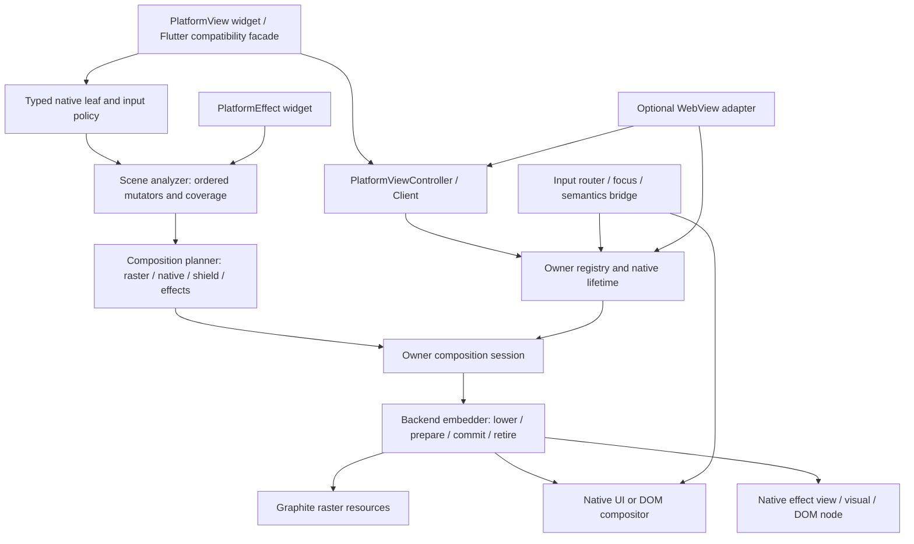

# Doroti PlatformView 재구성 아키텍처

2026-09-14 · 소스 검토 HEAD `227a0b4c7c9534aff2cf2c9edb5b038c9d2656cc`.

**PlatformView를 native instance 수명, 장면 분석, 합성 전략, 프레임 자원 수명, 입력 중재의 다섯 책임으로 재구성한다.** 기존 owner/generation 계약과 동작하는 플랫폼 경로는 유지하면서, 공통 의미를 먼저 추출하고 host별 전송 방식을 교체한다. 가장 먼저 해결할 제품 문제는 Android의 native 위에서 시작한 부모 스크롤, 큰 전경 변경 비용, 프레임 간 geometry·raster 일치다.

이번 변경은 **설계·작업계획 문서만**이다. 아래 신규 타입과 단계는 제안이며 제품 구현·성능 승인을 뜻하지 않는다. 실행 단계는 [work1.md](work1.md), WebView 소비자 계약은 [work2.md](work2.md), 이전 계획·실행 기록은 [원본 보관](history/26-09-14/platformview-rearchitecture/README.md)을 따른다.

**현재 요구:** `PlatformEffect`는 공통 API로 효과의 의미를 유지하고 플랫폼 간 비주얼을 최대한 유사하게 만드는 위젯이다. native API·CSS·공개 GPU 효과 중 이 목표에 적합한 구현을 내부에서 선택한다. WebView는 HCPP를 필수로 요구하지 않으며 플랫폼별 합성·입력·접근성·효과 호환성·성능에 유리한 구성을 선택한다. native WebView 위 효과와 선명한 Doroti 전경이라는 제품 목표는 유지한다.

**Windows 구현 선택 확정:** WindowsAppSdk와 Windows MAUI의 WebView backend는 `Microsoft.Web.WebView2.Core.CoreWebView2CompositionController`를 사용한다. controller 선택은 미결정 항목에서 제외한다. `RootVisualTarget`를 공통 host의 호환 visual tree에 연결하고 Doroti raster·PlatformEffect와 합성한다. GPU 전송을 우선 검토하되 실제 Composition API family·전송 방식·AOT 검증은 후속 구현 gate에서 결정한다.

## 1. 현재 출발점과 문제

| 현재 확인한 코드 | 유지할 부분 | 재구성할 부분 |
|---|---|---|
| [PlatformViewContracts](Doroti/src/Doroti.Ui/PlatformViewContracts.cs) | owner/instance/generation, 명시적 capability, typed payload | composition enum에 합성 의미·전송 방식이 섞임. 효과 flags와 단일 bool로 조합별 제약을 표현하기 어려움 |
| [PlatformViewCoordinator](Doroti/src/Doroti.Hosting/PlatformViewCoordinator.cs) | create 취소·late success 회수, UI dispatcher, placement reservation, frame lease | native instance 관리와 장면 지원 판정을 분리. 순수 planner가 coordinator를 직접 조회·retain하지 않도록 변경 |
| [PlatformCompositionPlan](Doroti/src/Doroti.Hosting/PlatformCompositionPlan.cs) | retained flatten, R/N/shield 순서, 미지원 효과 거부 | transform/rect clip과 전역 Unsupported 상태로 축약함. 단일 backdrop·sigma 제한이 공통 planner에 들어 있음 |
| 같은 파일의 `PlatformCompositionSession` | prepare/commit/retirement 구분 의도 | 현재 `Doroti/src` 검색에서 구현·호출이 계약 파일에만 있음. 실제 host의 Draw/Finish와 공통 프레임 계약을 연결해야 함 |
| [SkiaPlatformRasterContent](Doroti/src/Doroti.Skia.Rendering/SkiaPlatformRasterContent.cs) | 실제 clip 기반 crop, picture identity 캐시, 큰 겹침 병합 | 장면 coverage·damage·slot identity를 공통화. 현재 큰 scroll clip은 실제 그린 면적보다 넓을 수 있음 |
| [PlatformView 위젯](Doroti/src/Doroti.Framework.Widgets/PlatformView.cs), [RenderPlatformView](Doroti/src/Doroti.Framework.Rendering/PlatformViewSurface.cs) | explicit owner, async create, bounded layout, focus/semantics leaf | 새 typed 경로는 native 직접 입력. 이 경로의 gesture recognizer 선택·부모 arena 중재가 없음 |
| [기존 channel adapter](Doroti/src/Doroti.Framework.Services/PlatformViewChannelAdapter.cs) | owner별 codec 호환 경계 | create/dispose/clearFocus 일부만 제공. texture/touch/accept·reject/HCPP 호환 완료로 볼 수 없음 |
| Windows/Android/AppKit/Qt host | 이미 연결한 제품 경로와 제한 | planner 사용 이후 raster 준비·batch·실패·retirement가 host마다 다른 구조로 구현됨 |

예전 `idea.md`의 “SceneBuilder에 typed payload 없음”, “renderer에 PlatformView 제품 연결 없음”은 현재 상태가 아니다. 반대로 기존 Flutter 계열 위젯 파일이 있다는 이유로 새 typed 경로의 입력 동등성을 가정하지 않는다.

## 2. Flutter 로컬 코드와 공식 문서에서 채택할 것

로컬 Flutter HEAD는 `56b8e1a851a594b1a154f8ea93270807dab22b9a`다. 검토한 핵심 framework/platform-view/embedded-view 경로는 해당 경로별 `git status`에서 변경이 없었다. 참조 저장소 전체는 examples 삭제 등이 있어 clean checkout이라고 부르지 않는다. 웹 문서는 2026-09-14 열람본이며 로컬 commit과 동일 버전으로 취급하지 않는다.

| 근거 | 확인한 동작 | Doroti 결정 |
|---|---|---|
| [PlatformViewLayer](reference/flutter-master/engine/src/flutter/flow/layers/platform_view_layer.cc) | preroll에서 mutator/geometry 전달, paint에서 embedder canvas 전환 | native leaf를 명시적 합성 경계로 분석 |
| [ExternalViewEmbedder·MutatorsStack](reference/flutter-master/engine/src/flutter/flow/embedded_views.h) | 플랫폼별 embedder와 ordered effect stack, view slice | 공통 장면 의미와 backend lowering 분리 |
| [SliceViews](reference/flutter-master/engine/src/flutter/flow/view_slicer.cc) | 기록 영역과 앞선 native 영역의 교집합으로 overlay를 만들고 배경에서 제외. 비사각 clip에는 underlay 보존 예외 | overlap-aware slicing 채택. raster를 이동할 때 alpha 이중 합성과 clip hole까지 증명 |
| [rendering/platform_view.dart](reference/flutter-master/packages/flutter/lib/src/rendering/platform_view.dart), [PlatformViewSurface API](https://api.flutter.dev/flutter/widgets/PlatformViewSurface-class.html) | arena team, unresolved event 보관, 승리 후 전달/패배 후 폐기. UIKit은 accept/reject 경로도 별도 | 플랫폼별 입력 adapter를 두고 동일 sequence를 한 번만 처리 |
| [Android controller 2](reference/flutter-master/engine/src/flutter/shell/platform/android/io/flutter/plugin/platform/PlatformViewsController2.java) | pending/active SurfaceControl transaction, `applyTransactionOnDraw` | frame transaction 개념 채택. Java controller 전체와 Impeller 전제를 그대로 포팅하지 않음 |
| [Web content manager](reference/flutter-master/engine/src/flutter/lib/web_ui/lib/src/engine/platform_views/content_manager.dart), [embedder](reference/flutter-master/engine/src/flutter/lib/web_ui/lib/src/engine/platform_views/embedder.dart) | DOM 수명과 composition order·clip chain·canvas 재사용 분리 | main DOM instance 보존, worker의 불변 frame packet, geometry/raster revision 분리 |
| [iOS embedder](reference/flutter-master/engine/src/flutter/shell/platform/darwin/ios/ios_external_view_embedder.mm) | preroll/composite/frame submit을 platform controller에 연결 | UIKit와 AppKit 각각의 view hierarchy·presenter를 유지 |

Flutter Android 문서는 HC, TLHC, HCPP의 비용과 지원 조건을 나눈다. HCPP는 3.44부터 실험적 opt-in이며 API 34+와 Impeller Vulkan을 요구하고, 복잡한 투명 native 겹침에도 알려진 제한이 있다. Doroti에서는 HCPP 대응도 비교 후보로 두되 Graphite·WebView·효과의 실제 결합 결과로 채택 여부를 결정한다. 기존 bounded readback도 비용과 기능을 검증할 비교 후보이며 방식 이름으로 탈락시키지 않는다. [공식 Android 문서](https://docs.flutter.dev/platform-integration/android/platform-views)

Flutter iOS도 모든 효과를 지원하지 않는다. UIView hybrid composition에서 ShaderMask·ColorFiltered 제한과 backdrop 조건이 문서화되어 있다. “Flutter API에 있음”을 Doroti의 모든 backend 지원으로 번역하지 않는다. [공식 iOS 문서](https://docs.flutter.dev/platform-integration/ios/platform-views), [macOS 전용 문서](https://docs.flutter.dev/platform-integration/macos/platform-views)

Web은 canvas 사이 DOM을 끼우는 overlay 비용과 iframe 내부 pointer 전달 제약이 있다. `isVisible=false`는 픽셀을 그리지 않는 content의 최적화 힌트이지 숨김·입력 불가 상태가 아니다. PointerInterceptor는 전경 입력 보호이며 전경 픽셀 합성이나 cross-origin 이벤트 중재를 해결하지 않는다. [HtmlElementView](https://api.flutter.dev/flutter/widgets/HtmlElementView-class.html), [pointer_interceptor](https://pub.dev/packages/pointer_interceptor)

### 2.1 Stretch와 backdrop를 같은 효과로 취급하지 않는다

로컬 [layer_state_stack.cc](reference/flutter-master/engine/src/flutter/flow/layers/layer_state_stack.cc)의 ImageFilterEntry에는 native image-filter mutator가 없다고 명시되어 있다. `embedded_views.h`의 `ImageFilterMutation`과 backdrop 관련 항목 존재가 일반 ImageFiltered/stretch 전파 지원을 뜻하지 않는다. [stretch_effect.dart](reference/flutter-master/packages/flutter/lib/src/widgets/stretch_effect.dart)는 ImageFiltered를 사용한다.

따라서 현재 Android sample의 clamped scroll은 제한 대응이다. native stretch 지원으로 승격하지 않는다. 직접 native 합성에서 비선형 변형을 조용히 생략하거나, 가릴 때 native를 정지 snapshot으로 바꾸지 않는다. live texture 경로를 선택하는 경우에도 변형·입력·접근성을 별도 검증한다. 이번 조사에서 Flutter 기기 실행 비교는 하지 않았다.

## 3. 목표 구조와 의존성



기존 프로젝트 경계를 활용한다. 새 public assembly는 필요성이 확인되기 전까지 추가하지 않는다.

| 위치 / 제안 타입 | 책임 | 금지할 의존성 |
|---|---|---|
| `Doroti.Ui`: `PlatformViewHandle`, `PlatformViewDescriptor`, `PlatformViewCapabilities`, `PlatformViewMutator` | 불변 DTO, frame/coordinate/error 계약 | OS handle, SkiaSharp, DOM 객체 |
| `Doroti.Framework.Services`: `PlatformViewController` 또는 기존 Client 확장 | create/update/dispose·focus, explicit owner, compatibility facade | HWND/UIView 제어, 매 프레임 채널 왕복 |
| `Doroti.Framework.Rendering`: typed layer + scene 분석 메타데이터 | logical bounds, ordered mutators, input policy, semantics anchor | native 생성·GPU 할당 |
| `Doroti.Hosting`: analyzer/planner/session, 기존 coordinator | identity, capability 검증, frame admission, lease, commit 결과 | 플랫폼별 Gaussian sigma·Android View 특례 |
| `Doroti.Skia.Rendering`: coverage/damage·raster pool·GPU lease | 장면 raster 실행과 R 자원, transfer descriptor | native view 수명·navigation |
| 각 `Doroti.Host.*`: `IPlatformViewEmbedder`, input/focus/semantics adapter | lowering, UI/native resources, P 자원, commit/retirement 관측 | framework scene 재해석, 자체 별도 identity registry |
| 공통 `PlatformEffect` + 각 host의 effect adapter | effect node·배경 sample 의존성·native 효과 resource | WebView 전용 ID/별도 frame clock, window backdrop 설정 변경 |
| 선택형 `Doroti.WebView.*` | WebView 기능·profile·document 수명 | 자체 compositor·중복 pointer shield |

타입명은 설계안이다. 기존 `IPlatformCompositionPresenter`를 확장해 embedder 역할을 수용하고, 같은 책임의 병렬 public interface를 영구 유지하지 않는다. 프레임 DTO의 의미를 먼저 고정한 뒤 구현 파일을 책임별로 분리한다.

## 4. 핵심 계약

### 4.1 생성·attachment·프레임 수명의 분리

`(OwnerViewId, InstanceId, InstanceGeneration)`을 native identity로 유지한다. owner별 allocator로 충돌을 막고, 명시적 ID API는 호환용으로 남긴다. widget key 교체만으로 이전 비동기 dispose 완료를 가정하지 않는다. 같은 ID는 retirement 완료 전 재생성 거부 또는 예약 대기로 처리한다.

생성 정보(view type, creation bytes, factory-specific immutable options)는 instance 수명 동안 불변이다. bounds·clip·transform·visibility·paint order는 attachment/frame 정보로 옮긴다. mutable control settings는 typed update로 전달하며 업데이트를 지원하지 않는 설정만 명시적 재생성한다. 새 controller 경로와 기존 Client는 한 coordinator를 사용한다.

수명은 `Requested → Creating → Ready → Attached ↔ Hidden/Detached → Disposing → Disposed`를 유지하고 실패는 typed terminal로 처리한다. detach는 instance 제거가 아니다. 한 instance는 동시에 하나의 attachment만 가진다. keep-alive는 같은 owner 안의 명시적 lease이며 다른 창 이동은 초기 지원 범위 밖이다. owner close는 keep-alive를 포함해 닫는다.

dispose 요청 때 입력·focus admission을 먼저 차단하고, UI attachment와 GPU/presentation 참조가 끝난 후 native 자원을 해제한다. 생성 중 취소 후 late native success도 해당 dispatcher에서 회수한다. framework callback은 owner event queue로 돌아오며 UI/render thread를 동기 wait로 교착시키지 않는다.

### 4.2 합성 의미와 실제 전송 방식을 분리

| 축 | 제안 값과 의미 |
|---|---|
| 화면 요구 | 기존 `NativeOverlay` 제약 또는 `InterleavedComposition` 요구. 전경/중간/역순/alpha를 유지 |
| native representation | live hierarchy, 명시적 external texture, 명시적 snapshot |
| raster transport | GPU import/copy, GPU→CPU readback→native upload, DOM canvas |
| effect support | native leaf, raster-only group, mixed group, backdrop sampling별 조건 |
| 입력 | direct native, arena-mediated, cooperative DOM, unsupported |
| 관측 | GPU complete, host committed, compositor acknowledged, retirement; 물리 표시 여부 별도 |

`PlatformViewCapabilities`는 **runner + renderer + OS/runtime + view type + native subtree 종류**에 대한 구조화 결과다. requested/resolved strategy와 비용·거부 사유를 남긴다. OS 종류만으로 지원을 반환하지 않는다. `SurfaceView` 자식, 투명 native, secure/external content, rounded clip, opacity group 같은 제약을 표현한다.

전체 scene의 요구도 lower 전에 다시 검증한다. 생성 시 RectClip만 요청했다고 나중에 등장한 backdrop·modal·부모 transform을 승인하지 않는다. 지원 정책 안에서 적합한 strategy/effect adapter를 선택하고 actual backend와 근사 정도를 보고한다. 의미·입력·성능 예산을 충족하는 후보가 없으면 `UnsupportedComposition/UnsupportedEffect/UnsupportedInputPolicy/ResourceBudgetExceeded/StaleGeneration/OwnerClosed` 등 typed 이유와 해당 handle/scope를 반환한다. 정지 snapshot이나 효과 누락을 정상적인 전략 선택으로 포장하지 않는다.

#### 4.2.1 WebView 전략 선택 — 플랫폼별 적합한 구성

기본 정책은 제안 `PlatformPreferred`다. HCPP 대응, native hierarchy/visual, live texture, bounded readback, DOM/canvas 등에서 **제품 요구를 충족하는 후보를 먼저 추린 뒤** 입력·접근성·효과 fidelity·지연·메모리·안정성·유지보수 비용을 비교한다. `NativeCompositor`는 가능한 strategy/capability 중 하나이며 필수 profile이 아니다. Windows의 CoreWebView2CompositionController와 Linux의 시스템 Qt WebEngine 공급 정책은 유지한다.

- native instance/DOM identity·문서 상태·실시간 갱신을 보존한다. live texture 표현도 실제 입력/IME/접근성과 내용 갱신이 검증되면 선택 가능하다. 정지 snapshot으로 실시간 view를 대체하지 않는다.
- Doroti raster의 GPU import/copy, bounded readback/upload, browser canvas는 비용이 다른 구현 수단이다. GPU 전송을 우선 검토하되 readback을 일괄 금지하지 않고 영역·빈도·메모리·frame 예산으로 판정한다. readback 없는 것 자체를 품질/성능 성공으로 간주하지 않는다.
- scene paint order, geometry·crop·effect revision, resource readiness·commit/retirement는 공통 session으로 연결한다. browser commit의 원자성을 Android transaction과 동일하게 주장하거나 native animation을 framework frame에 lockstep으로 강제하지 않는다.
- factory/runtime 조회로 선택 가능한 전략과 거부 이유를 반환하고 실제 선택을 진단에 남긴다. 생성 시 negotiation을 우선하며 pointer capture·IME 조합·navigation 도중 상태를 잃는 재생성/전략 변경을 하지 않는다. runtime 전환은 state-preserving handoff가 검증된 조합만 허용한다.
- 효과를 요구한 scene은 `BackdropOverNative`와 시각적 유사성도 함께 검사한다. 표시만 되고 해당 배경을 sample할 수 없는 후보는 이 scene의 적합 후보에서 제외한다. 효과 없는 scene의 지원 여부와 분리한다.

Android HCPP 대응은 선택 연구다. API 34+와 Flutter Impeller 조건을 Doroti WebView 전체의 최소 지원 조건으로 올리지 않는다. 실제 선택 전략에 필요한 OS/API 하한은 backend별로 확정한다.

### 4.3 Ordered mutator와 좌표

`PlatformViewMutator`는 순서가 있는 transform, rect/rounded/path clip, opacity, backdrop sample scope를 표현한다. 모두 지원한다는 뜻이 아니다. analyzer는 정보를 보존하고, backend가 지원 조합으로 lower하거나 거부한다. 같은 opacity를 각 자식에 나눠 적용하면 mixed group 결과가 달라질 수 있으므로 group identity를 보존한다.

좌표 공간은 **widget logical → owner logical → device physical → backend local**을 명시한다. 현 RenderView의 root scale을 native placement에서 한 번만 제거한다. inverse transform, clip 공간, fractional DPI round-in/out·AA 여유를 계약화하고 singular/비유한 transform은 거부한다. raster와 input은 동일하게 commit된 geometry revision을 사용한다.

backdrop는 “그 native의 속성”만으로 표현하지 않고, 앞선 native/raster를 읽는 의존 구간을 가진 effect node로 둔다. Android 현재 단일 clipped Gaussian·sigma 한계·API 31+ 구현은 backend policy로 이동한다. animated native/media가 backdrop sample을 바꾸는 경우 native invalidation 또는 제한된 refresh 계약이 필요하며, text/click 변화만으로 전체 native content freshness를 보장하지 않는다.

### 4.4 Scene analysis·slicing·damage

1. retained scene을 분석해 immutable `CompositionScene`을 만든다. picture revision, 보수적인 paint coverage, 실제 clip, effect dependency, stable scene/slot identity를 보존한다.
2. 순수 planner가 native/raster/shield/effect 순서를 만든다. coordinator 조회 대신 불변 capability/handle snapshot을 받는다. 유효성 재검사와 retain은 session admission에서 수행한다.
3. raster 중 앞선 native와 겹치는 부분을 overlay로 분리하고 나머지는 base에 배치한다. background/overlay의 합이 원래 장면과 같음을 검증한다. transparent native, nonrect clip hole, backdrop 의존 영역은 보수적으로 보존한다.
4. 안정된 slot 안에서 content damage와 geometry damage를 분리한다. 단순 translation은 backing 재사용 후보이며 DPI/clip/size/effect/native sample 변화는 무효화 조건이다.
5. 빈 구간·인접 동등 구간을 합쳐 resource budget을 맞춘다. 순서를 바꾸거나 알 수 없는 그림을 버려 한도를 맞추지 않는다.

Flutter의 recorded region/R-tree 접근을 참고하되 **정확한 draw bounds를 얻기 전에는 현재 실제 clip/viewport 기반 보수적 범위를 사용한다.** picture cull hint는 clip도 정확한 coverage도 아니다. stroke/shadow/filter 확장, saveLayer, unknown operation은 안전한 상위 범위로 확대한다. 좁은 crop을 위해 sample에 수작업 ClipRect를 계속 추가하는 방식에서 벗어나려면 이 메타데이터가 먼저 필요하다.

캐시 키에는 picture/content revision, logical raster origin, clip/effect, device scale, color/alpha format, GPU generation을 포함한다. native content를 raster cache로 대체하지 않는다. 현재 Android의 작은 spinner 개선은 유지하되 전체 scroll 성능의 근거로 사용하지 않는다.

### 4.5 Frame transaction과 자원 반환

```text
Analyze → Plan → Admit/retain → Prepare raster/native resources
        → Submit GPU → backend commit → optional compositor acknowledgement
        → Retire GPU resources / Retire presentation resources → Release leases
```

이는 논리적 경계다. OS가 fence를 받는 backend는 commit을 GPU 완료 전에 예약할 수 있고, readback backend는 CPU pixels 준비를 기다려야 한다. API 호출 순서를 하나로 강제하지 않고 의존성과 소유권을 강제한다.

- token은 owner, view/metrics epoch, frame number, surface generation, scale을 유지한다. 추가 attachment/geometry revision으로 늦은 input·commit을 식별한다.
- `PreparedComposition`은 staging 자원과 취소/retirement 의무를 소유한다. 준비 실패 때 live native geometry를 먼저 바꾸지 않는다.
- commit 결과는 accepted/superseded/failed와 관측 가능한 ACK를 구분한다. GPU 제출 후 취소는 자원 사용 취소가 아니므로 fence까지 보존한다. 이미 일부 native commit이 발생한 오류는 host가 복원 가능성을 보고하고 복원 불가이면 owner를 명시적 실패로 전환한다.
- R은 Graphite raster 자원, P는 플랫폼 표시 자원이다. Qt GPU R→P copy, Android/Windows bitmap bank, AppKit surface가 각자의 마지막 소비 완료 경계를 제공한다. 제출 성공, GPU fence, window commit, 실제 scanout은 별개다.
- plan은 native lease뿐 아니라 참조한 retained scene/picture·외부 texture의 수명도 소유한다. renderer가 비동기로 사용하는 commands가 scene dispose 뒤 유효하다고 가정하지 않는다. 참조형 DTO를 넘기는 경우 snapshot/retain 책임을 명시한다.
- UI operation reservation을 GPU 대기 동안 잠근 채 UI thread를 막지 않는다. 경합은 제한된 retry/supersede로 처리한다. 프레임 수와 resident/retiring byte 한도를 함께 관리한다.
- resize/context loss 때 instance는 유지하고 surface generation만 교체한다. 실패 frame은 이전 presentation을 보존하며 새 generation 자원을 옛 ACK로 반환하지 않는다. device loss를 timeout만으로 추정하지 않는다.
- 마지막 native가 장면에서 사라진 frame도 빈 native/shield batch를 commit해 이전 attachment를 정리한다. 이전 presentation 자원이 남아 있으면 0-native raster fast path로 바로 우회하지 않는다. TickerMode/offstage는 native media·애니메이션 pause와 같지 않으므로 suspend 정책은 소비자 capability로 별도 표현한다.

진단은 analyze/plan/raster/transfer/UI commit 시간, bytes copied/read back, resource 재사용, retired backlog, native invalidation, skipped/superseded 이유를 분리한다. `Presented`라는 이름만으로 물리 표시 측정을 주장하지 않는다.

### 4.6 입력·focus·IME·semantics

입력 정책은 `DirectNative`, `GestureArena`, `BlockNative`로 분리한다. Web cross-origin처럼 event 수집 자체가 불가능한 조합은 capability에서 명시한다. `PointerInterceptor`는 scene의 hit-test 보호 구간이며 raster alpha로 생성/제거하지 않는다. `IgnorePointer`, `AbsorbPointer`, modal barrier 의미를 유지한다.

gesture 중재는 **down 시점부터** sequence owner를 결정할 준비가 필요하다. native가 down/click을 먼저 처리한 다음 parent scroll로 복제하지 않는다. Android는 wrapper ingress와 MotionEvent 보존/변환/replay·cancel 가능성을, UIKit은 native recognizer의 지연/accept/reject를 별도로 구현한다. desktop wheel·trackpad signal은 touch arena와 다른 계약이다.

미결정 event queue는 개수/시간 제한을 두고 overflow·dispose·capture loss 때 일관된 cancel을 보낸다. 합성 event 표식과 owner/pointer/sequence/generation으로 재진입·중복 전달을 막는다. multi-touch의 pointer index/action·timestamp·downTime 보존도 필요하다. 승리한 경로만 side effect를 발생시킨다.

focus는 native와 framework 사이 양방향이며 native가 focus를 얻을 때 Doroti IME client를 양보한다. Tab/Shift+Tab은 traversal boundary로 연결하고 텍스트 조합을 generic key replay로 대체하지 않는다. modal/detach/close 후 숨은 native에 focus가 남지 않도록 한다.

semantics는 native subtree anchor와 framework tree의 순서/clip을 맞춘다. native editor를 framework editable node로 다시 복제하거나 accessibility 상태 반영을 사용자 입력으로 되돌리지 않는다. UIA/TalkBack/VoiceOver/Orca는 backend별 제품 검증 대상이다.

## 5. 플랫폼별 전략

| backend | 유지하는 출발점 | 권장 후속 / 중단 조건 |
|---|---|---|
| WindowsAppSdk Graphite/Vulkan | HWND + layered raster readback C | WebView controller는 CoreWebView2CompositionController로 고정. 호환 visual/effect와 raster 전송 방식은 제품 결과로 결정 |
| Windows MAUI | 별도 미완료 결합 | 같은 CoreWebView2CompositionController backend를 사용하며 MAUI presenter/root visual/input 결합은 별도 검증 |
| Android MAUI/Graphite | SurfaceView base + live View + bounded readback raster/shield | native hierarchy·live texture·bounded readback·HCPP 대응 후보를 실제 WebView/효과/입력/성능으로 비교. SurfaceControl 채택은 선택 |
| UIKit iOS / Catalyst | 별도 host 구현 필요 | UIView/WKWebView + Metal foreground, 입력 지연·focus·semantics. AppKit 코드와 증거를 이름만 바꿔 재사용하지 않음 |
| AppKit | Metal/native sibling C 소스 | 공통 frame 계약에 adapter 연결, 기존 Graphite/Ganesh 구분, NSView hit-test와 layer order 일치 |
| Web | DOM registry 독립 harness | 현재 worker-direct WebGPU/WebGL 제품 프로토콜에 multi-canvas frame packet 연결. main DOM 수명과 worker GPU 수명 별도 관리 |
| Linux Qt Quick | Qt 소유 device/queue/swapchain + Graphite R→P GPU copy | 현 제품 선택 유지. queue drain을 없애는 작업은 retirement/resize 정합성 후 수행. WebEngine Quick item을 같은 scene에 연결하는 work2 spike 필요 |
| Linux Qt Widgets | 제한형 비겹침 B | 기존 앱 호환 경로로 유지. QWidget/WebEngine Widgets를 Quick Controls 지원으로 묶지 않음 |

Qt Quick scene graph의 graphics/thread ownership은 Qt 계약에 맞춘다. Doroti 공통화를 위해 Qt 소유 VkDevice를 다시 만들거나 파괴하지 않는다. WebEngine은 Widgets와 Quick 통합 접점이 있으므로 현재 Quick 제품 경로에는 Quick adapter를 먼저 검증한다. [Qt Quick scene graph](https://doc.qt.io/qt-6/qtquick-visualcanvas-scenegraph.html), [Qt WebEngine overview](https://doc.qt.io/qt-6/qtwebengine-overview.html)

## 6. PlatformEffect — 공통 효과 의미와 유사한 비주얼

### 6.1 위젯 의미와 입력

제안 `PlatformEffect`는 **공통 effect intent를 받아 각 플랫폼에서 의미와 비주얼을 최대한 유사하게 구현**한다. PointerInterceptor처럼 framework 위젯이 host 객체의 배치/수명을 선언하되 OS API 이름이나 material 선택을 일반 caller에게 요구하지 않는다. native 효과·CSS·공개 GPU shader를 내부 adapter가 선택/보정한다. 효과는 시각 node, 입력 차단은 shield node로 분리하므로 blur를 켰다는 이유로 native 입력을 막지 않는다.

```text
Doroti 배경 → live WebView → PlatformEffect의 backdrop/tint → 선명한 Doroti child
```

effect는 같은 owner의 **자신보다 앞서 그려진 배경**을 sample한다. 자기 자신과 child를 sample하지 않는다. 기본 source는 `WithinOwnerBehind`; desktop/다른 창을 읽는 `BehindWindow`는 기존 WindowBackdrop 영역이며 이 위젯의 기본·첫 구현 범위가 아니다. 기존 Skia `BackdropFilter`도 유지하고 native effect로 조용히 변환하지 않는다.

API 의미를 보여주는 의사 C# 예시다. 아래 타입/인자는 아직 구현되지 않았다.

```csharp
new PlatformEffect(
    effect: PlatformEffectStyle.BackdropBlur(strength: 0.6),
    appearance: PlatformEffectAppearance.MatchCommon,
    source: PlatformEffectSource.WithinOwnerBehind,
    pointerPolicy: PlatformEffectPointerPolicy.PassThrough,
    unsupported: PlatformEffectFallback.Error,
    child: new Text("선명한 전경"));
// 공통 tint/saturation·clip 옵션은 adapter가 같은 시각 목표로 매핑한다.
// OS 고유 외관은 선택적 PreferSystemAppearance 정책으로 요청할 수 있다.
// 전경 버튼/메뉴 보호에는 기존 PointerInterceptor 또는 BlockNative를 사용한다.
```

layout은 child 또는 부모의 bounded constraints로 결정하며 rect/rounded clip·transform·paint order를 typed layer에 기록한다. child는 framework에서 한 번만 layout/paint하고 effect 이후의 raster로 합성한다. pure effect node는 focus/semantics/gesture 참가자가 아니다. child semantics는 유지하며 native input 통과는 host hit test/DOM pointer-events 정책으로 구현한다. `BlockNative`를 선택하면 기존 shield 경로로 한 번 전달하고 effect용 native control에 키보드 focus를 주지 않는다.

공통 intent는 우선 backdrop blur·translucent surface로 제한하고 strength(정규화 강도), tint, saturation, light/dark appearance·clip을 정의한다. strength는 각 OS의 blur radius/sigma와 같은 단위가 아니다. `MatchCommon` 기본 정책에서 adapter가 public material·blur parameter·tint/saturation 조합을 보정해 공통 기준 비주얼에 접근한다. 정확한 numeric blur API가 없다는 이유만으로 일반 caller에게 플랫폼별 분기를 요구하지 않는다.

의미 보존은 실제 앞선 배경 sample·실시간 갱신·출력 범위·선명한 child·입력 정책을 뜻한다. 비주얼 유사성은 같은 배경/크기에서 blur 강도, tint/밝기/채도, edge 확산·투명감이 가까운지를 뜻하며 픽셀 완전 일치는 기본 계약이 아니다. OS 고유 material/vibrancy는 선택적 `PreferSystemAppearance`에서 우선할 수 있다. advanced exact-sigma/strict 요청은 별도 capability로 제한한다. 내부 CAFilter/KVC 조작 없이 구현하며 requested intent/resolved parameters·approximation reason을 진단으로 제공한다.

공통 reference scene은 체크무늬·작은 글자·사진·움직이는 WebView와 선명한 child로 구성한다. 동일 logical 크기·DPR·색공간·테마별 비교에서 blur edge profile/대비 감소·평균 tint/밝기와 시각 검토를 병행하고, FX0에서 강도별 허용 편차를 정한다. 공통 기준에 더 가까운 구현을 고르며 단순히 OS 기본 blur가 보이는 것으로 시각 수용을 끝내지 않는다. accessibility override는 일반 시각 비교와 별도로 기록한다.

### 6.2 현재 기반과 backend별 구현안

| 플랫폼 | 사용할 구현 / 조사 근거 | 정확한 지원 경계와 필수 검증 |
|---|---|---|
| AppKit macOS | `NSVisualEffectView`, `withinWindow`, semantic material | WKWebView/Metal raster 위 effect. Apple 문서상 withinWindow effect view끼리 겹침 제한이 있으므로 중첩/겹침을 초기에는 거부하고 별도 해법 전까지 지원하지 않음. 기존 `AppKitWindowBackdrop`의 `BehindWindow`와 다른 객체/수명 |
| UIKit / Catalyst | `UIVisualEffectView` + `UIBlurEffect`/선택 vibrancy | WKWebView와 GPU foreground의 실제 합성 확인. public material 우선, effect/ancestor alpha와 mask 제약은 별도 lowering. Doroti child에 native vibrancy가 자동 적용된다고 가정하지 않음 |
| WindowsAppSdk / MAUI | 호환 Composition API family의 backdrop brush + Gaussian effect + SpriteVisual | WebView2 RootVisualTarget와 raster surface가 같은 호환 visual tree에 있어야 함. `Windows.UI.Composition`, `Microsoft.UI.Composition`, raw DirectComposition 객체의 혼용 가능성을 추정하지 않음. host backdrop/Mica는 창 안 WebView sample을 대체하지 않음 |
| Android | 선택한 WebView 전략에 맞는 RenderNode/RenderEffect·공개 live sampling adapter | 일반 View용 현재 helper는 출발점. 별도 surface pixels는 View.Draw에 있다고 가정하지 않음. 공통 intent에 맞게 강도/tint를 보정하고 실제 source sample 확인 |
| Linux Qt Quick | Qt Quick `ShaderEffectSource`의 live GPU sample + `MultiEffect` 또는 공개 ShaderEffect | 앞선 Quick WebEngine/raster source group만 sample하고 자신/child를 제외. 전체 window를 source로 잡아 feedback loop를 만들지 않음. WebEngine item의 실제 GPU sample·clip·color·freshness 확인; QWidget B는 별도 unsupported |
| Web | main DOM의 전용 effect element + CSS `backdrop-filter`, tint/clip, `pointer-events: none` | iframe/canvas 사이에 effect element를 scene 순서로 배치. backdrop root/stacking/ancestor opacity를 분석. iframe 문서 접근 없이 CSS 합성할 수 있는 범위는 브라우저별 실제 검증; 내부 JS/픽셀 readback 권한과 혼동하지 않음 |

공식 근거: [AppKit withinWindow와 겹침 제한](https://developer.apple.com/documentation/appkit/nsvisualeffectview/blendingmode-swift.enum/withinwindow?changes=lat_8_1), [NSVisualEffectView material](https://developer.apple.com/documentation/appkit/nsvisualeffectview?changes=l_4__6), [UIKit effect와 alpha 제약](https://developer.apple.com/documentation/uikit/uivisualeffectview?changes=_2), [Composition backdrop effect](https://learn.microsoft.com/en-us/windows/uwp/composition/using-the-visual-layer-with-xaml), [WebView2 root visual 계약](https://learn.microsoft.com/en-us/microsoft-edge/webview2/reference/win32/icorewebview2compositioncontroller?view=webview2-1.0.4129.50), [Qt live source](https://doc.qt.io/qt-6/qml-qtquick-shadereffectsource.html), [Qt MultiEffect](https://doc.qt.io/qt-6/qml-qtquick-effects-multieffect.html), [CSS Filter Effects 2](https://drafts.csswg.org/filter-effects-2/). 모두 2026-09-14 열람했으며 adapter 호환/제품 성공의 증거는 아니다.

로컬 [AppKitWindowBackdrop](Doroti/src/Doroti.Host.Maui/AppKitWindowBackdrop.cs)는 이미 NSVisualEffectView를 사용하지만 window background 용도다. [AndroidPlatformBackdropView](Doroti/src/Doroti.Host.Maui/AndroidPlatformBackdropView.cs)는 앞선 View를 hardware canvas에 그려 RenderEffect를 적용하며 현재 source.Draw가 못 읽는 별도 surface까지 지원하는 것은 아니다. 로컬 [FlutterPlatformViews.mm](reference/flutter-master/engine/src/flutter/shell/platform/darwin/ios/framework/Source/FlutterPlatformViews.mm)의 blur 조정은 내부 backdrop subview/CAFilter 속성에 의존하므로 public API 기반 신규 위젯에 그대로 복제하지 않는다.

Android의 공개 cross-window blur는 뒤쪽 **창**을 흐리는 기능이다. 동일 window의 임의 rect effect와 같은 계약이 아니다. [Android window blur 문서](https://source.android.com/docs/core/display/window-blurs), [RenderEffect API](https://developer.android.com/reference/android/graphics/RenderEffect). 단순 `View.setRenderEffect`는 source 콘텐츠 필터이지 자동 backdrop sample이 아니다. HCPP 후보가 sample 불가이면 다른 WebView/효과 조합을 선택할 수 있다. hidden API/reflection이나 효과마다 별도 top-level window를 만드는 우회를 기본안으로 채택하지 않는다.

### 6.3 Frame·capability·접근성 계약

`ScenePlatformEffectPayload`/`PlatformEffectSegment`에 owner/effect identity·generation, style, sample source scope, effect bounds/clip/transform, paint order, pointer policy를 기록한다. effect의 GPU sample 영역은 blur kernel 여백을 포함하고 출력 clip과 구분한다. source가 두 view와 raster에 걸치면 그 전체 합성 배경을 읽어야 하며 특정 WebView 한 장만 흐려 근사하지 않는다.

effect resource는 공통 session의 prepare/commit/retire에 참여한다. frame에서 사라진 effect·DOM node·observer·GPU sample을 회수하고 입력 shield도 같은 revision으로 정리한다. native page scroll/video/animation·browser repaint가 변하면 Doroti 위젯이 정적이어도 효과 배경이 갱신되어야 한다. 플랫폼 compositor의 자동 갱신 또는 native invalidation 연결을 명시한다. live GPU sampling은 허용하지만 native instance를 숨기고 캡처로 교체하지 않는다.

`PlatformEffectSupport`는 `sampledContentKinds`, `crossSurfaceSampling`, `supportsOverlappingEffects`, `style/sigma/clip support`, `runtimeAvailable`, `refreshSource`, `reducedTransparency`, `reason`을 표현한다. blur engine·native topology·resource 한도·system state를 함께 조회한다. Web은 CSS.supports만으로 iframe 위 동작을 승인하지 않는다. full-window effect pool을 무제한 생성하지 않고 sample pixels·GPU bytes·effect count·추가 pass를 예산에 포함한다.

기본은 **의미를 보존하는 최선의 시각 근사**이며 자동 adapter 선택·material/parameter 보정은 정상 구현이다. 의미와 설정된 품질 기준을 충족할 방법이 없을 때만 unsupported 정책을 적용한다. 배경을 흐리지 않는 `SolidTint`는 정상 blur 근사가 아니므로 앱이 허용한 degraded fallback 또는 접근성 override일 때만 적용하고 상태를 보고한다. OS Reduce Transparency/고대비는 존중하며 일반 blur 성공과 구분한다. container 전체 alpha로 blur 강도를 흉내 내지 않고 지원 material/intensity/tint API로 표현한다.

## 7. 마이그레이션 결정

**R0 현 상태 고정 → R1 계약 추출 → R2 scene/mutator·damage → R3 제품 frame session → R4 입력 중재 → R5 플랫폼 이관 → R6 WebView 전략 비교·통합 → R7 제품 승인** 순서다. R6의 플랫폼별 합성/효과 sampling 비교와 R-E 공통 효과·시각 기준은 R1부터 시작한다. R-E 구현은 R2/R3, 최종 WebView 효과 승인은 선택한 R6 전략에 연결한다. HCPP 대응 구현 자체는 필수가 아니다. 단계별 gate는 [work1.md](work1.md)에 있다.

새 planner는 먼저 기존 경로 옆에서 분석 결과만 비교한다. 화면을 두 번 제출하지 않는다. backend 하나씩 전환하고 문제가 생기면 같은 기능 범위의 이전 경로로 명시적으로 되돌린다. API facade/기존 validator/지원 상태를 한꺼번에 제거하지 않는다. GPU transport 교체를 공통 계약 정리와 같은 변경으로 묶지 않는다.

선택하지 않은 대안은 전체 texture 강제, 모든 플랫폼을 CPU bitmap 합성으로 통일, Flutter controller 전체 포팅, WebView별 자체 compositor다. 특정 live texture나 bounded readback 전략은 제품 요구·예산을 충족하면 채택할 수 있다. Snapshot API는 여전히 명시적 별도 기능이며 live WebView의 대체로 사용하지 않는다.
