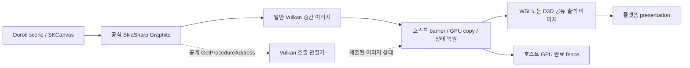

# Graphite 유지 + 공식 SkiaSharp 바이너리 전환 연구

작성일: 2026-09-11. 조사 기준 HEAD: `a6b30264bf5fe41cabdf4df67107ca906ce0e1df`.

상태: **연구 완료 / 구조 후보 제안 / GPU 실행·제품 전환 `notVerified`**.
후속 실행(2026-09-11): [W0 독립 구현 실험 결과](../../history/2026-09-12/validation/stock-graphite/2026-09-11/README.md). Windows 두 GPU의 공식 Graphite 기본 장면은 통과했지만 유한 종료 subtest가 실패하여 **전체 PARTIAL / 채택 보류**다. 아래 내용과 `evidence.json`은 최초 연구 당시 증거로 보존한다.
추가 대안(같은 날): [닫기 응답과 GPU 회수를 분리한 실험](../../history/2026-09-12/validation/stock-graphite/2026-09-11-retirement/README.md)이 두 GPU 총 18세대에서 통과했다. 완료 전 직접 Dispose 실패를 전체 구조의 불가능으로 확대하지 않고 이 방식으로 독립 실험을 이어갈 수 있다. 기존 5초 전체 회수·제품 adoption은 여전히 미통과다.
사용자 요구는 Graphite를 유지하면서 Skia 소스 직접 빌드를 없애는 구조의 연구다. 제품 코드, renderer 기본값, 패키지 버전, 기존 `work1.md`·`work2.md`는 변경하지 않았다. 이 문서의 타입 이름과 단계는 구현 제안이다.

## 1. 결론

**Graphite 유지와 공식 바이너리 사용은 양립한다.** 현재 NuGet Windows x64 바이너리에도 Graphite/Vulkan이 들어 있다. 어려운 부분은 Graphite의 존재 여부가 아니라 Doroti가 추가한 Vulkan 상호 운용 API의 대체다.

현재 배포 버전만으로 GPU 경로를 유지할 연구 후보는 **공식 Graphite API + 호스트 소유 중간 Vulkan 이미지 + 같은 큐의 GPU 복사·동기화 + Vulkan 호출 관찰을 통한 이미지 상태 추적**이다. 공식 `GetProcedureAddress` 콜백이 반환하는 일부 Vulkan 함수 포인터를 Doroti adapter로 연결하고, 실제 드라이버 호출을 그대로 전달하면서 공개 Vulkan 구조체의 정보를 관찰한다. Skia 바이너리나 C++ 객체 메모리는 수정하지 않는다.

이 후보는 아직 구현·검증되지 않았다. 특히 render pass의 암묵적 전환, 실패한 제출, device loss까지 처리하는 관찰기의 복잡성을 감수할 가치가 있는지 작은 실험으로 먼저 판단해야 한다. **직접 빌드를 제거하면 유지보수 비용이 사라지는 것이 아니라 일부가 Vulkan adapter로 이동한다.**

장기적으로 가장 단순한 구조는 필요한 상태·동기화 API가 upstream SkiaSharp의 공식 C ABI와 배포 패키지에 포함되는 것이다. 현재 C++ Skia에 기능이 있어도 공식 DLL의 C ABI에 없으면 C# P/Invoke 선언만 추가해서 호출할 수 없다.

## 2. 확인한 사실과 증거 범위

[검사 결과](evidence.json)와 [재현 스크립트](inspect-stock.py)를 함께 보존한다.

| 항목 | 이번 확인 결과 | 증거의 한계 |
|---|---|---|
| 프로젝트 SkiaSharp 버전 | `4.154.0-preview.1.26454.9` | 버전 변경 없음 |
| NuGet 공개 버전 목록 | 조사 시점 목록에 해당 버전이 있으며 그 이후 버전은 없음 | 개발 브랜치와 미공개 CI feed를 배포 패키지로 간주하지 않음 |
| Windows x64 공식 DLL | Graphite Vulkan `true`, Metal/Dawn `false` | backend 포함 여부만 호출. 컨텍스트 생성·렌더링 안 함 |
| 공식 Graphite C exports | 컨텍스트 생성, texture wrap, insert, submit, async readback, completion polling 존재 | 각 제품 기능의 동작 증거가 아님 |
| `doroti_graphite_*` exports | 검사한 Windows 공식 DLL에는 모두 없음 | 기존 ABI 3 호출 코드는 그대로 사용할 수 없음 |
| Windows x64 / Android arm64·x64 자산 | 설치 파일과 로컬 `.nupkg` 내부 파일 일치, `.nupkg` SHA-512와 캐시 해시 일치 | 원격 `.nupkg` 재다운로드·서명 검증은 안 함. Android 라이브러리는 실행하지 않음 |
| 공식 소스 | 고정된 SkiaSharp/Skia revision의 13개 파일을 HTTPS로 조회하고 SHA-256 기록 | Skia 내부 구현 관찰은 공개 ABI 보장을 대체하지 않음 |
| 제품·실기기·성능·NativeAOT | `notVerified` | 기존 커스텀 바이너리의 과거 성공을 이번 후보의 성공으로 이전하지 않음 |

SkiaSharp revision: `143a933a753dbfeca1909524b2c06c546c5c3e20`.
Skia revision: `cc43af052d3d98e605bee4ddc98671dafded1c57`.
Windows DLL SHA-256: `07ce51fd59e099b9561b0327223c27b21aa5605b5b8f4484dd297fdb8c8725a1`.
공개 버전은 [NuGet index](https://api.nuget.org/v3-flatcontainer/skiasharp/index.json)에서 확인했다.

재현 명령은 저장소 루트에서 실행한다. 패키지는 기존 NuGet 캐시에서 읽으며 upstream 소스와 버전 목록을 조회한다. DLL은 별도 Python 프로세스에 절대 경로로 로드한다.

```powershell
python Doroti/validation/run-with-timeout.py python research/graphite-official-binaries/inspect-stock.py
```

이번 명령은 exit 0이었다. 1,200초 외부 제한을 적용했고 GPU 컨텍스트는 생성하지 않았다. 재실행하면 `evidence.json`의 조사 시각·증거가 갱신된다.

## 3. 현재 커스텀 의존성의 실제 위치

| 현재 요소 | 역할 | 공식 바이너리 전환 시 과제 |
|---|---|---|
| [SkiaGraphiteVulkanInterop](../../Doroti/src/Doroti.Skia.Rendering/SkiaGraphiteVulkanInterop.cs) | ABI 3 확인, private constructor 접근, 추가 네이티브 API 호출 | 공개 `SKGraphiteContext.CreateVulkan`로 생성하고 전용 exports·`UnsafeAccessor` 제거 |
| [SkiaGraphiteSession.Vulkan](../../Doroti/src/Doroti.Skia.Rendering/SkiaGraphiteSession.Vulkan.cs) | persistent texture, get/set state, 외부 loss 전달 | 호스트 이미지 상태 계약과 host loss 상태로 대체 |
| [SkiaGraphiteSession](../../Doroti/src/Doroti.Skia.Rendering/SkiaGraphiteSession.cs) | recording/업로드 수명, 비동기 제출, GPU 완료 이후 회수 | 공개 insert 사용. recorder/cache/generation 계약은 유지 |
| [GraphiteVulkanWindow](../../Doroti/src/Doroti.Skia.Vulkan/GraphiteVulkanWindow.cs) / [Frames](../../Doroti/src/Doroti.Skia.Vulkan/GraphiteVulkanWindow.Frames.cs) | Android/Qt의 중간 이미지→swapchain GPU 복사, fence polling | 기존 큐·복사 구조 재사용 가능. 상태 조회와 복원 방식 변경 |
| [D3D12 경로](../../Doroti/src/Doroti.Skia.Vulkan/GraphiteVulkanWindow.D3D12.cs) | Graphite target 자체를 외부 그래픽스 소유권과 주고받음 | 첫 후보에서는 일반 Graphite 이미지와 공유 presentation 이미지를 분리 |
| [Windows App SDK presenter](../../Doroti/src/Doroti.Host.WindowsAppSdk/WindowsManagedVulkanPresenter.Graphite.cs) | 커스텀 DLL 선택, ABI/hash 검증, D3D11 presentation 연계 | 공식 모듈 선택과 package provenance, 별도 출력 이미지 계약 |
| host `.csproj`, buildTransitive, runner, Android AAR | 소스 빌드 실행·커스텀 asset 복사·공식 native asset 제외 | 제품 검증 이후 이 경로들을 함께 제거·교체 |

`doroti_graphite_has_unfinished_gpu_work`는 네이티브 bridge에 있지만 현재 `Doroti/src` 제품 코드에서는 참조를 찾지 못했다. 이를 새 제품 의존성으로 만들 이유가 없다. 공통 frame API도 이미 호스트 fence 완료 뒤 `CompleteGpuWork()`를 호출하도록 설계되어 있다.

## 4. 추가 API별 대체 가능성

| 커스텀 기능 | 대체 후보 | 판단 |
|---|---|---|
| feature/extension 전달을 포함한 context 생성 | 공개 CreateVulkan + 보수적인 장치 기능 설정 | 조건부 가능. 공식 shim은 이 descriptor를 전달하지 않음 |
| recording wait/signal semaphore | 호스트의 같은 큐 pre/post submission | Vulkan 명세상 근거 있음. 실제 조합 실험 필요 |
| 미완료 GPU 작업 조회 | 마지막 호스트 제출의 fence + 공개 CheckAsyncWorkCompletion | 같은 큐의 범위와 자원 수명을 지키면 대체 후보 |
| 외부 texture layout 조회 | 공개 Vulkan 호출 관찰기로 제출된 layout 계산 | 핵심 연구 과제. 간단한 barrier hook만으로는 부족 |
| texture layout 설정 | 호스트 복사 후 **Graphite가 마지막으로 사용한 layout·owner로 복원** | 불일치 자체를 만들지 않는 방식. 복원 실패 시 generation 폐기 |
| 외부 device loss를 Graphite에 통지 | 호스트 lost 상태로 admission 차단 + 실제 Vulkan 오류를 통한 정리 | 공개 통지 API가 없어 가장 조심해야 하는 종료 과제 |

공식 [Vulkan C ABI](https://github.com/mono/skia/blob/cc43af052d3d98e605bee4ddc98671dafded1c57/include/c/sk_graphite_vulkan.h)에는 생성과 texture wrap이 있지만 사후 상태 getter/setter가 없다. [Graphite C ABI](https://github.com/mono/skia/blob/cc43af052d3d98e605bee4ddc98671dafded1c57/include/c/sk_graphite.h)의 insert 구조체에는 semaphore·target texture state·GPU finished callback 필드가 없다. 반면 [C++ InsertRecordingInfo](https://github.com/mono/skia/blob/cc43af052d3d98e605bee4ddc98671dafded1c57/include/gpu/graphite/GraphiteTypes.h)에는 대응 기능이 존재한다.

### 4.1 장치 feature/extension의 제한

공식 [Vulkan 생성 구현](https://github.com/mono/skia/blob/cc43af052d3d98e605bee4ddc98671dafded1c57/src/c/sk_graphite_vulkan.cpp)은 장치·큐·함수 조회 콜백을 전달하지만 enabled feature/extension descriptor는 채우지 않는다. [VulkanSharedContext](https://github.com/mono/skia/blob/cc43af052d3d98e605bee4ddc98671dafded1c57/src/gpu/graphite/vk/VulkanSharedContext.cpp)는 descriptor가 없으면 feature가 없는 것으로 취급한다.

따라서 첫 실험은 실제 optional device feature를 비활성화하고 Graphite에는 일반적인 전용 VkImage만 전달한다. WSI와 Windows external memory 확장은 호스트가 사용하되 Graphite가 관리하는 이미지에는 external allocation·foreign queue ownership·YCbCr 등의 요구를 섞지 않는다. 이것은 **호스트가 쓰는 확장을 Graphite가 몰라도 되는지 검증할 제한된 설계 가설**이며, feature/extension 누락이 항상 안전하다는 뜻이 아니다. Skia allocator·capability·driver workaround와 최종 SPIR-V requirements까지 점검한다.

GPU 기능 조회 결과를 enabled feature인 것처럼 위조하거나, `GetProcedureAddress`에서 지원 여부를 속여 기능을 강제로 켜지 않는다. 필요한 기능을 이 제한 안에서 제공할 수 없으면 해당 공식 버전으로는 후보를 채택하지 않는다.

## 5. 우선 연구 후보: 일반 Vulkan 중간 이미지 + 호스트 출력



### 5.1 소유권과 프레임 순서

1. 한 render owner가 Graphite와 호스트의 **동일 VkQueue** 접근을 직렬화한다. context/recorder/queue와 generation의 관계를 고정한다.
2. 호스트가 일반 VkImage `R`을 할당하고 공개 `SKGraphiteBackendTexture.CreateVulkan`으로 한 번 감싼다. 기본 실험은 단일 color subresource, sample count 1, alias 없음이다. Graphite 내부 MSAA/resolve는 별도 제한 없이 검증한다.
3. `R`은 swapchain·D3D와 직접 공유하지 않는다. 이미지 usage는 실제 포맷 지원을 확인한 color attachment/input attachment/sampled/transfer 조합으로 만든다.
4. 공식 `InsertRecording`과 `Submit(Sync=false)`로 `R`에 그린다. 관찰기는 실제 제출 성공까지 확인한 `R`의 최종 예정 layout `L`을 제공한다. CPU에서 API가 반환한 것은 GPU 완료가 아니다.
5. 호스트 command buffer가 Graphite의 이전 쓰기→복사 읽기 의존성과 `L→TRANSFER_SRC_OPTIMAL` 전환을 만들고 출력 이미지 `P`로 복사한다. 이어 `R`을 **원래 L로 복원**하며 다음 Graphite 접근에 필요한 메모리 의존성을 설정한다.
6. `P`는 호스트가 관리하는 WSI present layout 또는 외부 그래픽스 handoff 상태로 보낸다. 이 제출에 acquire wait, present-ready signal, host fence를 둔다. 초기 구현은 보수적인 stage/access 범위를 사용하고 sync validation 후에만 좁힌다.
7. 호스트 fence 완료 후 공개 `CheckAsyncWorkCompletion()`을 구동하고 recording/frame을 회수한다. `R` slot은 복원 완료 전 재사용하지 않는다. presentation image는 플랫폼 사용 종료까지 별도로 보존한다.

WSI acquire는 `P`를 사용하는 호스트 copy 제출에서 기다리면 된다. `R`에 그리는 Graphite 작업까지 acquire로 막을 필요는 없다. renderer가 다른 공유 입력을 소비해야 한다면 별도의 pre-wait submission을 설계한다.

핵심 불변식은 **Graphite의 마지막 추적 상태와 다음 Graphite 사용 시 GPU가 보게 될 상태가 같다는 것**이다. 매 프레임 `COLOR_ATTACHMENT_OPTIMAL`이라고 가정하지 않고, 호스트 copy 전 상태로 돌려놓는다. `UNDEFINED`를 oldLayout으로 써서 기존 픽셀 보존 문제를 덮지 않는다. 전체 redraw를 강제하는 것으로도 동기화 문제가 자동 해결되지 않는다.

같은 큐라는 사실만으로 메모리가 동기화되지는 않는다. [vkQueueSubmit](https://docs.vulkan.org/refpages/latest/refpages/source/vkQueueSubmit.html)은 wait/signal의 앞뒤 제출 범위를 정의하고, [vkCmdPipelineBarrier](https://docs.vulkan.org/refpages/latest/refpages/source/vkCmdPipelineBarrier.html)는 같은 큐의 이전·이후 명령 사이에 메모리 의존성을 설정할 수 있다. 실제 barrier/stage/access/ownership 조합은 별도 증명이 필요하다.

### 5.2 공개 함수 조회 콜백을 이용한 관찰기

공식 [SKGraphiteVkBackendContext](https://github.com/mono/SkiaSharp/blob/143a933a753dbfeca1909524b2c06c546c5c3e20/binding/SkiaSharp/Gpu/Graphite/SKGraphiteVkBackendContext.cs)는 `GetProcedureAddress`를 제공한다. 후보 `VulkanSubmissionObserver`는 여기에서 선택된 함수의 adapter 포인터를 반환한다. adapter는 호출을 실제 loader/driver 함수로 전달하고 필요한 구조체 값만 복사한다. 이는 Skia의 별도 공식 state-tracking 기능은 아니며 Doroti가 책임지는 Vulkan 중간 계층이다.

필수 추적 범위:

- **명시적 전환:** `vkCmdPipelineBarrier`와 지원하는 `*2/KHR` 변형의 이미지 subresource, layout, queue family. layout 전환 외 접근 의존성도 검증 자료로 남긴다.
- **암묵적 전환:** image view→image, framebuffer→attachments, render pass→attachment initial/final layout·subpass 정보를 연결한다. `Begin/Next/EndRenderPass` 및 `*2/KHR` 변형을 포함한다. dynamic rendering은 지원하거나 경로 진입을 탐지해 거부한다.
- **제출 수명:** command buffer 생성·begin/reset/free, command pool reset/destroy, primary/secondary 실행 순서, queue submit/submit2 성공·실패, 자원 destroy 및 handle 재사용. 드라이버가 재사용한 숫자 handle을 과거 generation으로 해석하지 않는다.
- **기록과 실행의 분리:** callback 도착 순서로 전역 layout을 갱신하지 않는다. command buffer별 journal을 만들고 **실제 queue submission 순서로**, 성공한 제출에 대해서만 상태를 확정한다. cancelled/unsubmitted command의 상태를 출력에 사용하지 않는다.
- **범위 제어:** 처음에는 관찰 가능한 단일 owner/queue, 단일 layer/mip/color output, alias 없음으로 한정한다. input image·내부 attachment의 모든 상태를 제품 API로 노출할 필요는 없지만 출력 상태에 영향을 주는 메타데이터는 빠짐없이 추적한다.
- **ABI·실패 처리:** 정확한 플랫폼 Vulkan calling convention, delegate/function pointer rooting, instance/device별 dispatch, callback 중 예외 유출 금지, 재진입 및 pending callback 정리. 알 수 없는 패턴은 정상 호출을 전달하고 fault를 기록한 뒤 해당 frame/generation의 출력·재사용을 중단한다. 임의 성공이나 Vulkan 오류를 만들어 반환하지 않는다.

`vkCmdPipelineBarrier` 하나만 hook하는 구현은 채택하지 않는다. 현재 [VulkanCommandBuffer](https://github.com/mono/skia/blob/cc43af052d3d98e605bee4ddc98671dafded1c57/src/gpu/graphite/vk/VulkanCommandBuffer.cpp)도 MSAA resolve subpass 전환 뒤 내부 layout 추적값을 변경한다. [VkAttachmentDescription](https://docs.vulkan.org/refpages/latest/refpages/source/VkAttachmentDescription.html)의 finalLayout 전환은 별도 명시적 barrier 없이 발생할 수 있다.

기존 bridge를 비교용 실험의 **oracle**로 사용할 수는 있다. 이 경우 결과는 관찰기 교차 검증으로만 기록하고, 최종 stock 검증은 공식 DLL만 로드한 별도 프로세스에서 수행한다. 두 Skia 인스턴스 사이에 객체를 넘기지 않는다.

### 5.3 완료, device loss, 취소

GPU 완료와 화면 표시 완료는 별개다. WSI present-ready semaphore는 swapchain image별로 관리하고, GPU submit fence만 보고 presentation wait가 소비됐다고 판단하지 않는다. acquire 취소·out-of-date·swapchain 폐기의 semaphore 수명을 [Khronos 재사용 지침](https://docs.vulkan.org/guide/latest/swapchain_semaphore_reuse.html)에 맞춰 검증한다.

정상 경로에서는 host fence가 Graphite와 후속 copy를 포함하는 같은 큐의 완료 기준이다. `CheckAsyncWorkCompletion`은 callback과 내부 회수를 구동하는 API이며 독립적인 frame 완료 증서가 아니다.

실제 `VK_ERROR_DEVICE_LOST`를 호스트가 먼저 발견하면 generation의 admission을 닫는다. 이후 정상 frame을 제출하지 않고 실제 드라이버 결과를 보존하여 자원을 정리한다. 공개 `IsDeviceLost`가 host 상태와 즉시 같아진다고 가정하지 않는다. 현재 Skia `VulkanCommandBuffer::isFinished`는 fence 조회의 device-lost를 종료로 취급하지만 내부 shared-context 플래그를 항상 갱신하지는 않는다. 반면 `waitUntilFinished`는 결과를 `checkVkResult`에 전달하고 내부 무한 timeout 대기를 사용한다. 따라서 **일반 timeout, 실제 device loss, 제출 실패 후 불확실한 GPU 수명을 구별하는 종료 검증이 필수**다.

`ReportDeviceLost`를 지우고 `Dispose()`만 호출하면 안전하다고 결론 내리지 않는다. 확정할 수 없는 수명의 자원을 해제하거나 fake device-lost를 반환하지 않는다. 공식 API로 유한 종료·회수 조건을 충족하지 못하면 이 후보는 제품 채택을 중단하고 upstream API 경로로 전환한다.

## 6. 플랫폼별 적용

| 플랫폼 | 조사 기준 경로 | 연구 방향 및 추가 비용 |
|---|---|---|
| Windows App SDK | Graphite Vulkan→D3D11/Windows presentation | 일반 `R`과 D3D 공유 `P` 분리, adapter 일치·외부 메모리 import와 handoff 검증. 기존 copy 재사용 가능성은 실제 presenter별 확인 |
| Windows MAUI | Graphite Vulkan↔D3D12 공유 target | 직접 공유 target 대신 `R→P` GPU copy가 추가될 수 있음. alpha, D3D fence, owner 전환, resize 검증 |
| Android | Graphite Vulkan→WSI | 기존 중간 이미지·copy·2-slot 구조를 가장 많이 재사용할 수 있음. emulator와 arm64 기기의 결과 분리 |
| Linux Qt | Graphite Vulkan→WSI | Qt가 공급하는 instance/surface의 실제 확장과 lifetime 확인. X11/Wayland·배포 baseline 각각 검증 |
| AppKit/iOS/Catalyst | 공개 Graphite Metal 경로 | Vulkan 관찰기 적용 대상 아님. 공식 asset·동일 Metal queue·drawable 완료 경로 유지, 각 플랫폼에서 별도 검증 |
| Web | 공개 Graphite Dawn/WebGPU 경로 존재 | 공식 WASM asset 사용을 확인하고 worker/device/resource 수명 유지. 공식 정적 라이브러리를 앱에 링크하는 과정과 Skia 소스를 빌드하는 과정을 구별 |

Windows 공식 DLL에서는 Dawn backend가 false다. 현재 버전에서 `CreateDawn` C# API가 있다는 이유만으로 Windows를 Graphite/Dawn/D3D12로 바꾸는 대안은 성립하지 않는다. 향후 **공식 native Dawn 자산의 실제 배포와 호환 ABI**가 확인되면 별도 후보로 재평가한다.

`work1.md`의 플랫폼 뷰 다중 raster segment·alpha·양방향 겹침 요구는 유지해야 한다. 단일 창·단일 texture의 성공으로 다중 surface 합성과 플랫폼 뷰 지원을 완료 처리하지 않는다. 이 연구가 해당 계획의 미완료 항목을 해결한 것은 아니다.

## 7. 대안 비교

| 대안 | Graphite 유지 | 현재 공식 Skia 바이너리만 사용 | 제품 판단 |
|---|---|---|---|
| upstream에서 필요한 C ABI를 제공한 공식 release | 예 | 해당 release가 발행되면 예 | 장기 선호. 현재는 외부 의존, 일정 미정 |
| 같은 큐 + 상태 관찰 + GPU copy | 예 | 예, 설계상 Skia 변경 없음 | **우선 실험 후보**, 정확성·종료·성능 미검증 |
| Graphite render→공개 async CPU readback→호스트 upload | 예 | 예 | 기능 검증용 비교군. 실시간 제품의 기본안으로 채택하지 않음 |
| 출력 상태를 고정 상수로 추정 / 매 프레임 UNDEFINED 재wrap | 예 | 예 | 일반적인 상태·내용 보존 근거가 없어 제외 |
| stock DLL에 C++ private symbol/POD offset 의존하는 shim | 예 | 겉으로만 stock | 안정적인 공식 ABI 사용 조건에 맞지 않아 제외 |
| CI에서 커스텀 Skia를 빌드하고 사내 NuGet으로 배포 | 예 | 아니오 | 로컬 빌드만 줄일 뿐 이번 요구를 충족하지 않음 |
| Ganesh 전환 | 아니오 | 예 | 사용자 조건에서 제외 |

공식 [Graphite Vulkan visual renderer](https://github.com/mono/SkiaSharp/blob/143a933a753dbfeca1909524b2c06c546c5c3e20/tests/VulkanTests/Visual/GraphiteVulkanRenderer.cs)는 headless 렌더 후 CPU readback을 사용한다. 이 예제의 성공은 WSI나 Windows 공유 GPU texture의 동기화 근거가 아니다. readback 경로의 하한 트래픽은 RGBA 1920×1080×60에서 readback 약 0.50 GB/s와 upload 약 0.50 GB/s이며, 복사·행 정렬·할당 비용은 별도다. 이는 성능 측정값이 아니라 단순 계산이다.

## 8. 권장 실험 순서와 중단 기준

첫 실험은 **Windows x64 공식 DLL + headless 두 Vulkan 이미지 사이의 GPU copy**로 제한한다. 현재 기계에서 stock 자산을 확인했고 WSI/Composition 변수를 분리할 수 있기 때문이다. 통과 후 Android/Qt WSI와 Windows D3D presentation으로 나눈다.

| 단계 | 산출물과 통과 조건 | 이번 상태 |
|---|---|---|
| G0 공식 자산·API 조사 | pin, source URL/hash, 캐시 archive 일치, compiled backend·exports 증거 | 수행한 범위 통과. 원격 archive 재검증·전체 RID는 남음 |
| G1 공개 API로 stock context 생성 | headless Vulkan, 실제 feature descriptor 기록, 이미지/텍스트/필터 픽셀; Skia 로드 경로·공식 자산 hash 일치 | TODO |
| G2 observer의 상태 정확성 | renderpass/MSAA/resolve/부분 repaint/readback/취소/handle 재사용을 포함하여 기대 상태·validation과 일치 | TODO |
| G3 stock GPU roundtrip | 반복 `R→P` 복사와 `R` 상태 복원, 비동기 fence retirement, 3 context generations·다중 slots, sync validation 오류 0 | TODO |
| G4 종료·실패 | submit 실패 전후, 취소 acquire, 실제 loss와 주입 오류의 구분, finite host wait, fresh context 재개와 미해제 자원 점검 | TODO |
| G5 WSI/D3D 제품 연결 | Android input/IME/background/resume; Windows opaque/alpha/Composition; Qt surface teardown, 각 경로의 실제 표시 검증 | TODO |
| G6 성능·기능 회귀 | 동일 장면·해상도·GPU에서 기존 커스텀 경로와 CPU/GPU p50/p95/p99, missed frame, memory, copy와 observer 비용 비교 | TODO |
| G7 빌드·배포 전환 | native source build target 제거, official asset root 복구, AAR/APK/publish/pack 검사, 각 배포물 로드 hash 및 AOT/trim 확인 | TODO |

G1~G4는 독립 실험으로 수행한다. G3의 readback은 결과 검증용에만 사용하고 steady-state presentation에 readback이 없음을 따로 기록한다. sync validation 없이 픽셀만 일치하면 동기화 통과로 보지 않는다. 오류 주입과 실제 device loss를 같은 증거로 기록하지 않는다.

다음 조건이면 GPU 관찰기 후보의 제품 채택을 멈춘다: 지원해야 하는 Vulkan 호출의 상태 전환을 완전히 추적할 수 없음, Skia가 필요로 하는 enabled feature 정보를 공식 ABI로 표현할 수 없음, 유한 종료·자원 수명을 보장하지 못함, GPU-only 조건을 지키지 못함, 또는 합의한 제품 성능 예산 초과. 새 수치 예산은 비교 baseline을 채집한 뒤 결정하며 임의의 성능 통과를 선언하지 않는다.

모든 실행 검증은 저장소 규칙대로 1,200초 외부 timeout을 사용한다. 제품·에뮬레이터·실기기·소스 검토 증거를 분리한다. 이번 연구에서 하지 않은 검증은 `notVerified`/`TODO`이며 `skippedByUser`가 아니다.

## 9. 전환 시 변경해야 할 배포 범위

G7에서 `native/graphite/build-*.py` 호출만 지우는 것으로 끝내지 않는다. Windows App SDK/MAUI 및 Qt의 prebuild target, host·target package의 buildTransitive copy, native path resolver와 ABI 3 검사, runner launch input, Android 공식 NativeAssets의 `ExcludeAssets` 설정과 AAR 내 커스텀 `.so`, template/최종 publish 산출물을 함께 점검한다.

버전과 자산 무결성 검증은 유지하되 대상은 공식 패키지 identity·RID·asset hash로 바꾼다. NuGet 캐시를 수정하지 않고, fresh process와 clean publish에서 공식 DLL/SO 하나만 사용함을 확인한다. Apple/Web의 공식 자산 경로까지 불필요하게 Vulkan adapter에 묶지 않는다.

upstream 요청을 준비한다면 필요한 API는 enabled device descriptor, backend texture state 조회/갱신 또는 최종 target state 지정, semaphore와 completion callback, 외부 loss/abandon에 대한 명확한 lifetime 계약이다. 이 연구에서는 upstream issue·PR·메시지를 전송하지 않았다.

후속 구현 및 제품 검증: [2026-09-12 실행 상태](../../history/2026-09-12/validation/stock-graphite/2026-09-12/README.md). 이 연구 시점의 결과는 그대로 보존하며 현재 채택/미완료 상태는 후속 결과를 따른다.
