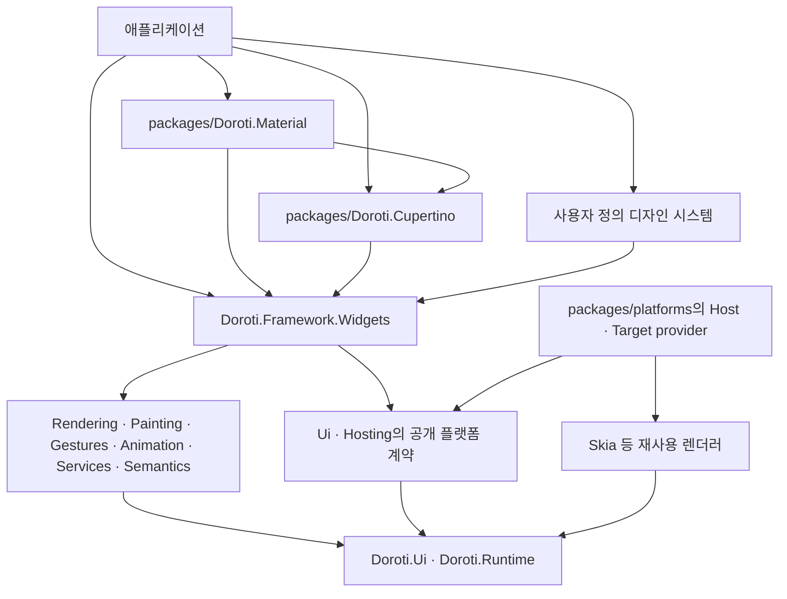

# Doroti 디자인·플랫폼 독립 구조 및 Windowing 선행 적용 작업계획

- 작성일: 2026-10-04 KST
- 갱신일: 2026-10-05 KST
- 조사 위치: [Doroti/](Doroti/), [packages/](packages/), [reference/flutter-master/](reference/flutter-master/)
- 상태: **기존 구현·검증 기록 보존 / 전체 수락 미완료 / 잔여 작업계획은 work3로 이관**
- 구현 기록: [소유권 ADR](Doroti/docs/migrations/design-platform/application-ownership.md), [전환 전 평가·이동표](Doroti/docs/migrations/design-platform/baseline.json), [실행·검증 상태](Doroti/docs/migrations/design-platform/execution.json). 부분 검증은 각 항목의 최종 완료 체크를 대체하지 않는다.
- 재개 기록: [2026-10-05 현황·미흡 부분·추가 구현](Doroti/docs/migrations/design-platform/resume-2026-10-05.md). 당시 전체 구현을 재개해 이전 인계의 중단 상태를 해제했으며, 수행한 결과와 미완료 범위를 보존한다.
- 사용자 결정: Flutter의 디자인 시스템 분리와 out-of-tree 플랫폼 확장·앱 시작 전 등록·새 Windowing 방향을 Doroti가 먼저 적용한다. 기존 구조와의 호환을 유지하지 않는 단절적 구조변경을 한다.
- 변경 범위: 컴파일러인 `tools/Doroti.DartToCSharp/`는 이번 작업에서 제외한다. 컴파일러 코드·패키지 매핑·변환 fixture 검증은 수정하지 않으며, 플랫폼 CLI·doctor·IDE·SDK의 확장 작업은 유지한다.
- 패키지 위치: 사용자가 만든 **저장소 루트의 [packages/](packages/)**를 사용한다. `Doroti/packages/`를 별도로 만들지 않는다.
- 문서 관계: [work.md](work.md)는 앞선 종합 리뷰의 결과 기록이다. 이 문서의 미완료 항목을 그 결과와 합치거나, 이전 PASS를 새 구조의 검증 결과로 재사용하지 않는다.
- 후속 실행 계획: [work3.md](work3.md)에 AppKit·Mac Catalyst·iOS·Android와 공통·Qt/Windows/Web·도구·릴리스의 잔여 작업을 현재 소스 기준으로 옮겨 구성했다. 이 문서는 구조 계약·완료 체크·기존 검증 이력을 유지하고, 앞으로의 실행 순서·플랫폼별 수락·원 항목 대응표는 work3를 따른다. work3 작성은 계획 정리이며 추가 구현·runtime 검증은 수행하지 않았다.
- 추가 조사: 플랫폼 확장 조사 2026-10-04 KST, 사용자가 갱신한 `reference/flutter-master` 재대조 2026-10-05 KST. 이미 제공하는 기능·실험 API·열린 제안을 구분하고, 플랫폼 부분은 **Doroti 자체의 공개 계약으로 설계할 선행 적용 범위**로 추가했다. 이 항목은 당시 조사·계획 기록이며, 2026-10-05 전체 구현 재개의 범위는 후속 work3 계획의 기준으로 유지한다.
- 참고 소스는 아래 파일 경로·링크로 표시한다. 기존 Doroti C# 포트와 사용자가 갱신한 Flutter 참고 소스는 구분해 조사한다.
- 기반 설계 재검토: 패키지 분리의 기준을 실행 계약·소유권·빌드 경계로 고정한다. provider의 process 준비와 view 준비를 분리하고, 공유 framework session·창별 native context·서비스 해제·도구 프로세스의 책임을 먼저 검증한다.
- .NET 우선 결정: 사용자의 허용에 따라 같은 managed runtime 안의 호출은 interface·typed request/result·Task/ValueTask로 연결한다. .NET 도구 확장은 직접 호출을 기본으로 하고, 별도 process·JS/worker·외부 byte protocol 경계에 필요한 직렬화만 둔다. Flutter의 메시지 구조를 내부 실행 계약으로 그대로 복제하지 않는다.

## 1. 목표와 확정할 구조

Doroti 코어는 디자인과 무관한 위젯 동작·렌더링·입력·접근성 기반을 제공한다. Material과 Cupertino는 코어 위에서 동작하는 독립 NuGet 패키지로 유지보수하고, 애플리케이션이 필요한 디자인 패키지를 명시적으로 선택한다.

플랫폼 구현도 코어 밖에서 연결할 수 있게 한다. provider는 플랫폼 구현의 소스·릴리스 묶음이고, Host는 OS 연결 구현, Target은 OS/TFM/RID·배포 자산·빌드 연결을 선택하는 소비자 패키지다. Runner SDK는 Target이 공급하는 부트스트랩 자산으로 선택 provider를 강한 타입으로 구성한다. 앱 startup은 provider의 process 준비 뒤 실행하며, view 서비스와 첫 frame은 앱 구성 이후 준비한다. 창·OS 메뉴·입력 등의 기능은 실제 session/view의 capability로 선택한다.

이번 변경은 폴더 이동만으로 끝내지 않는다. **소스 소유권, PackageId, AssemblyName, namespace, 자산 등록, 버전 관리, SDK·템플릿, 소비자 검증**을 함께 바꾼다.

| 항목 | 현재 | 전환 후 |
|---|---|---|
| Material 프로젝트 | `Doroti/src/Doroti.Framework.Material/` | `packages/Doroti.Material/` |
| Material PackageId / AssemblyName / namespace | `Doroti.Framework.Material` | `Doroti.Material` |
| Cupertino 프로젝트 | `Doroti/src/Doroti.Framework.Cupertino/` | `packages/Doroti.Cupertino/` |
| Cupertino PackageId / AssemblyName / namespace | `Doroti.Framework.Cupertino` | `Doroti.Cupertino` |
| 공통 위젯 및 기반 라이브러리 | `Doroti/src/Doroti.Framework.*` | 기존 코어 위치·이름 유지, 디자인 소유 기능 제거 |
| Material 색상 알고리즘 | `Doroti.Runtime` 및 그 NuGet 의존성 | `Doroti.Material` 소유 |
| 디자인 셰이더의 정의·자산 | Material 자산 + `Doroti.Ui`의 고정 목록 | Material 패키지가 정의·등록, 코어는 범용 로더 제공 |
| 애플리케이션의 디자인 선택 | 템플릿은 Material 고정 | `widgets`, `material`, `cupertino` 선택; 기본값 `widgets` |
| 버전 | 제품 공통 `0.3.0-beta` 및 일괄 override | 코어 릴리스 묶음과 각 디자인 패키지의 버전 분리 |
| 플랫폼 구현 위치 | `Doroti/src/Doroti.Host.*`, `Doroti.Target.*` | `packages/platforms/<provider>/`의 Host/Target 구성 묶음 |
| 플랫폼 전용 native 소스·빌드 | 기존 Native 프로젝트와 샘플·템플릿의 native 구성 | 해당 provider의 `native/`·`eng/`가 소유, 구 구현 위치 제거 |
| 플랫폼별 부트스트랩 | Host, 공통 Runner SDK 생성 코드, 샘플·템플릿에 나뉨 | provider의 `bootstrap/`가 OS 연결을 소유하고 runner에는 필수 진입점·앱 설정만 유지 |
| 플랫폼 발견·도구 | CLI·SDK·IDE의 고정 플랫폼/host 분기 | workspace 선언과 평가된 provider descriptor·operation 계약 |
| 도구 확장 경계 | 플랫폼별 로직이 공통 CLI·doctor에 내장 | 공통 typed Tooling.Contracts·managed CLI host와 provider 도구 extension, 필요 시 process RPC |
| 내부 플랫폼 호출 | 일부 typed capability와 MethodChannel/JSON·byte 메시지가 병존 | 같은 runtime은 typed 호출, owner thread 이동은 typed queue, 실제 외부 경계만 codec 사용 |
| 플랫폼 시작 순서 | SDK가 앱 descriptor를 만든 뒤 구체 Host 실행 | 정적 launch plan → process 준비 → 앱 Configure → view 등록·Seal → 위젯 연결 |
| 창 API | Desktop 관리자와 비활성 Flutter식 `_window*` 포트 병존 | 하나의 창 수명 관리 위에 공통 Window 계약과 위젯 제공 |
| 창 종류 | top-level 중심, owned window 거절 | Regular / Dialog / Popup / Tooltip / Satellite 및 종류별 capability |

코어를 구성하는 여러 패키지는 같은 코어 릴리스 묶음으로 관리해도 된다. **코어, 디자인 패키지, 플랫폼 provider 묶음의 릴리스 주기와 버전**을 독립시킨다. 같은 provider의 Host/Target/native 배포물은 하나의 검증된 묶음으로 맞춘다. 모든 기반 어셈블리를 개별 릴리스하는 재설계까지 확대하지 않는다.

`packages/platforms/<provider>/`는 하나의 nupkg를 뜻하지 않는다. 각 Host/Target/native 배포 패키지는 기존 정체성을 유지하며 provider의 공통 버전·지원 범위로 함께 검증한다. 앱은 코어·선택 디자인을, runner는 앱·선택 Target을 참조한다. 공통 Ui/Hosting/Desktop과 렌더러는 구체 provider를 참조하지 않는다.

```text
DorotiLab/
  Doroti/
    src/                       # 코어, 렌더러, 플랫폼·도구 계약, 공통 SDK
      Doroti.Tooling.Contracts/ # 신규 packable 공통 DTO·도구 protocol
      Doroti.Tooling.Extension.Sdk/ # typed 도구 lifetime·process adapter 공통 구현
    eng/                       # 공통 제품 빌드 설정·검증·릴리스 도구
    tests/                     # 코어·호스트 회귀, 패키지 경계 검증
  packages/
    README.md
    Directory.Build.props
    Directory.Build.targets
    Directory.Packages.props
    Doroti.Material/
      Doroti.Material.csproj
      Version.props
      README.md
      src/
      assets/shaders/ink_sparkle.sksl
      tests/Doroti.Material.Tests/
    Doroti.Cupertino/
      Doroti.Cupertino.csproj
      Version.props
      README.md
      src/
      tests/Doroti.Cupertino.Tests/
    platforms/
      windowsappsdk/           # Host.WindowsAppSdk, Native, Windows Target
        bootstrap/             # 플랫폼 등록·OS 시작/lifecycle 연결
        native/                # C++ 소스·ABI 헤더·native 빌드 프로젝트
        eng/                   # provider 전용 native 빌드·패키징 도구
      web/                     # Host.Web, Web Target, JS/Wasm 자산
      qt/                      # Host.Qt, Linux Qt Target, native ABI
      maui/                    # Host.Maui와 Android/Apple/Windows MAUI Target들
                               # provider별 descriptor, Version.props, tests, tooling/
```

위 트리는 소유권 경로다. 현재 두 디자인과 WindowsAppSdk/Web/Qt/MAUI provider 프로젝트가 이 경로로 이동했다. 실제 실행·검증 및 남은 범위는 구현 기록으로 관리한다.



화살표는 대표적인 의존 방향이며 모든 기존 코어 간 참조를 표현한 것은 아니다. **코어·호스트·렌더러·SDK에서 디자인 패키지로 향하는 참조는 금지**한다. Material → Cupertino는 플랫폼별 선택 UI·테마 등 기존 적응 동작을 위해 명시적인 일반 의존성으로 유지한다. Cupertino → Material의 일반 의존성은 금지하며, 디자인 패키지 간 순환도 금지한다.

**코어·공통 SDK/CLI가 구체 Host/Target provider를 참조하는 방향도 금지**한다. 구체 플랫폼 타입은 provider 패키지와 runner에서 생성되는 composition root에만 나타난다. 소스 이동 시 기존 Host/Target PackageId·namespace는 필요 없이 개명하지 않는다. 공통 계약·시작 순서·manifest의 변경은 다음 breaking 릴리스로 전환하고 구 계약을 중계하는 shim을 남기지 않는다.

## 2. Flutter에서 채택하는 부분과 Doroti의 변경 정책

### 공식 근거

- [Flutter 독립 패키지 전환 문서](https://docs.flutter.dev/release/breaking-changes/material-ui-and-cupertino-ui): 디자인 라이브러리를 SDK 밖으로 옮겨 별도로 릴리스하고, 디자인 소유 localization도 패키지에서 제공한다.
- [공통 기능 추출 작업 #53059](https://github.com/flutter/flutter/issues/53059): 공통 동작을 Widgets에 제공하되 `Scaffold`, `ColorScheme`, `InkWell`, 텍스트 선택 UI 등을 무조건 코어로 끌어내리지 않는다.
- [Material의 실제 패키지 정의](https://github.com/flutter/packages/blob/main/packages/material_ui/pubspec.yaml): `material_ui`는 코어와 `cupertino_ui`에 의존한다. 독립 패키지는 서로 아무 의존도 없다는 뜻이 아니다.
- [기본 기능 보강 작업 #97496](https://github.com/flutter/flutter/issues/97496): 새로운 디자인 중립 기반 위젯의 보강은 패키지 이동 이후에도 계속되는 별도 작업이다.

### 플랫폼 변화 조사 결과와 선행 적용 결정

| 공식 근거 | Flutter에서 확인한 상태 | Doroti에 반영할 설계 |
|---|---|---|
| [2026 roadmap](https://github.com/flutter/flutter/blob/main/docs/roadmap/Roadmap.md) | out-of-tree 플랫폼 확장이 로드맵에 있으며, 새 로컬 reference에는 아래 도구 확장 prototype도 들어 있다. 모든 플랫폼의 독립 배포 완료를 뜻하지 않는다 | 코어 수정 없이 provider·target·도구 extension을 추가하는 공개 계약을 먼저 만든다 |
| [시작 전 플랫폼 코드 등록 제안 #186012](https://github.com/flutter/flutter/issues/186012) | 열린 제안. `platformMenuDelegate`, `windowingOwner` 같은 구현을 앱 `main` 전에 등록하는 훅을 요구한다 | .NET의 SDK 생성 entrypoint에서 provider 준비를 앱 startup 인스턴스 생성·Configure보다 앞에 둔다 |
| [Desktop Windowing 설명](https://flutter.dev/blog/desktop-windowing-apis) | main 채널의 실험 플래그, 다섯 창 종류·owner 계층·동일 widget tree와 디자인 위젯 연동 방향 | 공개 Window 계약·위젯을 자체 설계하고 종류별 capability와 실제 native 동작으로 수락한다 |
| [Flutter `_window.dart` 소스](https://github.com/flutter/flutter/blob/main/packages/flutter/lib/src/widgets/_window.dart) | 내부·실험 API이며 patch에서도 변경될 수 있다고 명시한다 | `*Io` 포트와 Flutter의 내부 FFI를 제품 계약으로 고정하지 않는다. 동작 참고와 Doroti 구현 API를 분리한다 |

빠른 선행 적용의 첫 목표는 **외부 provider의 독립 설치·등록·시작과 종류별 Window 계약의 검증**이다. 이후 WindowsAppSdk의 실제 창, 디자인 위젯 연동, Qt/MAUI 이식을 같은 계획의 후속 단계로 수행한다. 등록 가능한 mock provider나 feature flag 활성화만으로 native Windowing 구현 완료를 선언하지 않는다. API가 변할 수 있는 Flutter 내부 구조를 그대로 이식하는 작업은 하지 않는다.

### 2026-10-05 새 로컬 reference에서 추가로 확인한 구현

| 로컬 소스 | 확인한 내용 | Doroti 반영 |
|---|---|---|
| [flutter_tools_core](reference/flutter-master/packages/flutter_tools/packages/flutter_tools_core/lib/flutter_tools_core.dart) | host와 extension이 공유하는 config/device/diagnostics/templates의 DTO·계약을 별도 package로 export한다 | 독립 `Doroti.Tooling.Contracts`에 공통 도구 모델·protocol을 둔다 |
| [protocol provider](reference/flutter-master/packages/flutter_tools/packages/flutter_tools_extension/lib/src/protocol_base/provider.dart), [service](reference/flutter-master/packages/flutter_tools/packages/flutter_tools_extension/lib/src/protocol_base/service.dart) | Dart IsolateChannel 위에서 JSON-RPC peer를 제공한다. `extension.getCapabilities`와 namespace별 service handler가 있다 | runtime provider와 별도로 versioned tool extension handshake·서비스·shutdown 계약을 만든다 |
| [extension_manager](reference/flutter-master/packages/flutter_tools/lib/src/experimental/extension_manager.dart), [extension_discovery](reference/flutter-master/packages/flutter_tools/lib/src/experimental/extension_discovery.dart) | 중복 초기화를 합치고, host 지원·service capability에 따라 client를 등록한다. spawn/handshake timeout·조기 종료를 처리한다 | descriptor와 실제 handshake 결과를 대조하고 bounded 초기화·취소·서비스별 지원 판정을 한다 |
| [Linux prototype](reference/flutter-master/packages/flutter_tools/packages/flutter_tools_extension_linux_prototype/lib/flutter_tools_extension_linux_prototype.dart) | diagnostics/config/templates/device 서비스를 구현한 Linux prototype이다 | 빠른 첫 검증은 외부 test provider의 doctor/config/device/template과 실제 build/run까지 포함한다 |
| [executable.dart](reference/flutter-master/packages/flutter_tools/lib/executable.dart), [feature 설정](reference/flutter-master/packages/flutter_tools/lib/src/features.dart) | Linux entrypoint를 아직 host에서 명시적으로 넣고 `enable-tool-extensions` master feature로 관리한다 | Doroti는 workspace/package manifest에서 extension entry를 발견한다. prototype의 고정 목록을 복제하지 않는다 |
| [extension_device_manager](reference/flutter-master/packages/flutter_tools/lib/src/experimental/extension_device_manager.dart) | 현재 adapter의 `startApp`은 `LaunchResult.failed()`, install/stop 등은 고정 응답이다 | device 발견·표시와 실제 설치·실행·종료의 증거를 분리하고 고정 성공 stub을 제공하지 않는다 |
| [로컬 `_window_io.dart`](reference/flutter-master/packages/flutter/lib/src/widgets/_window_io.dart) | Windows/Linux/macOS별 WindowingOwner를 직접 선택하고 나머지는 null이다 | 공개 공통 Window 계약과 provider 등록으로 확장하며 코어의 OS switch를 옮겨 심지 않는다 |
| [material.dart](reference/flutter-master/packages/flutter/lib/material.dart), [cupertino.dart](reference/flutter-master/packages/flutter/lib/cupertino.dart) | 로컬 소스에 독립 패키지로 옮기라는 Deprecated annotation이 있다 | SDK 내 코드는 기존 behavior baseline으로 구분하고, 새 디자인은 `flutter/packages`의 각 패키지를 참고한다 |

이 관찰은 로컬 소스 읽기 결과다. Flutter CLI·prototype·native Windowing을 실행한 검증이 아니다. **runtime 시작 전 hook**, **도구 extension RPC**, **Windowing 서비스**는 연결되지만 서로 다른 계약이므로 한 가지 provider 초기화로 모두 구현됐다고 판정하지 않는다.

### 이번 Doroti 전환의 계약

1. 구 프로젝트·패키지·어셈블리·namespace는 새 릴리스에서 제거한다. `TypeForwardedTo`, namespace alias, 구패키지 facade, compatibility bridge, 구·신 소스 이중 컴파일을 제공하지 않는다. 소비자는 새 패키지 참조와 `using`으로 직접 수정한다.
2. 새 코어에는 Material/Cupertino 전용 타입·색상 알고리즘·테마·셰이더 정의·기본 자산 목록을 두지 않는다. 일반 로더와 입력·접근성·창·메뉴 계약은 코어에 두고, 실제 OS·브라우저 구현은 외부 provider가 소유한다.
3. 새 디자인 패키지는 코어의 공개 확장 계약을 사용한다. 코어가 제품 디자인 패키지에 제공하는 `InternalsVisibleTo`를 없애고, 실제로 필요한 기능만 검토 후 public/protected 계약으로 만든다. 내부 구현 전체를 공개하지 않는다.
4. `RawMenuAnchor`, `RawRadio`, `RawTooltip`, `Expansible`, `EditableText`, `SelectableRegion`, `RawScrollbar` 등 이미 존재하는 기반 위젯을 재사용한다. 동일 기능의 두 번째 구현을 만들지 않는다.
5. Material·Cupertino의 디자인별 테마·완성 위젯은 각각의 패키지에 둔다. 모든 위젯을 위한 범용 테마, 범용 adaptive 컨트롤, 새로운 Slider/Button 계층은 이번 필수 범위에 넣지 않는다.
6. C#의 `using`은 소비자에게 재export되지 않는다. 각 앱은 `Doroti.Framework.Widgets`와 선택한 디자인 namespace를 명시적으로 import한다. 패키지 내부 `GlobalUsings.cs`와 소비자 앱의 import를 구분한다.
7. 플랫폼 provider 확장과 다섯 창 종류·OS 메뉴·시작 전 등록은 이번 필수 범위다. 렌더러 교체와 Material 3 Expressive/Liquid Glass의 신규 디자인 구현은 포함하지 않는다. 기존 C 프레임 구성·GPU 완료 기반 retirement·네이티브 뷰 composition 제한·Web worker 소유권을 유지하면서 새 창 수명과 연결한다.
8. 플랫폼 서비스는 process·application session·window/view별 수명을 명시한다. 전역 static provider singleton과 전역 `isWindowingEnabled` 변경으로 모든 세션을 활성화하지 않는다. 같은 native artifact를 여러 세션이 공유하는 경우에도 각 세션의 서비스·callback·view generation은 분리한다.
9. 공통 Window API와 Desktop 명령 API는 같은 controller/manager·WindowId·close 완료를 사용한다. 별도의 창 registry·수명 관리자·종료 정책을 하나 더 만들지 않는다. 구 `LegacyMainWindow`/`FromLegacy` 및 비활성 `WindowingOwnerIo` 경로는 최종 제거하고 소비자를 새 계약으로 직접 수정한다.
10. runtime provider는 앱 안에서 UI·view 서비스를 제공하고 static typed composition root로 연결한다. tool extension은 별도의 도구 계약을 구현하며 호환되는 .NET managed CLI host에는 직접 로드하고 격리가 필요하면 별도 process로 실행한다. runtime session·Widget·native handle을 도구 계약으로 전달하지 않는다.

## 3. 전환 전 소스 조사와 변경 기준

아래 관찰은 계획 작성 당시의 baseline이다. 링크는 이동된 현재 대응 소스로 연결했으며, 과거 의존 상태를 현재 상태나 새 구조의 PASS로 해석하지 않는다.

| 관찰 | 현재 근거 | 계획에 미치는 영향 |
|---|---|---|
| 디자인 프로젝트는 이미 별도 assembly와 PackageId를 가진다 | [Material 프로젝트](packages/Doroti.Material/Doroti.Material.csproj), [Cupertino 프로젝트](packages/Doroti.Cupertino/Doroti.Cupertino.csproj) | 새 프로젝트를 재구현하지 않고 기존 검토 소스를 이동·개명한다 |
| Material → Cupertino 참조가 이미 있다 | Material의 `ProjectReference` 및 [GlobalUsings.cs](packages/Doroti.Material/src/GlobalUsings.cs) | 새 의존 선언으로 옮기고 한쪽 방향을 계약으로 고정한다 |
| 공통 Raw 계층과 실제 디자인 위젯의 조합이 이미 존재한다 | [raw_menu_anchor.cs](Doroti/src/Doroti.Framework.Widgets/raw_menu_anchor.cs), [raw_radio.cs](Doroti/src/Doroti.Framework.Widgets/raw_radio.cs), [raw_tooltip.cs](Doroti/src/Doroti.Framework.Widgets/raw_tooltip.cs), [expansible.cs](Doroti/src/Doroti.Framework.Widgets/expansible.cs); Material의 [menu_anchor.cs](packages/Doroti.Material/src/menu_anchor.cs), [tooltip.cs](packages/Doroti.Material/src/tooltip.cs), [radio.cs](packages/Doroti.Material/src/radio.cs), [expansion_tile.cs](packages/Doroti.Material/src/expansion_tile.cs) | 폴더 이동을 새로운 Raw 기반 구현 완료로 보고하지 않는다. 기존 조합의 기능·수명을 확인한다 |
| 코어 Runtime이 Material 색상 라이브러리에 의존한다 | [Runtime 프로젝트](Doroti/src/Doroti.Runtime/Doroti.Runtime.csproj), [MaterialColorSchemeRuntime.cs](packages/Doroti.Material/src/MaterialColorSchemeRuntime.cs), [MaterialImageColorRuntime.cs](packages/Doroti.Material/src/MaterialImageColorRuntime.cs), [MaterialImageQuantizerWu.cs](packages/Doroti.Material/src/MaterialImageQuantizerWu.cs) | helper·namespace·`MaterialColorUtilities` 의존을 Material로 옮긴다. 코어 소비자 복원에서도 없어야 한다 |
| `Ui`의 닫힌 셰이더 목록이 Material 경로·어셈블리·resource name을 안다 | [FrameworkShaderAssets.cs](Doroti/src/Doroti.Ui/FrameworkShaderAssets.cs), Material의 [ink_sparkle.cs](packages/Doroti.Material/src/ink_sparkle.cs) | 범용 등록·검증 계약과 패키지 소유 descriptor를 분리해야 한다 |
| Widgets가 Material에 내부 접근을 허용한다 | [Widgets 프로젝트](Doroti/src/Doroti.Framework.Widgets/Doroti.Framework.Widgets.csproj) | 명칭만 바꾼 friend assembly를 남기지 않고 공개 확장 지점을 정한다 |
| 디자인 localization은 이미 각 프로젝트에 있다 | [Material localization](packages/Doroti.Material/src/material_localizations.cs), [Cupertino localization](packages/Doroti.Cupertino/src/localizations.cs), [Widgets localization](Doroti/src/Doroti.Framework.Widgets/localizations.cs) | 소유권을 유지한다. 현재 `Default*Localizations` 존재를 전체 locale 지원으로 해석하지 않는다 |
| `packages/`는 `Doroti/`의 MSBuild 설정을 자동 상속하지 않는다 | [루트 props](Directory.Build.props), [Doroti props](Doroti/Directory.Build.props), [Doroti targets](Doroti/Directory.Build.targets), [중앙 NuGet 버전](Doroti/Directory.Packages.props) | 공통 제품 설정을 추출하고 패키지 루트의 명시적인 import·개별 버전 정책을 만든다 |
| 기본 템플릿이 Material을 고정 참조한다 | [템플릿 csproj](Doroti/templates/Doroti.Templates/content/doroti-app/DorotiTemplateApp.csproj), [template.json](Doroti/templates/Doroti.Templates/content/doroti-app/.template.config/template.json) | 앱 생성부터 디자인을 선택하고 코어만 사용하는 기본 경로를 제공한다 |
| 현재 테스트 실행 프로젝트는 Cupertino를 참조한다 | [Doroti.Tests.csproj](Doroti/tests/Doroti.Tests/Doroti.Tests.csproj), [Program.cs](Doroti/tests/Doroti.Tests/Program.cs), [Doroti.Testing.csproj](Doroti/src/Doroti.Testing/Doroti.Testing.csproj) | 기존 전체 테스트 성공만으로 코어 독립성을 증명할 수 없다. 디자인별 테스트와 코어 소비자를 분리한다 |
| package suite와 release 후보가 구 디자인 경로와 단일 버전에 결합돼 있다 | [validate.py](Doroti/eng/validate.py), [release-candidate.py](Doroti/eng/release-candidate.py) | 루트 탐색·버전 인자·소비자 생성·receipt를 독립 패키지 기준으로 수정한다 |

| 플랫폼 관련 관찰 | 현재 근거 | 변경 필요 |
|---|---|---|
| 이미 per-view capability 등록·Seal·dispose가 있다 | [Capabilities.cs](Doroti/src/Doroti.Ui/Capabilities.cs), [PlatformDispatcher.cs](Doroti/src/Doroti.Ui/PlatformDispatcher.cs) | 이 registry를 확장한다. provider를 이유로 별도 전역 서비스 locator를 만들지 않는다 |
| 앱 factory가 startup을 먼저 생성·Configure한다 | [DorotiApplicationBootstrap.cs](Doroti/src/Doroti.Hosting/DorotiApplicationBootstrap.cs), [Runner 생성 코드](Doroti/src/Doroti.Runner.Sdk/Sdk/Sdk.targets) | provider 준비와 app Configure를 두 단계로 분리하고 생성 plugin handler의 초기화 시점도 옮긴다 |
| OS 시작 코드는 이미 일부 Host에 위임하지만 SDK 생성 코드와 runner에도 나뉘어 있다 | [MAUI 플랫폼 시작 코드](packages/platforms/maui/Doroti.Host.Maui/DorotiMauiPlatformApplications.cs), [Android Application](samples/DorotiSampleApp2/android/MainApplication.cs), [Activity](samples/DorotiSampleApp2/android/MainActivity.cs), [iOS AppDelegate](samples/DorotiSampleApp2/ios/AppDelegate.cs), [Windows App](samples/DorotiSampleApp2/windows/App.xaml.cs), [Web bootstrap](samples/DorotiSampleApp2/web/src/doroti_bootstrap.ts), [Runner SDK](Doroti/src/Doroti.Runner.Sdk/Sdk/Sdk.targets) | 기존 위임을 활용하면서 provider별 bootstrap 소유권을 고정한다. OS 필수 shell·앱 고유 설정과 공통 초기화 로직을 구분한다 |
| Windows Native 프로젝트와 샘플·템플릿의 Qt native 구성이 기존 위치에 있다 | [Windows Native 프로젝트](packages/platforms/windowsappsdk/native/Doroti.Host.WindowsAppSdk.Native.vcxproj), [Qt 샘플 CMake](packages/platforms/qt/native/CMakeLists.txt), [Qt 템플릿 CMake](packages/platforms/qt/native/CMakeLists.txt) | 플랫폼 전용 소스·빌드 구성을 provider로 모으고 샘플·템플릿은 패키지와 앱 설정을 사용한다 |
| HostSession은 여러 view를 관리하지만 widget entrypoint는 한 view만 허용한다 | [DorotiHostSession.cs](Doroti/src/Doroti.Hosting/DorotiHostSession.cs), [DorotiWidgetEntrypoint.cs](Doroti/src/Doroti.Framework.Widgets/DorotiWidgetEntrypoint.cs), [View 위젯](Doroti/src/Doroti.Framework.Widgets/view.cs) | 다중 view를 지원하는 논리 widget tree와 입력·frame owner 설계가 필요하다 |
| Flutter식 기본 Window owner를 생성하지 못한다 | [_window_io.cs](Doroti/src/Doroti.Framework.Widgets/windowing.cs), [binding.cs](Doroti/src/Doroti.Framework.Widgets/binding.cs), [_features.cs](Doroti/src/Doroti.Framework.Foundation/_features.cs) | `createDefaultOwner() => null`과 static flag를 실제 provider 서비스 조회로 교체한다 |
| Desktop은 명시적인 native factory와 수명 관리를 이미 가진다 | [WindowHost.cs](Doroti/src/Doroti.Desktop/WindowHost.cs), [DorotiWindowManager.cs](Doroti/src/Doroti.Desktop/DorotiWindowManager.cs), [WindowOptions.cs](Doroti/src/Doroti.Desktop/WindowOptions.cs) | 기존 controller·명령 직렬화·cleanup을 확장한다. 현재 `OwnerWindowId != null` 거절을 owned 창 계약으로 바꾼다 |
| 창마다 별도 framework session이라는 기존 결정이 있다 | [window context 문서](Doroti/docs/desktop-window-context.md), [Windows factory](packages/platforms/windowsappsdk/Doroti.Host.WindowsAppSdk/WindowsDesktopWindowFactory.cs), [Qt factory](packages/platforms/qt/Doroti.Host.Qt/QtDesktopWindowFactory.cs) | 단일 논리 tree 채택은 새 결정이며 binding·async scope·native thread callback 이관을 먼저 검증한다 |
| platform menu 위젯은 MethodChannel delegate를 사용한다 | [platform_menu_bar.cs](Doroti/src/Doroti.Framework.Widgets/platform_menu_bar.cs), [system_channels.cs](Doroti/src/Doroti.Framework.Services/system_channels.cs) | 실제 OS 메뉴 capability와 세션/창 owner callback을 연결한다. delegate 존재를 native 메뉴 지원 증거로 쓰지 않는다 |
| target manifest의 스키마가 다르다 | [Windows manifest](packages/platforms/windowsappsdk/Doroti.Target.Windows.WindowsAppSdk.win-x64/doroti-target-manifest.json), [Web manifest](packages/platforms/web/Doroti.Target.Web.browser-wasm/doroti-target-manifest.json), [Windows target metadata](packages/platforms/windowsappsdk/Doroti.Target.Windows.WindowsAppSdk.win-x64/buildTransitive/Doroti.Target.Windows.WindowsAppSdk.win-x64.targets) | identity·버전·ABI·capability·bootstrap·도구 operation을 공통 schema로 정규화한다 |
| CLI·IDE는 플랫폼·backend 목록을 고정한다 | [doroti.ps1](Doroti/eng/doroti.ps1), [VS Code contracts.ts](Doroti/tools/vscode-doroti/src/contracts.ts), [workspace](samples/DorotiSampleApp2/doroti-workspace.json), [doctor](Doroti/eng/doctor.ps1) | workspace 선언·provider metadata 기반으로 describe/build/run/dev/doctor를 확장한다 |
| Material dialog는 현재 RawDialog/route로 연결된다 | [dialog.cs](packages/Doroti.Material/src/dialog.cs), [popup_menu.cs](packages/Doroti.Material/src/popup_menu.cs), [tooltip.cs](packages/Doroti.Material/src/tooltip.cs) | 네이티브 창 선택과 결과·theme·focus·접근성 전달을 실제 호출 경로에 추가한다 |
| native 창 계약이 창별 framework root를 요구한다 | [WindowHost.cs](Doroti/src/Doroti.Desktop/WindowHost.cs)의 `InitializeAsync(..., IDorotiViewEntrypoint, ...)`·`WindowContent`, [DesktopWindowScope.cs](Doroti/src/Doroti.Desktop.Widgets/DesktopWindowScope.cs)의 `WidgetWindowContent` | 공유 tree에는 새 native/view 생성 계약이 필요하다. 창마다 entrypoint를 만드는 API를 그대로 유지할 수 없다 |
| capability registry는 등록한 IDisposable을 직접 해제한다 | [Capabilities.cs](Doroti/src/Doroti.Ui/Capabilities.cs)의 `Dispose`, [ApplicationBoundary](Doroti/src/Doroti.Hosting/DorotiApplicationBoundary.cs)의 공유 lease | session 공유 객체를 여러 view에 직접 등록하면 중복 해제가 생길 수 있다. 등록 소유권과 종료 주체를 먼저 정한다 |
| scene과 native texture는 실행·소비 owner에 묶인다 | [GraphicsAndSemanticsContracts.cs](Doroti/src/Doroti.Ui/GraphicsAndSemanticsContracts.cs)의 `Scene`, [NativeTextureContracts.cs](Doroti/src/Doroti.Ui/NativeTextureContracts.cs)의 `RetainForConsumer`, [DispatcherLocal.cs](Doroti/src/Doroti.Ui/DispatcherLocal.cs) | Scene을 thread 간에 전달하는 것만으로 공유 tree가 성립하지 않는다. 제출 데이터·자원 lease·scope 전달을 검증한다 |
| 제품 props는 기본 TFM·버전과 Apple import를 함께 적용한다 | [Doroti props](Doroti/Directory.Build.props), [Root props](Directory.Build.props) | 공통 품질 설정과 프로젝트 역할별 TFM·버전·OS 설정을 나눈다. 새 소스 경로 전체에 기존 props를 통째로 적용하지 않는다 |
| typed 서비스와 byte/JSON 경로가 함께 존재한다 | [PlatformMessaging.cs](Doroti/src/Doroti.Ui/PlatformMessaging.cs)의 clipboard/text input 계약, [SystemSoundPlatformMessageCapability.cs](Doroti/src/Doroti.Hosting/SystemSoundPlatformMessageCapability.cs)의 JSON 처리, [platform_channel.cs](Doroti/src/Doroti.Framework.Services/platform_channel.cs), [메뉴 delegate](Doroti/src/Doroti.Framework.Widgets/platform_menu_bar.cs) | .NET 내부 서비스·플러그인은 typed 호출로 연결하고 JSON/Standard codec은 실제 외부 protocol adapter에 한정한다 |

## 4. 소유권과 공개 API의 기준

| 영역 | 코어에 유지 | 디자인 패키지에 유지·이동 |
|---|---|---|
| 앱 기반 | `WidgetsApp`, Navigator/Router/Overlay, 상태·복원·포커스 | `MaterialApp`/`CupertinoApp`, 디자인별 앱 구성·테마 |
| 텍스트 | `EditableText`, `RenderEditable`, 입력 연결, 편집·선택 기반, `Text` + `SelectableRegion` | `TextField`/`CupertinoTextField`, `SelectableText`, `SelectionArea`, 선택 핸들·툴바·magnifier의 디자인별 UI |
| 메뉴·툴팁·라디오·접기 | Raw 위젯과 controller·state·builder 계약 | 디자인별 메뉴·Tooltip·Radio·ExpansionTile와 스타일 |
| 스크롤·페이지 전환 | 공통 scroll physics, RawScrollbar, 이미 공통화된 page transition 기반 | 디자인별 Scrollbar·route·transition theme 및 기본값 |
| 테마·색상 | 일반 `Color`, `TextStyle`, MediaQuery/접근성 정보, 공통 `WidgetState` | `ThemeData`, `ColorScheme`, CupertinoTheme, 디자인 토큰·색상 생성 알고리즘 |
| localization | `Localizations`, delegate 기반, `WidgetsLocalizations` | `MaterialLocalizations`, `CupertinoLocalizations`, 디자인 소유 문자열·delegate |
| 자산 | 일반 로더·resource owner·해시·uniform/sampler ABI 검증 | 아이콘 정의, 디자인 폰트 연결 정보, InkSparkle descriptor·셰이더·라이선스 |
| 플랫폼 서비스 | typed provider/초기화·창·메뉴·view 계약 | 실제 OS/브라우저 구현은 디자인이 아니라 `packages/platforms` 소유 |

페이지 전환이나 텍스트 선택에서 실제 public API 이동이 더 필요한지는 호출부를 확인해 결정한다. Flutter의 제안 목록만 보고 신규 공통 타입이 구현된 것으로 가정하지 않는다. 일반 `RenderEditable`의 측정·IME·selection geometry와 Material/Cupertino의 외관을 분리해서 검증한다.

### 4.1. 기반 설계에서 먼저 확정할 결정

아래 계약 이름은 예정 이름이다. 패키지 이동과 전체 이식에 앞서 PW0/PW1/PW2/PW4의 첫 검증 경로에서 구체적인 signature·소유권·지원 범위를 확정한다.

| 설계 지점 | 확정할 기반 |
|---|---|
| 패키지·선택 단위 | provider 소스 묶음, Host 구현 패키지, Target 배포 패키지, workspace alias, backend/profile, OS/TFM/RID를 별도 identity로 관리한다. 같은 alias에 여러 provider를 암묵 선택하지 않는다 |
| 시작 단계 | 앱 코드를 실행하지 않는 `DorotiLaunchPlan`을 먼저 만들고 `PrepareProcessAsync` 뒤 startup을 생성·Configure한다. 앱 구성으로 생긴 view 요청은 이후 `CreateViewAsync` 또는 OS가 만든 view의 adopt 경로로 연결한다 |
| framework와 native 창 | application당 `DorotiHostSession`·framework dispatcher·binding·논리 root를 하나씩 둔다. native 창별로 owner context·view·surface·입력·frame 자원을 두고 OS UI loop/thread 공유 여부는 provider 정책을 따른다. native factory는 framework root를 생성하지 않는다 |
| 창 API의 의존 방향 | Ui의 `IWindowService`는 앱이 사용하는 창 수명·명령 계약, `IWindowingHostCapability`는 provider의 native 생성·평가 계약이다. Desktop manager가 둘을 연결하고 Widgets는 Ui 계약만 사용한다. Widgets→Desktop 구현 참조를 추가하지 않는다 |
| 서비스 해제 | 등록마다 `Owned`/`Borrowed`를 명시한다. view registry는 자신이 소유한 객체만 해제하고 session 공유 객체는 마지막 view/callback drain 뒤 session lease가 한 번 해제한다 |
| thread 간 전달 | framework owner에서 불변 제출 데이터와 자원 lease를 확보하고 native/render owner에서 소비한다. 살아 있는 Widget·Element·BuildOwner·Scene·native allocation을 다른 owner가 직접 사용하지 않는다 |
| 도구와 앱 실행 | tool extension은 플랫폼 정보·평가·실행 계획을 반환한다. CLI가 build/run/dev session과 그 process를 소유하며 extension 연결 종료와 앱 Stop을 구분한다 |
| .NET 호출과 직렬화 | 내부 interface·Task/ValueTask·typed queue를 기본으로 한다. logical 계약 모델과 JSON wire model·C ABI model을 구분하고 transport 변환은 경계 adapter 한 곳에서 수행한다 |
| 빌드·배포 | 공통 설정은 품질·라이선스·제품 source gate를 담당한다. 각 프로젝트·provider가 TFM/RID·버전·native 빌드·OS 조건을 명시하고 nupkg 소비자는 provider의 저장소 native 소스를 요구하지 않는다 |

#### 실행·자원 소유권

| 수명 | 소유 자원 | 종료 주체 |
|---|---|---|
| process/platform | native library·OS application loop·필수 플랫폼 연결 | provider process lease. native primary 창을 닫아도 살아 있는 app/session의 실행 loop를 종료하지 않는다 |
| application session | framework dispatcher/binding/root, window manager, 공유 resource/plugin·앱 메뉴 | Hosting의 session coordinator. view 제거와 앱 종료를 구분한다 |
| window/view | native window context, capability 등록, RenderView/PipelineOwner, focus/IME/semantics/PlatformView, surface generation | 같은 window manager와 view lease. survivor의 상태를 건드리지 않는다 |
| frame/consumer | 제출 snapshot·image/texture/resource lease·consumer completion | 해당 renderer의 admission/retirement. present receipt를 GPU 완료로 간주하지 않는다 |
| tool extension | typed 서비스·invocation·진단 probe, process mode의 RPC peer | managed CLI host와 extension lifetime. in-process 해제는 협력적이며 강제 중지·crash 격리는 process mode가 담당한다 |
| CLI execution session | 앱/빌드 process·ADB/Web 실행 session·Restart/Stop ownership | CLI executor. tool connection의 재연결이 앱을 임의 재시작하지 않는다 |

공유 service에 접근할 때도 WindowId/viewId/generation을 명시한다. `Owned`/`Borrowed`는 단순 documentation label이 아니라 등록·해제 API의 계약이다. 같은 객체의 충돌하는 소유권 등록을 거절하고, 이미 종료한 session의 Borrowed 객체를 새 view에 붙이지 않는다. 비동기 native/GPU cleanup은 registry의 동기 Dispose 전에 해당 owner에서 drain한다. drain timeout에는 자원을 보유한 실패 상태와 재회수 경로를 남긴다.

#### 최소 실행 경로와 진행 gate

1. **G0 — 공통 계약 검증:** headless/fake view 두 개로 process 준비→Configure→view 등록·Seal→attach 순서, 공유 root와 서비스 소유권, 취소·늦은 callback·단일 종료를 확인한다. 이 단계는 native Windowing 수락이 아니다.
2. **G1 — 첫 실제 provider 검증:** Windows provider의 두 실제 Regular 창으로 공유 tree 업데이트·frame 제출, primary 창 닫기 후 survivor, GPU/native drain을 확인한다. 별도 nupkg 소비자와 외부 test provider의 최소 describe/doctor/build/run 경로도 확인한다.
3. **G2 — 기능 확장 검증:** G1의 실행·소유권 경계를 기준으로 다섯 WindowKind·디자인 route/menu/tooltip·도구 서비스·다른 provider를 이식한다. G0/G1 실패를 feature flag·mock 성공·기존 독립 session으로 대체하지 않는다.

처음부터 모든 provider 폴더와 도구 서비스를 한꺼번에 옮기지 않는다. 같은 신규 계약으로 Windows의 최소 경로를 먼저 구성한 뒤 반복 가능한 검증과 함께 이식한다. 최종 제품은 구 계약·호환 bridge 없이 배포한다.

같은 단계 안에서도 구현 의존을 지킨다. **PW1의 공통 typed 계약·소유권 → PW2의 staged bootstrap → PW4-6의 native/root 계약 분리 → PW4-1–PW4-4 및 PW4-7의 G0 회귀 → Windows 이식·PW3의 최소 SDK/독립 소비자 → PW4-5의 G1** 순으로 진행한다. 내부 codec 우회·typed 완료 순서는 G0부터 검사하고 M2에서 managed CLI·.NET tool service·필요한 process adapter를 완성한다. G1 이후 다른 provider로 확장한다.

## 5. 단계별 실행 계획

통합 순서: **DS0·PW0 → DS1과 공통 계약·G0 → Windows provider·G1 → 디자인 분리·다섯 창 종류·도구 확장 → 나머지 provider 이식 → 독립 소비자·샘플·최종 제거**. 아래 마일스톤은 해당 단계의 부분 작업을 먼저 수행할 수 있음을 명시한다. 각 실행 ID의 최종 완료는 선언된 전체 범위를 검증한 뒤 체크한다. 중간에 구·신 구조를 동시에 배포하는 전환 기간은 만들지 않는다.

| 우선 마일스톤 | 포함 작업 | 수락 조건 |
|---|---|---|
| M0: 기반 계약과 G0 | DS0–DS1, PW0, PW1/PW2/PW4의 공통 계약·headless 회귀 | launch plan·단계별 준비·registry 소유권·공유 root·view/frame bridge의 자동 회귀. 도구 RPC 전체 구현은 이 gate의 선행조건이 아니다 |
| M1: Windows provider와 G1 | PW1/PW2의 Windows 이식, PW3의 최소 SDK/manifest/test provider, PW4의 실제 두 창, PW7-1/PW7-2의 최소 CLI 연결 | 실제 두 Regular 창·primary close/survivor·consumer drain, 독립 nupkg 실행, 외부 test provider describe/doctor/build/run |
| M2: 디자인·창 종류·도구 | DS2–DS7, PW5–PW7, PW3의 tool extension 서비스 | Material/Cupertino 독립 소비자, Windows 다섯 창 종류·OS 메뉴·디자인 결과/focus, managed CLI·typed .NET extension·process adapter/config/device/template·Restart/Stop |
| M3: 전체 이식과 제품 수락 | PW1/PW2의 남은 provider 이식, PW8, DS8–DS9 | Qt/MAUI/Web/mobile의 실제 capability·실행 범위, 구 구조 제거와 문서·release 후보 일치 |

M0/M1을 먼저 끝내는 것이 빠른 적용의 우선순위다. 일정 수치나 전 플랫폼 완료 시점을 근거 없이 약속하지 않는다. 어느 마일스톤도 후속 미완료 항목을 지운 전체 완료로 보고하지 않는다.

### DS0. 소유권 목록·의존 계약·변경 기준 고정

- [ ] **DS0-1** 현재 소스·resource·ProjectReference·PackageReference·InternalsVisibleTo·namespace·소비자 목록을 만든다. 유지할 core closure, Material closure, Cupertino closure를 실제 평가된 그래프로 기록한다.
- [ ] **DS0-2** 위 소유권 표를 파일·타입별 이동표로 구체화한다. 구→신 경로와 namespace, resource identity, 참고 소스 위치, 기존 테스트 소유자를 기록하고 원본·이동본을 동시에 컴파일하지 않는다.
- [ ] **DS0-3** 코어·호스트·렌더러·SDK → 디자인 금지, Material → Cupertino 허용, Cupertino → Material 일반 의존 금지를 기계 판독 계약으로 정의한다. 테스트 프로젝트의 교차 참조는 제품 그래프와 별도로 다룬다.
- [ ] **DS0-4** 초기 버전은 코어·공통 tool 계약/서버 SDK `0.4.0-alpha.1`, 새 Material·Cupertino 각각 `1.0.0-alpha.1`, 기존 Host/Target provider 묶음은 `0.4.0-alpha.1`로 계획한다. 디자인·provider별 지원 코어 범위, tool host/author SDK의 protocol 범위, managed/native ABI와 Material의 Cupertino 범위를 명시한다. 실제로 검사한 조합만 지원표에 쓰고 prerelease의 미래 호환을 추정하지 않는다.

완료 기준: 이동 대상·공개 API 변경·의존 방향·버전 소유자가 명확하며, 기존 리뷰 증거와 새 검증 기준이 구분되어 있다.

### DS1. 루트 packages의 빌드·패키징 기반 분리

- [ ] **DS1-1** `packages/Directory.Build.props`, `Directory.Build.targets`, `Directory.Packages.props`를 만든다. 공통 품질·라이선스·제품 source gate를 공유 props/targets로 추출해 양쪽에서 명시 import한다. 공통 설정에 TFM/RID·제품 버전·Apple/MAUI import를 넣지 않는다. 코어 기본 TFM·버전은 Doroti의 코어 설정에, 디자인의 `net10.0`과 플랫폼·도구·native의 TFM/RID·SDK 조건은 해당 프로젝트/provider에 둔다. early props·late targets·중첩 import·제품 역할 조건을 실제 MSBuild 평가로 확인한다.
- [ ] **DS1-2** 각 디자인 프로젝트의 `Version.props`가 버전의 기준이 되게 한다. 코어의 `VersionPrefix`/`VersionSuffix`, 모든 프로젝트에 전달하는 `-p:Version=...`, ProjectReference의 전역 속성 전파가 디자인 버전을 덮어쓰지 않도록 설계한다.
- [ ] **DS1-3** `MaterialColorUtilities` 등의 디자인 전용 외부 의존 버전은 패키지 루트가 관리한다. 필요한 공통 의존은 명시적인 공유 설정을 사용하되 동일 의존 버전을 서로 다른 파일에서 중복 고정하지 않는다.
- [ ] **DS1-4** 패키지별 README·Description·PackageTags·Repository 정보·LICENSE/THIRD-PARTY-NOTICES·SourceLink 및 test project의 `IsPackable=false`를 설정한다. 공통 targets가 코어 README를 디자인 패키지 README로 덮어 넣지 않아야 한다.
- [ ] **DS1-5** project 역할·provider·선택 TFM/RID/profile별 restore/build/pack 입력과 obj/bin 경계를 고정한다. 지원하지 않는 호스트의 MAUI/Apple workload를 core/design/headless/tool 계약 빌드가 요구하지 않아야 한다. NuGet 의존 범위·resolved package·실제 nuspec의 일치를 검사하고 저장소 native 빌드와 prebuilt nupkg 소비 경로를 분리한다.

완료 기준: 코어·디자인·도구와 선택 provider의 평가 결과가 공통 품질 규칙과 각자의 TFM/RID·버전·의존을 적용한다. managed·native 프로젝트의 빌드 설정이 서로 섞이지 않는다. `packages/`는 소스 위치이며 nupkg 출력·복원 캐시를 넣지 않는다. MSBuild의 가장 가까운 설정 파일 탐색과 명시 import, NuGet 버전 범위·native 자산 선택 규칙을 기준으로 확인한다. [MSBuild 설정 범위](https://learn.microsoft.com/en-us/visualstudio/msbuild/customize-by-directory?view=vs-2022), [NuGet 버전 범위](https://learn.microsoft.com/en-us/nuget/concepts/package-versioning), [native 자산 배포](https://learn.microsoft.com/en-us/nuget/create-packages/native-files-in-net-packages)

### DS2. 소스 이동과 구 정체성 제거

- [x] **DS2-1** Material·Cupertino의 검토된 C# 소스와 자산을 새 프로젝트로 이동한다. 위 표의 PackageId·AssemblyName·namespace로 바꾸고 상대 참조·GlobalUsings·resource name을 갱신한다. 제품 Compile 범위는 `src/**/*.cs`로 명시해 하위 `tests`·임시 산출물·기계 생성 후보가 포함되지 않게 한다. 위젯 동작 변경은 이동과 분리해서 추적한다.
- [x] **DS2-2** [Doroti.slnx](Doroti/Doroti.slnx), [Doroti.Product.slnx](Doroti/Doroti.Product.slnx), [Doroti.Editor.slnx](Doroti/Doroti.Editor.slnx)의 포함 경로와 솔루션 폴더를 수정한다. core 전용 build와 디자인 build의 진입점을 구분한다.
- [x] **DS2-3** 샘플·템플릿·테스트·플랫폼 CLI/IDE의 구 ProjectReference/PackageReference/using을 새 이름으로 직접 변경한다. 같은 클래스의 구·신 타입이 살아 있는 compatibility facade를 추가하지 않는다.
- [x] **DS2-4** 원본 Flutter 소스 위치와 Doroti 이동 경로를 구분해 기록한다. 소스 출처 주석을 최신 upstream 이식 완료라는 표현으로 바꾸지 않는다. 최종적으로 구 두 프로젝트 디렉터리를 제거한다.

완료 기준: 제품 타입의 소유 어셈블리가 한 곳으로 정해지고 새 참조로 컴파일할 수 있다. 구 경로·구 namespace는 명시적인 migration 기록·과거 증거·거절 테스트 외에 활성 제품 그래프에 남지 않는다.

### DS3. Runtime의 Material 의존과 내부 접근 해소

- [x] **DS3-1** `MaterialColorSchemeRuntime`, `MaterialImageColorRuntime`, `MaterialImageQuantizerWu`를 Material 패키지로 옮긴다. 일반 Runtime 네임스페이스에서 디자인 전용 API를 제거하고 Material의 `color_scheme.cs` 및 제품 호출부를 갱신한다.
- [x] **DS3-2** Runtime에서 `MaterialColorUtilities` PackageReference를 제거하고 Material에 추가한다. 코어만 쓰는 앱의 assets 파일·NuGet 의존 목록·AssemblyRef에 그 라이브러리가 들어오지 않는지 검사한다. 색상 seed·ARGB·quantizer 결과 회귀는 Material 테스트가 소유한다.
- [x] **DS3-3** Widgets → Material의 InternalsVisibleTo를 제거한다. 실제 사용하던 내부 멤버를 Roslyn/컴파일 진단으로 식별하고 필요한 builder·controller·state access만 안정적인 public/protected 계약으로 추출한다. 별도의 public 확장 계약 없이 `_private` 접근을 우회하지 않는다.
- [x] **DS3-4** Runtime/Ui/Hosting/기반 Framework/Testing/WidgetPreviews/Desktop/Host/renderer 전체의 전이 의존을 검사한다. 디자인 타입을 문자열·reflection·자동 assembly 검색으로 숨겨서 참조하는 경로도 제거한다.

완료 기준: 코어와 공통 테스트 도구는 디자인 소스·어셈블리·Material 색상 라이브러리 없이 사용할 수 있고, 디자인 패키지는 제품 friend assembly 없이 public 계약으로 빌드된다.

### DS4. 셰이더·폰트·localization의 패키지 소유권

- [x] **DS4-1** `FrameworkShaderManifest`의 고정 목록을 범용 descriptor 등록 계약과 소유자별 목록으로 분리한다. Material의 InkSparkle descriptor는 Material이, stretch-effect는 Widgets가, 렌더러의 blur descriptor는 해당 렌더러가 제공한다.
- [x] **DS4-2** 각 소유자가 자신의 shader 사용 전에 명시적으로 등록하도록 연결한다. 등록은 thread-safe·중복 호출에 대해 결정적이어야 하며, 같은 ID의 다른 owner/hash/ABI는 오류로 처리한다. 코어가 디자인 패키지를 reflection으로 자동 로드하지 않는다.
- [x] **DS4-3** 로더의 실제 packaged byte hash·uniform/sampler ABI·owner·resource 검증을 유지한다. 미등록 shader, 잘못된 owner/hash, 충돌 ID, 삭제된 resource가 진단과 실패로 끝나야 한다. Material이 없는 앱에 InkSparkle가 등록되지 않아도 Widgets·blur 로딩은 정상이어야 한다.
- [x] **DS4-4** Material/Cupertino 아이콘의 font family·package key·실제 폰트 공급/등록 경로와 라이선스를 정리한다. 현재 앱이 공급하는 폰트와 일반 Web 기본/fallback 폰트 정책을 구분한다. 디자인 아이콘 자산 때문에 코어가 다른 디자인 패키지를 끌어오지 않아야 한다.
- [x] **DS4-5** 각 디자인의 기존 localization API·delegate·문자열을 새 패키지에 유지하고 앱의 delegate 사용을 갱신한다. Widgets의 localization 기반은 코어에 둔다. 전체 번역 신규 이식은 별도 범위이며, 현재 지원 locale와 unsupported locale의 fallback만 실제 범위대로 기록한다.

완료 기준: 디자인 자산의 등록 정보가 코어에 고정되지 않고, 필요한 패키지만 포함한 실제 소비자에서 셰이더·아이콘·localization이 동작한다. 자산 파일 이동만으로 GPU·표시·locale 수락을 주장하지 않는다.

### DS5. 디자인 중립 기반과 위젯 동작 경계 검증

- [ ] **DS5-1** 기존 Raw 메뉴·라디오·툴팁·접기 위젯과 디자인 wrapper의 조합을 검사한다. Overlay 닫기, group 선택, hover/long press 지연, 펼침 상태 보존, controller·listener dispose를 각 계층 책임에 맞게 검증한다.
- [ ] **DS5-2** `RawMenuAnchor`를 썼다는 이유로 포커스·키보드·Semantics가 자동 완성되었다고 가정하지 않는다. 메뉴 상위 wrapper가 담당하는 기능과 Raw 계약을 분리하고, 디자인별 키보드/접근성 회귀를 유지한다.
- [ ] **DS5-3** [Widgets editable_text.cs](Doroti/src/Doroti.Framework.Widgets/editable_text.cs), [Rendering editable.cs](Doroti/src/Doroti.Framework.Rendering/editable.cs), 디자인 TextField·selection wrapper의 책임을 재확인한다. core만 사용하는 Text/SelectableRegion/EditableText fixture에 필요한 style·selectionControls·contextMenuBuilder를 명시한다.
- [ ] **DS5-4** Material TextField의 플랫폼 적응과 Cupertino TextField의 고유 핸들·툴바·magnifier 정책을 보존한다. 디자인 분리를 이유로 Android의 Cupertino 입력을 Material 외관으로 바꾸지 않는다. 기존 수직 커서 이동·한글 IME·selection geometry의 회귀 진입점을 이어간다.
- [ ] **DS5-5** 공통 page transition 기반은 Widgets에 두고 디자인별 route/theme 기본값을 각각 유지한다. 테스트에서 실제 발견한 역방향 참조만 공통화한다. 추후 범용 테마·탭·컨트롤 아이디어를 필수 항목으로 추가하지 않는다.

완료 기준: 공통 기능을 이용한 core 전용 UI와 각 디자인 UI가 동작하고, 패키지 분리 때문에 선택·포커스·접근성·수명 계약이 바뀌지 않는다. synthetic 텍스트 테스트와 실제 IME 검증은 별도 결과다.

### DS6. SDK·템플릿과 명시적인 디자인 선택

- [ ] **DS6-1** [App SDK](Doroti/src/Doroti.App.Sdk/Sdk/Sdk.targets)와 Runner SDK가 디자인 패키지를 암묵적으로 추가하지 않도록 확인한다. 앱은 디자인 패키지를 직접 선택하고 runner는 앱·선택 provider를 연결한다. provider 생성·초기화 순서는 PW2, SDK/CLI의 확장 방식은 PW3/PW7 계약을 따른다.
- [x] **DS6-2** `dotnet new doroti-app --design widgets|material|cupertino`를 구현한다. 기본 `widgets`는 읽을 수 있는 textStyle을 명시한 WidgetsApp 기반 앱, 다른 선택은 각 디자인 App 기반 앱을 생성한다. 생성 프로젝트에는 선택에 맞는 새 참조·namespace·delegate·자산 선언만 있어야 한다.
- [x] **DS6-3** 신규 SDK에서 구 PackageId/어셈블리와 새 코어·디자인의 혼합 참조를 검사하고 명확한 빌드 진단으로 거절한다. 직접 참조와 전이 참조를 모두 검사하되 과거 릴리스 자체의 외부 빌드 동작까지 제어한다고 주장하지 않는다.
- [x] **DS6-4** repo ProjectReference 모드와 NuGet PackageReference 모드, 세 템플릿 선택을 각각 검증한다. SDK 버전·코어 버전·디자인 버전을 구분하고, 앱의 explicit using을 package-generated global using으로 대체하지 않는다.

완료 기준: 새 프로젝트 생성부터 디자인 선택이 명시적이며 core 전용 앱에는 디자인이 들어오지 않는다. 새 SDK가 구·신 구조 혼합을 허용하지 않는다.

### DS7. 독립 NuGet 소비자와 회귀 집계

- [x] **DS7-1** 기존 Doroti.Tests의 디자인 회귀를 패키지별 테스트 프로젝트로 옮기고 공통 테스트 helper만 공유한다. 코어 회귀 실행 프로젝트에는 디자인 참조를 남기지 않는다. `Doroti.Testing`은 디자인 중립으로 유지한다.
- [x] **DS7-2** `Doroti/tests/design_package_contract.py` 등 유지보수되는 진입점을 만들어 실제 MSBuild 평가 그래프·NuGet assets·nupkg nuspec·출력 AssemblyRef를 검사한다. 소스 문자열 검색은 보조 검사로만 사용한다.
- [x] **DS7-3** 임시 소비자가 저장소의 자동 props/targets·중앙 패키지 설정을 상속하지 않도록 격리하고, 독립 NuGet 캐시로 core-only, core+Cupertino, core+Material, 두 디자인 조합을 restore/build/run한다. 소비자는 nupkg만 사용하며 원본 제품·샘플·테스트 소스의 직접 참조를 금지한다. core-only에는 두 디자인과 MaterialColorUtilities가 없어야 하고, Cupertino-only에는 Material과 MaterialColorUtilities가 없어야 한다. Material 소비자의 Cupertino 포함은 허용된 의존이다.
- [ ] **DS7-4** 디자인 패키지만 버전을 올린 후보를 고정된 코어와 조합하고, 코어만 올린 후보를 고정된 디자인과 조합한다. 각 디자인별 검증 가능한 최소 지원 코어·현재 코어, 선언 범위 밖의 거절·구 namespace 미지원·혼합 참조 실패를 확인한다.
- [x] **DS7-5** [validate.py](Doroti/eng/validate.py)의 Build/Packages/Developer/Release 집계에 새 테스트를 등록한다. 현재 Cupertino-only package root를 세 종류의 소비자로 확장하고, 테스트 자료가 샘플이나 저장소 프로젝트를 숨겨서 참조하지 않도록 검사한다.

완료 기준: 소비자의 실제 복원·실행과 어셈블리 경계로 독립성이 확인되며, 두 디자인의 개별 버전 변경이 코어의 같은 버전으로 강제되지 않는다.

### DS8. 실제 샘플과 플랫폼별 회귀

- [x] **DS8-1** [DorotiTestbedApp](samples/DorotiTestbedApp/DorotiTestbedApp.csproj)은 새 Material을, [DorotiSampleApp2](samples/DorotiSampleApp2/DorotiSampleApp2.csproj)는 새 Cupertino를 명시 참조하도록 바꾼다. 각 앱의 자산·startup·platform runner 경로를 함께 확인한다.
- [ ] **DS8-2** WindowsAppSdk와 Windows MAUI, Web에서 가능한 build/startup/interaction/shutdown 경로를 검증한다. 새 패키지가 native host나 renderer를 자기 의존으로 포함하지 않아야 한다. 샘플 첫 화면·아이콘·대화상자·입력·메뉴·탐색을 실제 실행 경로로 확인한다.
- [ ] **DS8-3** Android와 Linux Qt의 기존 검증 프로파일로 의존 평가·빌드·가용 장치/환경의 실행을 확인한다. Apple iOS/macOS/MacCatalyst는 해당 호스트가 있는 환경에서 수행하고, 없으면 `SKIPPED`로 남긴다. Mono Debug Hot Reload와 Release/AOT를 구분한다.
- [ ] **DS8-4** 셰이더·아이콘·localization의 실제 등록 누락과 trim/AOT 제거를 확인한다. 프레임·render owner·GPU 자원 수명·IME·Semantics·네이티브 뷰 등 기존 구현을 회귀 범위에서 유지한다. 프로젝트 빌드 성공을 화면·GPU·물리 입력 수락으로 확대하지 않는다.

완료 기준: 각 샘플이 새 디자인 참조로 사용 가능하고, 플랫폼별 build/runtime/physical evidence의 범위가 나뉘어 있다. 모든 장치 검증이 없는 상태에서 플랫폼 전체 완료로 표기하지 않는다.

### DS9. 릴리스 도구·문서·최종 제거 확인

- [ ] **DS9-1** [release-candidate.py](Doroti/eng/release-candidate.py)를 코어·Material/Cupertino·provider 묶음의 후보 버전을 각각 받도록 변경한다. 새 패키지 루트를 탐색하고 전체 그래프에 같은 `-p:Version`을 주입하는 동작을 없앤다. provider 선택도 고정 target 사전 대신 PW3/PW7 metadata를 사용한다. 후보 receipt에는 package별 버전·지원 core 범위·managed/native ABI·소스/자산 위치·검증 조합을 기록한다.
- [ ] **DS9-2** 루트/Doroti README의 한·영 구조표, 샘플 README, SDK·템플릿·테스트·릴리스 문서를 수정하고 `packages/README.md` 및 패키지별 migration 안내를 작성한다. 구→신 PackageId/namespace/API/자산 등록 변경과 직접 수정 예제를 제공한다.
- [ ] **DS9-3** 현재 문서의 구 소스 링크를 새 위치로 연결한다. 과거 결과·history의 소스 기준과 PASS 범위를 새 구조의 결과로 다시 쓰지 않는다. 필요한 경우 이동 경로와 당시 소스 위치를 함께 설명하고 기존 증거를 보존한다.
- [ ] **DS9-4** 이번에 변경하는 제품·SDK·CLI·IDE·샘플·테스트를 재검색해 구 프로젝트·구 namespace·중복 타입·shim·고정 Material shader 목록·Runtime의 색상 의존이 남지 않았는지 확인한다. 컴파일러 디렉터리는 검사 대상에서 제외하고, 검사 범위의 허용 잔여는 migration 표·역사 기록·명시적인 거절 fixture로 한정한다.
- [ ] **DS9-5** 새 구조의 로컬 pack·template 소비자와 검증 요약을 별도 문서/JSON에 남긴다. 구현 완료·자동화 검증·플랫폼 수락을 별도 상태로 기록하며 실제 NuGet 공개나 서명·클린 머신 설치는 수행한 경우에만 결과를 적는다.

완료 기준: 구 구조가 새 제품에서 제거되고, 새 패키지 이름으로 설치·개발·검증·릴리스 후보 생성까지 이어지는 문서와 도구가 일치한다.

## 6. 플랫폼·Windowing 선행 적용 계획

이 절은 Flutter의 미완성 제안을 Doroti가 자체 계약으로 먼저 구현할 범위다. 아래는 실행 계약과 수락 기준이다. 공통 typed 계약·workspace/provider metadata·Windows 구현은 이미 존재하며, 실제 통과 범위와 미완료는 실행 기록에 분리한다.

### 6.1. 공통 계약·플랫폼 구현·앱 구성의 경계

| 소유자 | 예정 계약·역할 | 금지할 결합 |
|---|---|---|
| `Doroti.Ui` | `IWindowService`, `IWindowingHostCapability`, `IPlatformMenuHostCapability`, 공통 `WindowId`·`WindowKind`·geometry·결과/event DTO, 등록 소유권·view/frame 전달 계약 | Widget, MAUI, Win32, Qt, JS, 구체 provider 타입 참조 |
| `Doroti.Hosting` | `DorotiLaunchPlan`, `IDorotiPlatformProvider`·prepared process lease, application session coordinator·view 등록/Seal·종료 | 특정 플랫폼 이름으로 Host 클래스를 선택하는 switch·reflection 로딩, 앱 Configure를 호출하는 사전 plan 평가 |
| 신규 `Doroti.Tooling.Contracts` | `IDorotiToolExtension`·typed service interface, capability/configuration/device/diagnostics/template/operation 모델·오류 계약 | Widget·Ui native handle·구체 Host·CLI 구현·process executor·JSON transport 구현 참조 |
| 신규 `Doroti.Tooling.Extension.Sdk` | author helper, 공통 lifetime·typed invocation와 process mode의 JSON adapter/server | 앱 UI runtime, provider native host, 앱 run session 소유 |
| `Doroti.Framework.Widgets` | `Window`/`DialogWindow`/`PopupWindow`/`TooltipWindow`/`SatelliteWindow`, `WindowScope`, 공유 root와 여러 View branch | 코어에 플랫폼별 FFI owner 구현·전역 현재 창 추정, Desktop 구현 참조·창별 framework entrypoint 생성 |
| `Doroti.Desktop` | 기존 manager/controller/명령 직렬화가 `IWindowService`를 구현하고 provider native capability와 연결, 단일 창 수명 관리 | 별도 Windowing registry 운영, native factory에 widget root·WindowContent 전달 |
| `packages/platforms/<provider>` | 실제 Host/Target, 등록 타입, manifest, native/JS 자산·ABI·도구 operation·지원표, `tooling/`의 .NET extension assembly 또는 process entry | 코어 내부 타입 접근, 앱의 사용자 코드에서 필수 초기화 호출, CLI host 안에 runtime Host 로딩 |
| 각 runner | 선택된 provider의 강한 타입 생성·OS entrypoint·앱 연결 | 앱 프로젝트에 provider/플랫폼 SDK 참조 주입 |
| Material/Cupertino | capability에 따른 디자인 dialog/menu/tooltip 표현·theme/localization | 특정 OS/Host 직접 호출, 실제 실패를 숨기는 자동 fallback |

플랫폼 provider 묶음은 **UI 서비스 실행 계약**과 **도구 확장·operation 계약**을 제공한다. runtime 등록과 tool extension 실행은 서로 다른 entry다. `build`, `run`, `publish`, `dev`, `doctor`, native binding 명령 등의 지원 여부·host OS/TFM/RID·실행 entry를 descriptor에 선언한다. CLI는 선언을 해석하고 기존 공통 프로세스·timeout·로그·세션 소유권 처리를 재사용한다. 플랫폼마다 CLI 코어의 switch를 추가하는 방식으로 확장하지 않는다.

기존 target metadata를 다음 구조로 통일한다.

- `doroti.platform-provider/v1`: provider ID/version, protocol·지원 core 범위, managed 등록 타입, host prerequisites, operation·capability 계약, tool extension mode·assembly/entry·필수 runtime·지원 service 선언.
- `doroti.target-package/v2`: target ID/package/version, OS/TFM/RID, provider 연결, renderer/adapter 정책, managed/native ABI 및 native artifact hash·배포 위치.
- `doroti.workspace/v2`: 앱 프로젝트와 선택한 플랫폼 alias/provider/runner/backend/profile의 명시적인 연결. alias는 정해진 문자 규칙·중복 검사로 제한하며 플랫폼 이름 자체를 고정 목록으로 제한하지 않는다.
- `doroti.tool-extension/v1`: tool host/extension의 계약 version, identity·지원 core/runtime 범위, host OS·service capability·오류·취소·shutdown 규약. .NET 직접 호출과 process adapter가 같은 의미를 구현하며 JSON wire framing은 process mode에만 적용한다.

기존 `schema: doroti-target/v2`, `schemaVersion: doroti.target-package/v1`, workspace v1은 새 릴리스의 활성 입력으로 유지하지 않는다. 모든 built-in target·샘플·템플릿·CLI/IDE를 새 schema로 직접 수정한다. 실제 OS minimum·renderer 제한·native 해시 정책은 현재 구현에서 가져오며 schema 통일을 이유로 지원 범위를 넓히지 않는다.

manifest는 배포 패키지의 선언과 가능한 지원 범위를 제공한다. build 평가에서는 실제 resolved package·TFM/RID·profile·host prerequisites를 확인하고, runtime에서는 실제 session/view의 capability와 요청 옵션을 native allocation 전에 평가한다. manifest에 있는 WindowKind나 RPC handshake의 tool service를 실제 OS 창·메뉴 지원으로 승격하지 않는다. 값이 누락된 기능은 미지원이며 구체 Unsupported 이유를 제공한다.

`GetDorotiPlatformContract`는 restore/evaluation 뒤 선택된 Target이 내보내는 공통 MSBuild 진입점이다. Describe는 공통 target 연결과 정적 metadata를 읽고 provider 실행을 요구하지 않으며, doctor/device/config 평가처럼 동적 정보가 필요한 명령만 선언된 operation/extension을 실행한다. design-time evaluation에서 native 빌드·기기 연결·앱 시작을 하지 않는다. native 패키지 소비는 prebuilt RID 자산을 사용하고 provider 소스의 재빌드는 명시적인 저장소 개발 operation으로 실행한다. 앱 자체의 AOT·OS toolchain 요구는 선택 profile대로 유지한다.

#### 도구 extension의 실행·서비스 계약

Flutter의 Isolate RPC는 동작 참고로 사용한다. Doroti의 기본 도구 실행은 **managed CLI host + provider 소유 .NET extension의 typed 직접 호출**이다. `dotnet-inproc`는 호환되는 host runtime·계약을 사용하는 extension에 적용하고, `process-stdio`는 다른 runtime·비.NET 구현·의존 또는 crash 격리·강제 중지가 필요한 경우에 적용한다. manifest와 host capability로 실행 전에 mode를 선택하며 load·계약 오류를 다른 mode의 성공으로 숨기지 않는다.

manifest 발견과 extension 활성화를 구분한다. 선택된 resolved package의 선언된 tool assembly/entry만 사용하고 typed `GetCapabilitiesAsync` 또는 process의 `extension.getCapabilities`로 identity/version·host/service·지원 계약/runtime을 대조한다. in-process invocation은 request/result 객체를 직접 전달하고 codec을 호출하지 않는다. 공통 입력에는 workspace/project·provider/target·profile/device·generation을 명시한다. 누락·중복 service·지원 범위 불일치와 초기화 실패는 명확히 거절하며 동시 최초 활성화는 한 번만 수행한다.

동적 .NET 도구 assembly는 managed host의 `AssemblyLoadContext`·`AssemblyDependencyResolver`로 의존을 해결한다. 공통 `Doroti.Tooling.Contracts`는 host와 같은 assembly instance를 공유해 interface/type identity 분열을 막고, manifest가 선언한 entry type만 생성한다. 설치 assembly 전체 검색과 runtime Host 로딩은 하지 않는다. 이 로딩은 desktop managed 도구에 한정하며 앱 runtime provider는 강한 타입 등록을 유지한다. unload 전에 service·task·event·probe 참조를 정리하고, ALC가 thread 강제 종료나 crash 격리를 제공한다고 가정하지 않는다. [공식 .NET plugin 구성](https://learn.microsoft.com/en-us/dotnet/core/tutorials/creating-app-with-plugin-support)

process mode는 stdio JSON-RPC 2.0의 UTF-8 `Content-Length` frame·payload 상한·stderr 로그·request ID·timeout·취소를 사용한다. typed service와 외부 wire 모델 사이 변환은 공통 adapter에서 한 번 수행한다. VS Code·PowerShell 밖으로 전달하는 JSON 출력도 CLI 경계에 두고, 서비스 내부에서 JSON 문자열을 다시 parse하거나 byte envelope로 재포장하지 않는다.

| 서비스 | 공통 DTO·응답 | 실제 수락 |
|---|---|---|
| configuration | provider별 typed 옵션·기본값·범위·필수 조건, 프로젝트/profile 평가 | 새 옵션이 CLI/IDE에 노출되고 잘못된 값은 실행 전 거절된다 |
| diagnostics | prerequisites/probe·결과·명령·timeout·검증 scope | provider doctor가 실제 probe를 실행하며 timeout/미가용 상태를 유지한다 |
| device | 안정적 device ID·target/profile 지원·발견/변경 결과 | build/run이 선택한 ID로 실제 실행되고 Stop에서 그 실행만 종료한다 |
| templates | template ID·version·입력 모델·자산/runner 참조·생성 결과 | 신규 alias와 디자인 선택으로 생성한 앱의 독립 복원·빌드·실행이 된다 |
| operations | typed 실행 계획·entry·인자 배열·작업 경로·지원 profile | CLI executor가 build/run/publish/dev/native를 실행하고 operation ID·진행/exit code·취소·소유 session을 관리한다 |

typed 계획의 shell 문자열을 eval하지 않고 CLI의 공통 executor가 실행한다. 앱·빌드 process, ADB/Web session, Hot Reload/Restart/Stop은 CLI execution session이 소유한다. extension은 정보·계획 평가와 bounded diagnostics/device probe만 담당한다. process extension crash는 RPC/probe를 실패시키며 앱을 임의 종료·재시작하지 않는다. in-process 오류·취소는 typed invocation 결과로 전달하지만 CLR/native fatal crash 격리를 보장하지 않으므로 그 요구가 있는 extension은 process mode로 선언한다. 전체 CLI 취소/Stop은 실행 session과 extension lifetime에 각각 전달한다.

extension lifetime은 pending invocation을 단일 실패/취소로 완료하고 늦은 응답·이전 generation을 버린다. in-process shutdown은 취소·service cleanup·참조 해제의 협력적 종료이며, 대기 timeout만으로 실행 중 코드를 중지하거나 unload 완료로 표기하지 않는다. process shutdown은 cleanup/probe 종료 요청 뒤 grace timeout에 소유 process tree를 회수한다. CLI executor는 앱/빌드 실행을 별도로 정리한다. 공통 lifetime·process adapter는 Extension.Sdk에, logical 데이터/interface는 Contracts에 둔다.

### 6.2. 시작·실패·종료 순서

플랫폼별 부트스트랩도 이번 구조 정리의 대상이다. 기존 코드의 위치만 바꾸지 않고 OS 진입점·provider 준비·앱 구성·view 연결·종료의 책임을 다음과 같이 정한다.

| 소유 위치 | 부트스트랩 책임 |
|---|---|
| `Doroti.Hosting` | 정적 launch plan, process 준비·앱 Configure·view attach 단계의 조정과 공통 상태·오류·취소·lease·종료 |
| 공통 Runner SDK | 선택 provider의 build/생성 자산 연결, 앱 startup·plugin·설정의 강한 타입 composition root 구성 |
| `packages/platforms/<provider>/bootstrap/` | OS별 entrypoint adapter·필수 생성 자산, native/runtime 준비, lifecycle callback·dispatcher·view 등록과 종료 연결 |
| 각 앱 runner | OS가 요구하는 최소 진입점·등록 attribute와 앱 ID·manifest·권한·아이콘·서명 입력·앱 고유 설정 |

`MainActivity`, `MainApplication`, `AppDelegate`, `App.xaml`이나 Web loader처럼 OS·툴체인이 앱 assembly/resource에 요구하는 진입점은 필요한 만큼 runner에 생성하거나 유지한다. 실제 provider 초기화·서비스 등록·view/session 생성·실패 cleanup은 해당 provider의 단일 구현으로 위임한다. 공통 SDK나 샘플마다 같은 플랫폼 초기화 체인을 복사하지 않는다. 생성 자산은 provider가 공급하고 공통 SDK는 계약에 따라 연결하므로 컴파일러 수정은 필요하지 않다.

앱별 launch 인자·activation·딥링크·벤치마크 옵션·플러그인 설정은 명시적인 입력과 확장 지점으로 이관한다. 기존 callback·OS 등록 이름·manifest 연결·trim/AOT 진입점 보존을 확인하며, 공통 provider 안에 샘플 전용 초기화 정책을 하드코딩하지 않는다. 플랫폼 전용 native 소스·ABI 헤더·빌드 프로젝트·스크립트는 provider의 `native/`·`eng/`로 이동하고, 경로·소비자 전환 검증 후 구 구현 디렉터리와 중복 복사본을 제거한다. 공통 재사용 Skia 라이브러리의 소유권은 코어에 유지한다.

```text
SDK가 생성한 OS entrypoint
  → 앱 코드를 실행하지 않는 launch plan 평가·버전/ABI/선택 Target 검증
  → PrepareProcessAsync: OS loop/native 준비·session 서비스 factory 확보
  → ProcessPrepared: OS 연결 사용 가능, 앱 view·첫 frame은 아직 없음
  → 앱 startup 생성·Configure·descriptor 확정·plugin handler factory 실행
  → application framework session·단일 window manager 구성
  → view 요청 생성 또는 OS가 만든 primary view adopt
  → per-view capability·소유권 등록 → session coordinator의 Seal
  → application binding Bootstrap 한 번 → View branch Attach → root/layout
  → 불변 frame 제출 데이터·자원 lease → native/render consumer
  → 추가 창도 같은 session에 attach, WindowId/viewId/generation별 실행
  → stop: 새 작업 거절 → widget unmount → callback/IME/semantics 해제
           → native/GPU consumer drain → view/window 정리
           → 공유 app/plugin lease → framework session → process lease 종료
```

플랫폼 시작 전 등록은 앱의 startup/Configure보다 앞선다는 뜻이다. .NET runtime의 진입점이나 OS가 만드는 Application 객체보다 앞서 임의 코드를 실행한다는 뜻이 아니다. Web은 실제 managed runtime이 있는 main/worker 위치에서 등록하며 JS/managed runtime을 두 번 만들지 않는다.

순서 보장의 대상은 SDK가 호출하는 startup constructor/Configure·plugin handler factory다. .NET module initializer·임의 static 초기화·OS entrypoint constructor 전체를 통제한다고 주장하지 않는다. Configure는 선언·factory·옵션을 구성하고 view/Widget 초기화는 준비된 session/view의 정해진 단계에서 수행한다.

`PrepareProcessAsync`는 앱의 ViewConfiguration·Widget·plugin instance를 요구하지 않는다. 필요한 startup/handler는 강한 타입 factory로 plan에 담아 두고 ProcessPrepared 뒤 생성한다. 앱 Configure가 정하는 창 옵션은 그 이후 view 생성에 적용한다. OS가 primary 창을 먼저 만들었다면 같은 창을 adopt하며 새 primary 창을 추가 allocation하지 않는다.

준비 상태는 `ProcessPrepared`, `ViewAttached`, `FirstFrameSubmitted`로 구분한다. 첫 frame 제출은 화면 표시·GPU 완료·scanout 수락이 아니다. view attach 전 metrics/lifecycle은 owner에서 보관하고, root/layout이 준비되기 전 widget 입력을 전달하지 않는다. 준비 실패 후에는 다음 단계의 factory를 실행하지 않으며 이미 실행한 단계만 역순으로 정리한다.

process 자원, application 공유 서비스, window/view 서비스의 lease를 구분한다. UI를 요구하는 초기화는 해당 owner dispatcher에서 수행한다. per-view 서비스는 실제 view가 생긴 뒤 위젯 연결 전에 등록하며, 공개된 제한된 registrar를 통해 등록하고 session coordinator가 Seal한다. provider에게 registry 내부 접근이나 해제 권한을 주지 않는다. 이미 Seal된 registry에 나중에 구현을 덮어 넣지 않는다.

초기화 취소·실패 시 이미 확보한 자원을 역순으로 정리하고 모든 준비/Close/operation 결과를 정확히 한 번 완료한다. 닫기 중 native 생성 완료가 늦게 도착하면 새 view를 attach하지 않고 그 생성물만 정리한다. consumer drain timeout은 실패·보유 lease·재회수 경로로 남기며 GPU 완료 확인 없이 registry/native 자원을 강제 해제하지 않는다. Restart는 이전 application session과 view generation을 종료한 뒤 새 session으로 시작한다. 상태를 유지하는 Hot Reload는 provider를 재초기화하지 않는다.

### 6.3. 창 종류·논리 tree·미지원 동작

| WindowKind | 필수 계약 | native 수락의 핵심 |
|---|---|---|
| Regular | 일반 앱 창, 명시적인 primary 역할·크기·제약·수명 | resize/focus/close, 마지막 Regular 창과 app 종료 정책 |
| Dialog | owner 연결, modal/modeless, 결과 완료·focus 복구 | modal 중 owner 입력 제한, 닫기/owner 소멸 시 결과 단일 완료 |
| Popup | owner·anchor·작업 영역 내 배치, 키보드 focus, 외부 클릭/escape 닫기 | 창 경계 밖 표시, 방향키·선택, anchor 이동·DPI 변경 반영 |
| Tooltip | owner·anchor·content size, focus를 받지 않는 표시 | no-activate/no-focus, hover 수명·접근성 알림·창 제거 |
| Satellite | owner 상대 위치, 보조 창 수명·활성화 | owner 이동/resize/close 정책, 다중 owner/docking은 별도 capability |

다중 owner Satellite와 docking은 계약에 확장 지점을 두고, 이번 최초 구현은 single owner로 수락한다. 다중 owner·docking을 구현하지 않은 provider는 명시적으로 Unsupported를 반환한다. 다섯 창 종류를 모두 제공한다는 표현이 이 추가 기능까지 포함하지 않도록 지원표를 작성한다.

Flutter의 동일 widget tree 방향을 채택하려면 현재 단일-view entrypoint와 창별 framework session 결정을 바꿔야 한다. 새 목표는 **application의 하나의 논리 widget tree와 여러 `View` branch**다. 각 창은 고유 WindowId/viewId, RenderView/PipelineOwner, metrics·입력/IME/semantics·surface·frame generation을 가진다. state와 InheritedWidget은 공통 조상 아래에서 공유하며 동일 Widget/Element를 두 RenderView에 중복 attach하지 않는다.

이를 위해 framework build/state 동작의 application dispatcher와 native 창의 UI thread/render owner를 구분한다. 기존 Windows의 여러 native loop를 무조건 하나로 합치거나 서로 다른 thread에서 같은 BuildOwner를 실행하지 않는다. 현재 owner에 묶인 `Scene` 객체를 다른 thread에 넘기는 방식은 사용하지 않는다. callback은 WindowId/viewId·session/surface generation을 보존해 application dispatcher로 전달하고, framework owner에서 freeze한 제출 데이터와 consumer 전용 자원 lease만 render owner에 보낸다.

제출 계약에는 frame ID·view epoch·viewport/DPR·명령·image/texture lease·완료/거절 결과를 포함한다. queue는 현재 frame admission 예산 안에서 제한하고 metrics/frame 요청의 병합 정책과 입력·close 결과의 전달을 구분한다. native/render owner는 Widget·Element·binding state를 읽지 않는다. 서로의 dispatcher에 동기 wait를 걸지 않고 OS의 동기 응답이 필요한 부분은 owner가 보관한 불변 상태와 명시적인 응답 정책을 사용한다. GPU buffer는 여러 consumer에 공유 import하지 않으며 기존 copy·consumer 완료 규칙을 유지한다.

application 실행 loop는 primary native 창보다 오래 살아야 한다. primary 창 제거·취소·modal 재진입 중에도 survivor의 binding·frame·입력이 진행되어야 한다. dispatcher/async scope를 잃은 callback이 `DispatcherLocal`의 process fallback으로 실행되지 않게 등록·전달·진단 경계를 정한다. 이 경계의 검증은 G0/G1과 PW4에서 먼저 끝낸다. 기존 창별 session을 유지한 채 공유 tree 지원이라고 표시하지 않는다.

공통 앱 tree를 쓰더라도 Navigator/restoration/FocusScope·pointer route·IME client·semantics/PlatformView의 창별 정책은 명시적으로 유지한다. dispatcher 단위 singleton을 공유하게 되는 Services/TextInput/keyboard/cache 호출부는 view를 구분하는 입력과 owner 정책으로 수정한다. 같은 native image/texture를 app cache에 넣었다는 이유로 다른 renderer owner가 사용하지 않아야 한다. child 창을 닫아도 부모·다른 창의 state·input client·GPU surface를 정리하지 않는다. implicitView 또는 foreground window로 owner를 추정하지 않는다.

디자인 위젯의 표현 정책은 `Auto`, `Native`, `Overlay`로 정한다. `Auto`는 해당 요청의 WindowKind·modal/focus/position뿐 아니라 route/result·dismiss·theme/localization·restoration 등 필요한 동작을 지원할 때 native를 사용한다. 미지원이면 Overlay 경로를 사용한다. caller의 Navigator와 child window 결과는 Widgets/디자인 계층의 하나의 coordinator가 연결하며 native host는 route나 Widget을 만들지 않는다. `Native`는 미지원 시 실패하고, 잘못된 owner·취소·자원 할당 실패·ABI 불일치·device loss를 Overlay 성공으로 바꾸지 않는다. Web/mobile은 현재 실제 구현에 맞는 capability를 선언하며 추가 OS 창 생성이나 browser popup을 임의로 시도하지 않는다.

### 6.4. .NET 호출을 우선하는 데이터·비동기 경계

직렬화를 줄이는 기본 방법은 같은 runtime의 객체를 encode/decode하지 않는 것이다. logical request/result는 typed record·interface로 정의하고 외부 wire DTO와 native ABI struct는 별도 adapter 모델로 둔다. logical 모델에 `JsonElement`·codec 이름·method 문자열·임의 object dictionary를 기본 payload로 넣지 않는다. 입력 검증·소유권·generation 확인은 typed 호출에도 동일하게 적용한다.

| 경계 | 우선 구성 | 직렬화·변환 위치 |
|---|---|---|
| Widgets/Services ↔ Hosting/provider | statically registered interface·delegate, Task/ValueTask·CancellationToken | 같은 runtime은 codec 없이 typed 값 직접 전달 |
| framework ↔ native/render owner의 managed 부분 | 기존 dispatcher에 연결한 bounded `Channel<T>` 또는 typed queue, 불변 snapshot·lease | owner 이동에서 JSON/byte 메시지로 재포장하지 않는다 |
| .NET 앱 ↔ .NET 플러그인 | 선언된 계약 assembly·closed generic handler/typed capability·SDK 생성 등록 | typed request/result와 view context 직접 전달. runtime reflection 로딩 없이 trim/AOT 연결 |
| managed CLI ↔ .NET tool extension | 호환 runtime의 `dotnet-inproc`, 공통 interface assembly와 명시적인 tool load context | 기본 호출에 JSON/RPC round-trip 없음 |
| managed ↔ C/C++/OS | provider 전용 C ABI·SDK binding, 가능한 경우 `LibraryImport` | layout·문자 encoding·buffer 길이·callback 규약을 interop adapter에서 변환 |
| JS/worker·외부 byte plugin·process tool | 실제 경계의 명시적인 transport/codec·공통 adapter | 지원되는 interop 타입 또는 source-generated JSON wire DTO로 경계마다 한 번 변환 |
| manifest·IDE 출력·영구 기록 | schema가 있는 JSON·표준 DTO | 파일/외부 도구 입출력에만 사용 |

clipboard·text input의 기존 typed 계약을 재사용하고 menu·sound/haptic·navigation 등 내부 서비스의 byte/JSON 왕복도 typed capability로 바꾼다. 리뷰된 C# 호출부와 provider를 직접 수정하며 Dart→C# 컴파일러는 건드리지 않는다. 외부 byte protocol이 필요한 plugin/channel만 codec adapter를 선언한다. 공통 기본 실행을 `MethodChannel → codec → bytes → decode → .NET handler`로 유지하지 않는다.

.NET 플러그인에는 typed request/result handler·context·취소·lease 수명을 제공하고, 실제 byte/C ABI 구현은 각 plugin의 외부 adapter로 둔다. 임의 managed object·Exception·Widget·native pointer를 JSON으로 직렬화하지 않는다. view context와 자원 token은 기존 owner/generation 계약을 유지한다. 새 typed plugin API와 namespace로 소비자를 직접 수정하며 구 제품 정체성의 compatibility facade를 추가하지 않는다.

비동기 완료는 Task/ValueTask로 표현하되 기존 framework의 Future·microtask·frame 완료 순서와 필요한 owner dispatcher 복귀를 명시적으로 연결한다. ValueTask를 중복 소비하거나 native callback thread에서 widget state를 수정하지 않는다. typed queue는 직렬화기를 호출하지 않지만 불변성·scope·동기 재진입·종료를 자동 해결하지 않는다. `Channel<T>`의 capacity/full 정책을 기존 frame admission에 맞추고, 거절·drop·cancel에 자원 lease를 회수한다. 입력/Close/terminal 결과를 frame drop 정책으로 버리지 않는다. [공식 .NET Channels](https://learn.microsoft.com/en-us/dotnet/core/extensions/channels)

native는 managed record를 그대로 메모리 복사하지 않는다. ABI 전용 struct의 크기·alignment·signedness·calling convention, UTF-8/UTF-16 단위·길이와 callback lifetime을 명시한다. `ReadOnlyMemory`도 backing storage의 불변성을 보장하지 않으므로 freeze/소유 lease가 필요하며, borrowed span/pointer를 await나 queue 뒤까지 보관하지 않는다. GPU/native buffer 공유·retirement 제한은 유지한다. [P/Invoke source generation](https://learn.microsoft.com/en-us/dotnet/standard/native-interop/pinvoke-source-generation)

남는 JSON에는 등록된 `JsonSerializerContext`·`JsonTypeInfo<T>`와 알려진 wire 타입만 사용하고 reflection fallback을 끈다. protocol version·required/null/default·enum·정수 폭·오류 shape를 검증하고 64-bit ID가 JS number를 거치는 경로는 decimal string 등 손실 없는 wire 표현을 고정한다. native handle·대용량 frame/image를 JSON에 넣지 않는다. 왕복 도중 타입/필드가 손실되면 실패하며 암묵 변환으로 복구하지 않는다. .NET JSON source generation은 SDK/serializer 구현이며 제외한 Dart 컴파일러 변경과 구분한다. [System.Text.Json source generation](https://learn.microsoft.com/en-us/dotnet/standard/serialization/system-text-json/source-generation)

앱 runtime의 등록은 static typed 구성을 유지한다. 동적 ALC는 desktop managed 도구에만 적용하고, NativeAOT host에는 동적 assembly 로딩을 전제로 하지 않는다. 해당 host의 외부 tool은 process mode로 연결하며 앱의 AOT/trim 검사와 desktop 도구 로딩 검사를 분리한다. [NativeAOT 제한](https://learn.microsoft.com/en-us/dotnet/core/deploying/native-aot/)

수락 기준은 내부 typed 경로의 codec 호출 횟수 0, typed/process tool의 동일 결과·오류·취소 의미, 외부 wire/ABI의 명시적인 변환과 owner/frame 완료 순서다. 기존 경로와 비교 가능한 fixture에서 allocation·복사·latency를 측정한 범위만 기록하며 계획만으로 성능 향상이나 zero-copy를 주장하지 않는다.

### PW0. 플랫폼 구조 계약과 실제 capability 기준

- [ ] **PW0-1** built-in provider별 Host/Target/native/JS/도구 파일·TFM·RID·실제 entrypoint·등록/종료 순서를 조사해 이동표와 capability 지원표를 만든다. native 창·OS 메뉴는 구현 유무와 검증 유무를 별도로 기록한다.
- [ ] **PW0-2** launch plan·process 준비·view 생성/adopt·window service·native capability·제출/완료·typed plugin/tool 계약의 signature와 세 manifest schema·process wire protocol을 확정한다. logical 모델·wire DTO·C ABI 모델과 provider/Host/Target/alias/profile·runtime/tool capability를 구분하고 managed 계약·Window/native/shader ABI·지원 core/runtime 범위를 명시한다.
- [ ] **PW0-3** 플랫폼 공통 계약만 사용하는 core closure와 provider/runner closure를 정의한다. 디자인 역참조, core→provider, provider friend assembly 접근, 구 schema·static flag 활성화를 거절하는 검사를 설계한다.
- [ ] **PW0-4** 현재 창별 session 결정을 대체할 단일 application session·공유 tree ADR과 thread/view/frame·서비스 소유권·상태 전이 표를 작성한다. native 창 factory의 entrypoint 결합, primary 종료·survivor loop, Owned/Borrowed·consumer lease, 동기 callback 응답·deadlock 회피를 명시한다. Windows와 Qt의 기존 native loop 차이를 보존한다.
- [ ] **PW0-5** 사용자가 갱신한 flutter-master의 조사 파일 위치와 기존 C# 대응 위치를 기록한다. tool prototype·실험 Windowing·열린 hook 제안·디자인 packages 소스를 구분하고 이후 참고 소스가 갱신되면 변경 차이를 재검토한다.
- [ ] **PW0-6** G0/G1의 최소 계약 소비자·실패 조건과 M0–M3의 실행 의존을 고정한다. G0에는 단계 trace·소유권·view/frame bridge, G1에는 두 실제 Regular 창·primary close·독립 nupkg 소비를 포함한다. 첫 provider 검증 전에 전체 OS 이식·도구 서비스 전체 구현을 선행조건으로 두지 않는다.

완료 기준: Flutter의 실험/제안과 Doroti의 신규 계약이 구분되고, 등록·서비스·창·thread·ABI의 소유권이 하나로 정해진다.

### PW1. provider 패키지와 공통 서비스 계약

- [ ] **PW1-1** Ui/Hosting에 typed provider·launch plan·process/view context·window/menu 계약을 추가한다. 현재 per-view registry를 그대로 확장하되 provider가 사용할 제한된 registrar와 session coordinator의 Seal을 공개 계약으로 연결한다. 중복 ID·잘못된 타입·수명 종료를 거절하고 process/session 서비스는 별도 수명 context로 제공한다.
- [ ] **PW1-2** WindowId·요청/결과/event와 `IWindowService`·`IWindowingHostCapability`를 Ui에 두고 Desktop manager/controller가 같은 창을 관리하도록 연결한다. Widgets는 Ui 계약을 사용하며 Desktop은 Hosting/Ui 위의 구현으로 유지한다. provider 공개 DTO에 Widget·entrypoint·DesktopWindowContext/controller·구체 native SDK 타입을 넣지 않는다. application WindowId와 native viewId·generation의 매핑은 하나의 manager가 소유한다.
- [ ] **PW1-3** WindowsAppSdk → Web → Qt → MAUI 순으로 Host/Target 구현과 플랫폼 전용 native 소스·ABI 헤더·빌드 프로젝트·JS 자산을 `packages/platforms/<provider>/`로 옮긴다. native 구현은 provider의 `native/`, 전용 빌드 도구는 `eng/`가 소유하고 기존 Native 프로젝트·샘플·템플릿의 framework native 구현 위치와 중복 복사본은 전환 검증 후 제거한다. 기존 MAUI 다중 TFM은 provider 묶음 내부에서 유지하고 OS별 descriptor/등록을 구분한다. 공통 Ui/Hosting/Desktop 및 재사용 Skia 라이브러리는 코어에 유지한다.
- [ ] **PW1-4** shared Windows 코드, Apple props, CMake/CppWinRT, native build script, static web assets, SourceLink/license, Version.props와 ProjectReference를 함께 갱신한다. 앱 아이콘·ID·권한·자산은 앱 resource/선언 입력으로 연결하고 앱마다 공통 native Host를 재컴파일하는 구성은 제거한다. `GetDorotiPlatformContract`에서 실제 평가된 provider·Target·operation metadata를 반환한다.
- [ ] **PW1-5** 제품 provider가 요구하는 내부 접근을 공개 확장 계약으로 대체한다. native DLL 검색·정확한 ABI/hash·OS minimum·renderer admission 정책을 유지한다. loader가 임의 installed assembly를 검색해 provider를 선택하지 않는다.
- [ ] **PW1-6** capability 등록의 Owned/Borrowed와 application/view/frame lease를 구현한다. 동일 shared IDisposable을 두 view가 해제하지 않고, 마지막 active call·view drain 뒤 session 공유 handler/resource만 한 번 해제하는지 확인한다. 타입별 공개 등록/Seal 계약과 충돌 소유권·종료 후 접근·부분 등록 실패의 cleanup을 검증한다.
- [ ] **PW1-7** Services/provider와 .NET plugin의 내부 호출을 typed interface·request/result·Task/ValueTask·취소/context로 연결한다. clipboard/text input의 기존 계약을 재사용하고 menu·sound/haptic·navigation 및 .NET handler의 JSON/Standard codec 왕복을 제거한다. byte/C ABI plugin만 외부 adapter를 선언하고 reviewed C#·SDK 등록을 직접 수정한다. typed 호출의 codec 횟수 0과 검증·오류·view 소유권을 확인한다.

완료 기준: provider를 독립 프로젝트/NuGet으로 빌드·배포할 수 있고 코어가 구체 provider를 모른다. 폴더 이동만으로 플랫폼 독립 설치·실행이 완료된 것은 아니다.

### PW2. 앱 코드 이전의 등록과 정확한 수명

- [ ] **PW2-1** DorotiApplicationFactory와 SDK bootstrap을 정적 launch plan→PrepareProcessAsync→startup/Configure→descriptor→view 생성/adopt의 단계로 나눈다. plugin handler는 factory로 등록하고 ProcessPrepared 뒤 생성한다. 사전 plan 평가에서 startup·handler constructor/Configure를 호출하지 않는지 실제 trace로 검증한다. process 준비가 앱 view 옵션·Widget을 요구하지 않아야 한다.
- [ ] **PW2-2** platform factory·공유 window service는 session에, 실제 입력/metrics/render 및 menu owner facet은 해당 view/window에 등록한다. 등록 소유권을 명시하고 Seal 뒤 attach한다. ProcessPrepared/ViewAttached/FirstFrameSubmitted를 구분하며 OS가 이미 만든 primary 창은 adopt한다. binding의 windowingOwner/platformMenuDelegate를 신규 계약으로 연결하고 null 기본값·전역 static enable 경로를 제거한다.
- [ ] **PW2-3** 실패·취소·중복 Start·초기화 도중 Stop·늦은 completion·Restart 경쟁을 검사한다. 부분 생성 view/native handle/handler lease를 역순으로 정리하고 registry Seal 이후 등록, 종료 후 callback을 거절한다.
- [ ] **PW2-4** process/application/window/view/frame별 lease와 generation을 연결한다. 기존 DorotiApplicationBoundary의 shared handler lease·CreateWindowBoundary 정책을 재사용하고 종료 순서를 한 coordinator가 관리한다. primary native 창과 application loop 수명을 분리하며 drain timeout의 보유 자원·재회수·실패 완료를 명시한다.
- [ ] **PW2-5** Web runtime profile에 맞는 main/worker 등록 위치, Android/Apple native callback bootstrap, Windows/Qt owner dispatcher를 연결한다. 앱 provider·.NET handler는 AOT/trim에서도 static typed 생성/등록으로 연결하고 source-generated JSON은 manifest·실제 JS/worker wire 입력에만 사용한다.
- [ ] **PW2-6** Host·Runner SDK·샘플·템플릿의 기존 OS 시작 코드를 provider별 `bootstrap/`로 정리한다. 초기화 체인의 단일 소유자를 정하고 OS 필수 shell·앱 manifest/resource·앱 고유 설정만 runner에 유지한다. 기존 launch/activation·딥링크·앱 옵션·plugin 입력을 명시적인 확장 지점으로 옮기고, 실제 OS entrypoint에서 ProcessPrepared→Configure→view 등록/Seal→attach trace와 실패/종료 경로를 확인한다. 구 bootstrap 경로·중복 플랫폼 초기화 체인을 제거한다.

완료 기준: 실제 앱 코드는 provider 준비 후 실행되고 view는 capability 등록 후 attach된다. 플랫폼별 초기화·종료 체인은 provider가 소유하며 runner는 필수 OS shell·앱 설정을 연결한다. 오류가 다음 startup이나 surviving window의 자원으로 전파되지 않는다.

### PW3. 고정 플랫폼 목록을 없애는 SDK·workspace 계약

- [ ] **PW3-1** workspace v2와 provider/target manifest parser를 구현한다. alias·provider·Target package·backend/profile·TFM/RID를 명시 연결하고 NuGet resolved identity와 descriptor를 대조한다. 중복·누락·부적합 조합을 복원/생성 단계에서 거절하며 Windows MAUI runner를 파일 검색으로 추정하는 경로를 없앤다. 선언된 지원과 실제 host/view 평가를 구분한다.
- [ ] **PW3-2** Runner SDK는 공통 검증·파일/프로세스·bootstrap protocol을 맡고, OS별 entrypoint 생성 자산·host 호출·native binding·필수 platform target은 provider가 공급하게 한다. 앱 assembly/resource에 필요한 shell을 provider 자산으로 생성하고 앱 설정·startup·plugin 입력을 연결한다. 공통 생성 코드에 Doroti.Host.WindowsAppSdk/Qt/Web/Maui 호출을 고정하지 않으며 기존 플랫폼별 bootstrap 생성 분기를 provider 쪽으로 옮긴다.
- [ ] **PW3-3** build/run/publish/dev/doctor/native의 실행 entry·인자 배열·작업 디렉터리·profile을 typed plan으로 선언/평가한다. CLI executor가 operation ID·process/ADB/Web session·진행/exit code·취소·Restart/Stop을 소유한다. shell 문자열 조립·eval 없이 실행하며 static metadata 읽기와 동적 operation을 구분한다. 실행 중 tool connection을 닫아도 앱 execution session을 잃지 않아야 한다.
- [ ] **PW3-4** builtin 밖의 `test-headless` provider를 별도 fixture 프로젝트/nupkg로 만든다. 코어·CLI·IDE 소스 수정 없이 workspace alias로 describe/doctor/build/run하고 준비→Configure→view 실행 trace를 확인한다. 가짜 capability·headless frame 결과는 실제 플랫폼 수락과 구분한다.
- [ ] **PW3-5** Contracts의 typed logical interface/모델과 Extension.Sdk의 author/lifetime·process wire adapter를 독립 pack한다. .NET 직접 호출과 stdio JSON-RPC가 같은 capability·결과·오류·취소를 제공하도록 구성하고 process JSON은 source-generated wire 타입으로 한 번 변환한다. 도구 graph에 Ui/Hosting/Widget/provider native library가 들어오지 않는지 실제 소비자로 확인한다.
- [ ] **PW3-6** test provider의 configuration/device/diagnostics/templates/operations를 실제 응답으로 구현한다. manifest 발견·extension 연결·runtime 등록의 trace를 분리하고 신규 device ID·옵션·템플릿으로 독립 소비자를 생성·build/run/Stop한다. 고정 성공 install/stop stub이나 metadata 발견만으로 실행 PASS를 주지 않는다.
- [ ] **PW3-7** GetDorotiPlatformContract·design-time 평가·prebuilt Target nupkg의 외부 소비를 검증한다. restore/describe에서 native 소스 빌드·ADB 연결·앱 시작이 발생하지 않고, provider 소스 경로가 없는 독립 소비자에서 build/run이 되는지 확인한다. 저장소 native 재빌드는 명시적인 개발 operation으로만 실행하고 앱 AOT/OS toolchain은 profile대로 요구한다.
- [ ] **PW3-8** managed CLI host에 선언된 .NET tool assembly의 ALC/DependencyResolver 로딩·공유 Contracts identity·typed 활성화·협력적 shutdown을 구현한다. host runtime/계약·동적 로딩 capability·격리 요구를 평가해 dotnet-inproc/process-stdio를 명시 선택한다. 공통 interface assembly 중복·의존 충돌·late invocation·남은 참조를 검사하고 timeout을 코드 강제 종료/unload 완료로 오인하지 않는다. 이 loader를 앱 provider 등록에 사용하지 않는다.

완료 기준: platform 이름을 추가할 때 공통 SDK/CLI switch를 수정할 필요가 없으며, 외부 provider 소비자가 그 계약으로 실제 실행된다. builtin 이름만 받아들이는 새 registry로 교체하는 데 그치지 않는다.

### PW4. 하나의 논리 widget tree와 다중 View 연결

- [ ] **PW4-1** DorotiWidgetEntrypoint의 단일 `_view`/wrapWithDefaultView 계약을 다중 View branch·명시적인 root attachment로 바꾼다. 공유 application binding/build owner와 각 view의 PipelineOwner/RenderView·scope를 연결한다. OS entrypoint가 만든 최초 창을 primary Window에 연결해 중복 allocation을 막고, implicit view 가정이 있는 호출부를 명시적인 owner로 바꾼다.
- [ ] **PW4-2** Window/WindowScope와 state notification을 같은 manager에 연결한다. 부모 InheritedWidget/state/localization은 공유하고 창별 Navigator/restoration·FocusScope·pointer route·IME client·Semantics·PlatformView는 고유 identity를 유지한다. Services/TextInput/keyboard/cache의 dispatcher 단위 상태를 조사해 view 선택이 필요한 호출을 명시적인 owner/generation으로 연결한다.
- [ ] **PW4-3** Windows 추가 창의 callback을 application dispatcher로 직렬화하고 native/render owner에는 typed command·freeze한 제출 데이터·자원 lease를 전달한다. Scene·Widget state를 다른 owner에서 직접 사용하지 않는다. bounded frame queue·view epoch·surface generation·GPU 완료, timer/microtask/async scope와 OS 동기 응답 정책을 연결하고 상호 dispatcher 동기 wait를 제거한다.
- [ ] **PW4-4** 두 fake view에서 부모 state/InheritedWidget 갱신, 별도 focus·텍스트 선택, 한 branch detach 후 survivor 입력·frame, 생성/닫기 race, 늦은 IME/semantics/native callback을 결정적으로 검사한다. 하나의 Widget/Element를 두 view에 attach하는 경우를 거절한다.
- [ ] **PW4-5** G1의 Windows 실제 두 Regular 창으로 공통 tree 업데이트와 서로 다른 surface/receipt, primary 창 닫기 후 survivor 입력/frame·재생성·최종 drain을 확인한다. modal/close 재진입·늦은 callback에 deadlock과 다른 view 해제가 없어야 하며 느린 consumer 중에도 다른 view의 입력·frame admission이 진행되어야 한다. 실패하면 원인과 미완료를 남기며 후속 전체 WindowKind/native 수락을 승격하지 않는다.
- [ ] **PW4-6** IWindowHost.InitializeAsync·WindowCreateOptions의 entrypoint/WindowContent 결합과 WidgetWindowContent의 창별 root 생성을 신규 native/view 요청·공유 branch 계약으로 바꾼다. native factory는 app/root를 만들지 않으며 Widgets가 branch를 소유한다. Desktop.Widgets의 필요한 편의 기능은 Ui 계약을 사용하도록 직접 수정하고 구 root factory·LegacyMainWindow/FromLegacy·독립 session 공개 entrypoint를 제거한다.
- [ ] **PW4-7** `frame_submission_contract.py`에서 freeze·owner/generation·bounded admission·consumer별 lease·완료/거절·cancel/close/resize·device loss를 검사한다. 하나의 native allocation을 여러 consumer에 import하지 않고, UI Scene dispose나 한 view 제거가 아직 소비 중인 다른 제출 자원을 해제하지 않는지 확인한다. 단순 DTO 불변 선언을 thread/GPU 수락으로 대체하지 않는다.

완료 기준: 두 실제 native 창이 하나의 논리 tree를 사용하면서도 view·surface·입력 수명이 격리된다. 단순 애플리케이션 데이터 공유나 기존 창별 entrypoint 실행은 이 단계의 PASS가 아니다.

### PW5. WindowsAppSdk의 다섯 창 종류와 native 수락

- [ ] **PW5-1** WindowCreateOptions와 factory 평가에 WindowKind·owner·modal·anchor·activation·content-size 정책을 추가한다. 부모 존재·같은 application 소유·cycle·폐기 generation·필수 capability를 native allocation 전에 검사한다. unsupported 요청은 자원을 만들지 않아야 한다.
- [ ] **PW5-2** Windows native ABI에 owned Dialog/Popup/Tooltip/Satellite 생성·이벤트·종료를 연결한다. struct/callback layout이나 함수 계약 변경 시 ABI/version/hash를 갱신하고 target에서 검증한다. 기존 renderer 선택·C frame admission·presentation/retirement 정책은 유지한다.
- [ ] **PW5-3** modal 중 owner 입력 차단·focus 복구, Popup escape/외부 클릭·키보드 focus, Tooltip no-activate, Satellite owner-relative 이동·close를 구현한다. anchor의 view logical 좌표→screen 좌표·DPI·work area·inset을 명시적으로 변환하고 requested/actual bounds를 구분한다.
- [ ] **PW5-4** 부모 닫기·재생성·취소·결과 완료·reentrant close를 직렬화한다. auxiliary 창을 마지막 앱 Regular 창으로 세지 않으며 OnLastWindowClosed/Explicit의 app exit 규칙을 새 역할에 맞춘다. consumer 완료 전 GPU/native 자원을 해제하지 않는다.
- [ ] **PW5-5** 실제 HWND 종류·owner 관계·focus/입력·작업 영역 밖 anchor·content-size resize·한 부모 제거와 다른 Regular 창 생존·최종 resource drain을 검사한다. synthetic 결과, native window 존재, 화면 배치·물리 입력·mixed-monitor DPI를 각각 보고한다.

완료 기준: Windows provider가 실제 구현·검증한 창 종류만 capability로 광고하고 필요한 native 동작이 확인된다. enum·controller·native handle 생성만으로 다섯 종류 수락을 대신하지 않는다.

### PW6. 디자인 dialog/menu/tooltip 및 OS 메뉴 연결

- [ ] **PW6-1** Material의 showDialog/showMenu/Tooltip, Cupertino의 dialog/context menu에 Auto/Native/Overlay 정책을 연결한다. caller의 route/result coordinator가 child Window branch를 관리하며 owner는 BuildContext의 WindowScope/View에서 찾는다. captured theme/localization·Navigator 결과·dismiss/barrier·restoration·focus·Semantics를 전달하고 요청에 필요한 기능이 없으면 Unsupported로 평가한다.
- [ ] **PW6-2** 공통 RawDialog/RawMenuAnchor/RawTooltip과 native Window 표현의 역할을 나눈다. 미지원 capability에만 Auto Overlay를 사용하고 owner 오류·취소·native 실패를 성공으로 숨기지 않는다. 재생성·dismiss·reentrant close에서 Future·callback은 단일 완료여야 한다.
- [ ] **PW6-3** Widgets menu delegate가 typed platform menu capability를 직접 호출하도록 구성해 내부 MethodChannel/codec 왕복을 제거한다. Windows OS 메뉴와 AppKit/Qt의 지원 모델을 provider가 구현하고 shortcut/action callback은 menu ID·WindowId/viewId·generation을 보존한다. 앱 공통 menubar가 있는 플랫폼은 active owner를 명시 선택하고 닫힌 창에 callback을 보내지 않는다.
- [ ] **PW6-4** 두 디자인을 각각 새 Windows provider에서 실행하고 native/Overlay 양쪽 결과·테마·키보드·상태 갱신을 확인한다. native menu 미지원 host는 Unsupported를 명시하며 기존 OptionalMethodChannel의 응답 누락을 지원 성공으로 해석하지 않는다.

완료 기준: 앱의 실제 디자인 API가 provider 서비스를 사용한다. native 창과 Overlay의 선택 이유·미지원·실패가 관찰 가능하며 코어/디자인에 OS별 Host 참조가 생기지 않는다.

### PW7. CLI·doctor·IDE·릴리스의 외부 확장

- [ ] **PW7-1** doroti.ps1의 플랫폼 ValidateSet/allowedAliases, backend 검색, dev/native 분기를 provider operation 해석으로 교체한다. describe는 schema v2의 평가된 target/provider·지원 명령·mode·실행 제한을 반환하고 all은 선언된 provider만 순회한다.
- [ ] **PW7-2** doctor의 OS/TFM/RID/workload/native tool/probe 조건을 provider profile로 옮긴다. 요구 버전은 실제 build metadata에서 읽고 기존 timeout→PARTIAL, host 없음→SKIPPED, scope별 PASS 의미를 유지한다. 신규 provider가 doctor 코어 수정을 요구하지 않아야 한다.
- [ ] **PW7-3** VS Code contracts와 target 선택·Run/Hot Reload/Restart/Stop을 describe capability로 구동한다. 알려진 7개 이름만 허용하는 검사를 없애고 신규 alias도 동일 protocol로 처리한다. Debug 지원·restart-required·transport·OS 제한은 provider가 선언한다.
- [ ] **PW7-4** release 후보의 provider roots·개별 버전·operation·native provenance와 template 생성의 provider/profile 선택을 연결한다. native binding 경로·파일 삭제 경계·build fingerprint·프로세스/ADB/Web session 소유권을 provider별로 보존하고 old manifest 자동 변환·legacy bootstrap fallback을 제거한다.
- [ ] **PW7-5** typed extension service로 CLI 옵션 schema·device 목록/선택·doctor·template registry를 구성하고 VS Code 출력 경계에서만 JSON DTO로 변환한다. provider 미설치·미지원 service·활성화/호출 실패를 구분하며 CLI 코어에 entrypoint·템플릿 이름 목록을 추가하지 않는다. M1의 정적 test provider 위에 M2의 .NET 직접 호출·필요한 process adapter를 연결한다.
- [ ] **PW7-6** `Doroti.Tooling` 기반 managed CLI host로 command 해석·extension 호출·process executor·개발 session 소유권을 모은다. doroti.ps1은 argv 전달·host 실행의 얇은 진입점으로 정리하고 typed 서비스 응답을 PowerShell↔보조 process JSON 왕복으로 재포장하지 않는다. describe/IDE·로그/progress의 외부 출력만 schema대로 변환하며 기존 bounded 실행·Restart/Stop·exit code를 유지한다.

완료 기준: CLI/doctor/IDE/로컬 릴리스가 같은 provider metadata를 사용하며 신규 플랫폼 추가에 코어의 이름 목록이나 구체 Host switch 변경이 필요 없다.

### PW8. Qt·MAUI·Web/mobile 이식과 전체 검증 집계

- [ ] **PW8-1** Qt provider를 새 등록/Window 계약에 연결한다. 단일 Qt GUI loop와 native surface 소유권을 지키고 window kind·owner/modality·focus·anchor 동작을 실제 Qt로 확인한다. XWayland/Wayland·display 없는 환경은 구분해서 기록한다.
- [ ] **PW8-2** Windows MAUI·AppKit macOS·Catalyst의 기존 factory와 OS startup을 새 provider·shared tree·window/menu 계약에 연결한다. 실제 지원되는 WindowKind와 native focus/close 제한만 선언한다. Apple build·서명·장치 실행은 해당 환경에서 별도로 수락한다.
- [ ] **PW8-3** Android/iOS/Web도 같은 provider 등록 계약으로 시작한다. 추가 native 창 미지원 시 디자인 위젯의 Overlay를 검증한다. Web managed runtime/worker·cross-origin isolation·browser focus 정책을 유지하고 mobile/브라우저를 desktop native Windowing PASS로 표기하지 않는다.
- [ ] **PW8-4** `platform_provider_contract.py`, `platform_bootstrap_contract.py`, `frame_submission_contract.py`, `tool_extension_contract.py`, `typed_transport_contract.py` 및 창별 회귀를 Build/Packages/Targets/Developer/Release에 등록한다. G0/G1의 단계·typed 경계·소유권 검사를 유지하며 독립 NuGet 소비자에서 builtin·외부 provider, schema/ABI/core 범위 불일치·중복 등록·시작/Stop 실패·늦은 callback을 실제 실행해 확인한다.
- [ ] **PW8-5** package별 소스 위치·버전·protocol·native ABI, OS/장치/display·WindowKind/메뉴/입력·공유 tree 검증 결과를 별도 JSON·문서에 남긴다. 코어·디자인 고정 후 provider만 갱신한 후보와 provider 고정 후 호환 core 갱신 조합도 검사하고 구 경로·schema·부트스트랩·static singleton을 최종 제거한다.
- [ ] **PW8-6** dotnet-inproc의 동시 활성화·typed 결과/취소·계약 identity·종료/남은 참조를 검증하고 process mode는 실제 child process로 handshake timeout·초기화 중 종료·잘못된/과대 frame·중복 namespace·늦은 응답·crash·shutdown을 검사한다. process 재연결 중 앱 생존·그 뒤 Stop/Restart, invocation 단일 완료·소유 cleanup을 확인하며 in-process fatal crash 격리를 PASS로 표기하지 않는다.
- [ ] **PW8-7** `typed_transport_contract.py`로 내부 codec 미호출, typed/.NET plugin 완료·Future/owner 순서, .NET/process 도구의 결과·오류·취소 일치를 확인한다. 남은 source-generated JSON의 null/required·enum·64-bit ID·버전·미지원 타입·reflection fallback 거절, native ABI layout/encoding·buffer/callback lifetime·JS/worker 변환을 검사한다. frame 경로에 JSON·managed object dump가 없고 queue drop/cancel의 lease가 정리되는지 확인한다. trim/NativeAOT·desktop ALC는 해당 환경의 별도 증거로 남긴다.

완료 기준: 모든 built-in target이 신규 구조를 사용하고 플랫폼별 실제 capability/증거가 정리된다. unavailable host를 mock PASS로 채우지 않는다. 플랫폼 구조 구현, 자동 회귀 통과, 물리 제품 수락은 별도 상태로 남는다.

## 7. 검증 운영과 증거 기준

아래는 유지보수되는 검증 진입점이다. 계획 작성 당시에는 실행하지 않았으며, 후속 구현·재개 과정의 실제 결과는 날짜와 소스 범위를 붙여 별도 증거에 남긴다.

```powershell
python Doroti/eng/run-with-timeout.py --timeout 1200 python Doroti/eng/validate.py Build
python Doroti/eng/run-with-timeout.py --timeout 1200 python Doroti/eng/validate.py Packages
python Doroti/eng/run-with-timeout.py --timeout 1200 python Doroti/tests/design_package_contract.py
python Doroti/eng/run-with-timeout.py --timeout 1200 python Doroti/tests/platform_provider_contract.py
python Doroti/eng/run-with-timeout.py --timeout 1200 python Doroti/tests/platform_bootstrap_contract.py
python Doroti/eng/run-with-timeout.py --timeout 1200 python Doroti/tests/frame_submission_contract.py
python Doroti/eng/run-with-timeout.py --timeout 1200 python Doroti/tests/tool_extension_contract.py
python Doroti/eng/run-with-timeout.py --timeout 1200 python Doroti/tests/typed_transport_contract.py
python Doroti/eng/run-with-timeout.py --timeout 1200 dotnet run --project packages/Doroti.Material/tests/Doroti.Material.Tests/Doroti.Material.Tests.csproj -c Debug
python Doroti/eng/run-with-timeout.py --timeout 1200 dotnet run --project packages/Doroti.Cupertino/tests/Doroti.Cupertino.Tests/Doroti.Cupertino.Tests.csproj -c Debug
python Doroti/eng/run-with-timeout.py --timeout 1200 dotnet build samples/DorotiSampleApp2/windowsappsdk/DorotiSampleApp2.WindowsAppSdk.csproj -c Release
```

- [.github/copilot-instructions.md](.github/copilot-instructions.md)에 따라 각 테스트 실행에는 1,200초 외부 timeout을 적용한다. 반복 검증은 통상 30회 이내로 제한한다.
- Debug/Release, repository reference/NuGet reference, Mono/AOT/trim 등 실제 영향을 받는 분기를 분리해 검사한다. 코어·디자인 패키지의 managed API 경계와 호스트 runtime 결과를 혼동하지 않는다.
- 일회성 소비자·복원 캐시·로그·캡처는 `temp/testing/design-decoupling/<stage>/<run>/`에 둔다. 영구 테스트 소스는 `Doroti/tests` 또는 해당 패키지의 `tests`에 둔다.
- 플랫폼 등록·창 관련 일회성 자료는 `temp/testing/platform-decoupling/<stage>/<run>/`에 둔다. native Windowing 테스트는 실제 OS 진입점을 사용하고 fake provider는 계약 회귀 자료로 분리한다.
- [LOCAL_STORAGE.md](Doroti/eng/LOCAL_STORAGE.md)에 따라 `Doroti/artifacts`는 삭제 가능한 산출물이다. 보존할 소스 위치·패키지별 버전·명령·결과·검증 한계는 원시 산출물 정리 전에 추적 문서에 남긴다.
- `PASS`는 해당 검사에서 확인한 범위만 뜻한다. 일부만 확인한 수락은 `PARTIAL`, 환경이 없어 실행하지 않은 항목은 `SKIPPED`, 확인하지 않은 물리 입력·IME·GPU 표시·접근성·서명·설치는 `notVerified`로 기록한다.

## 8. 최종 수락 체크리스트

- [ ] 루트 `packages/`의 새 Material·Cupertino 프로젝트가 유일한 디자인 구현 소유자다.
- [ ] 구 두 프로젝트·PackageId·AssemblyName·namespace를 지원하는 호환 코드가 없다.
- [ ] 코어·Host·renderer·SDK 제품 그래프에 디자인 패키지 역참조가 없다.
- [ ] Runtime과 core-only NuGet 소비자에 Material 색상 의존이 없다.
- [ ] core-only / Cupertino-only / Material / 두 디자인 소비자의 복원·실행과 허용 의존이 확인된다.
- [ ] 디자인 패키지가 코어 friend assembly 없이 공개 확장 계약을 사용한다.
- [ ] 셰이더 정의·아이콘·localization 소유권과 자산 등록 경로가 일치한다.
- [ ] Raw 위젯 조합·입력·선택·포커스·메뉴·접근성·dispose 회귀가 유지된다.
- [ ] 새 SDK·세 템플릿 선택·솔루션·샘플이 새 정체성을 일관되게 사용한다.
- [ ] 디자인과 코어의 개별 버전 변경이 실제 NuGet 소비자로 검증된다.
- [ ] 검증·로컬 release 후보·receipt·문서에 package별 버전과 검증 범위가 남는다.
- [ ] 플랫폼별 build/runtime/physical 수락의 미확인 항목이 명시돼 있다.
- [ ] 실제 Host/Target 구현이 `packages/platforms`에 있고 공통 core/SDK/CLI에 구체 provider 역참조가 없다.
- [ ] 플랫폼 전용 native 소스·빌드와 bootstrap 초기화·종료 체인이 provider에 있고 구 구현 위치·중복 복사본이 제거된다. runner의 필수 OS shell·앱 고유 설정과 provider 책임이 구분된다.
- [ ] 외부 test provider를 코어/CLI/IDE 변경 없이 설치·발견·초기화·실행할 수 있다.
- [ ] 도구 logical 계약·typed invocation·process adapter는 runtime provider와 분리되며 configuration/device/doctor/template/operation 서비스가 CLI·IDE에 반영된다.
- [ ] tool handshake·범위 검증·취소·crash·shutdown 및 다음 연결 복구가 실제 process로 검증된다.
- [ ] provider가 앱 startup/Configure보다 먼저 준비되고 view 서비스가 위젯 attach보다 먼저 등록된다.
- [ ] launch plan이 앱 코드를 실행하지 않고 ProcessPrepared·ViewAttached·FirstFrameSubmitted의 의미와 단계별 실패가 검증된다.
- [ ] Owned/Borrowed·process/application/view/frame lease가 단일 소유자에 의해 해제되고 shared 서비스 중복 Dispose·consumer 완료 전 자원 해제가 없다.
- [ ] registry·lease·취소·Restart/Stop과 늦은 callback이 process/session/window/view별로 정리된다.
- [ ] target/provider/workspace·CLI/IDE schema와 managed/native ABI·지원 core 범위가 일치한다.
- [ ] 하나의 논리 widget tree 아래 실제 두 창의 state 공유와 view/frame/input 자원 격리가 검증된다.
- [ ] native 창 factory에 entrypoint/WindowContent 결합이 없고 primary 창 제거 뒤 application loop·survivor의 입력·frame이 진행된다.
- [ ] thread 간 제출 snapshot·resource lease·bounded queue·async scope·완료/거절·drain timeout이 G0/G1에서 검증된다.
- [ ] WindowsAppSdk의 Regular/Dialog/Popup/Tooltip/Satellite 및 owner/focus/modal/close가 실제 native 경로로 검증된다.
- [ ] 디자인 dialog/menu/tooltip과 native OS 메뉴가 capability를 통해 연결되고 Overlay 선택·Unsupported·실패가 구분된다.
- [ ] Qt/MAUI/Web/mobile의 신규 등록·실제 Window/menu 지원 범위와 미확인 항목이 기록돼 있다.
- [ ] 구 WindowingOwnerIo/null 기본 owner/static enable/legacy desktop bootstrap·manifest 경로가 활성 제품에서 제거된다.
- [ ] 새 로컬 reference·기존 C# 포트·독립 디자인 upstream의 소스 위치와 적용한 변경 내용이 각각 남는다.
- [ ] project 역할·TFM/RID/profile·버전·build import 경계와 prebuilt provider 소비가 검증되며 core/design/tool 빌드에 다른 OS workload·provider native 소스 빌드가 끼어들지 않는다.
- [ ] 도구 Contracts/Extension.Sdk/CLI executor의 의존·실행 수명이 분리되고 process tool crash/reconnect와 앱 Stop/Restart가 구분된다. in-process 강제 중지·fatal crash 격리를 보장하지 않는다.
- [ ] 내부 .NET 서비스·플러그인·owner queue는 typed 호출로 codec을 거치지 않고 Future/Task 완료·view/generation·자원 소유권을 유지한다.
- [ ] managed CLI의 .NET 직접 호출과 명시적 process mode, 공유 계약 assembly identity·runtime/AOT 지원 범위·종료 의미가 검증된다.
- [ ] 직렬화는 외부 wire/ABI·파일 경계에 한정되며 source-generated JSON·native marshalling의 타입/정밀도·layout·수명 검증과 측정 범위가 남는다.

각 실행 체크박스는 선언된 전체 수락 범위가 검증된 뒤에만 완료로 표시한다. 현재 M0 구현과 G0 일부의 새 실행 증거는 위 구현 기록에 남긴다. M1–M3와 최종 제품 수락은 미완료이며, 이전 리뷰 PASS를 새 구조 결과로 재사용하지 않는다.
