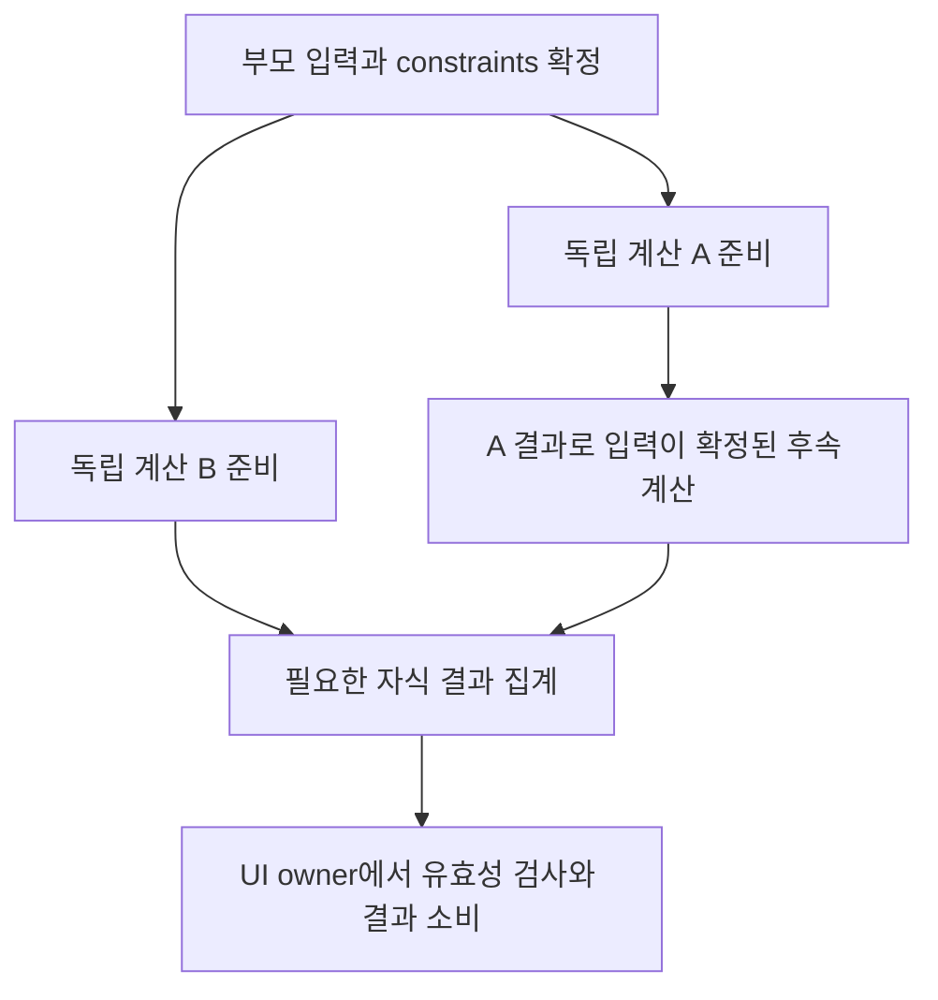

# 트리 의존성에 따라 확장되는 WASM 병렬 레이아웃 구성 계획

작성: 2026-09-08.

**이번 요청 범위:** 새로운 구성 작업계획을 작성하고,
`DorotiTestbedApp/web/DorotiTestbedApp.Web.csproj`에 `WasmEnableThreads=true`를
실제로 설정한다. 병렬 레이아웃 엔진의 구현은 아래 후속 단계이며 이번 문서
작성만으로 실행 완료로 표시하지 않는다. 스레딩 런타임 활성화와 레이아웃의
실제 병렬 실행·성능 수용은 서로 다른 상태다.

**현재 검증 결과:** 설정·Release 빌드·Skia `mt,simd` 선택·문서의 cross-origin
isolation은 확인했다. threaded runtime은 기존 Worker 부팅 경로에서 protocol
오류와 `mono_wasm_pthread_on_pthread_attached` 오류로 first content에 도달하지
못했다. **T0는 FAIL이며 후속 병렬 실행의 선행 해결 과제다.** 상세 증거는 10절.

기준 구현은 [보관된 work.md](history/26-09-08/work.original.md) 9.12절의
**HAMT + indexed**다. 9.13절 C2/C3/C4 실험은
미채택·제품 원복 상태이며 기존 패치, 최초 실패, notComparable/PARTIAL 결과를
보존한다. 새 계획은 이전의 “추가 Worker 제외” 범위를 사용자의 이번 요청에
따라 확장한다. AOT·렌더러 변경·가상화 확대를 함께 적용하는 계획은 아니다.

## 1. 목표와 핵심 가설

부모 계산이 끝나 자식의 입력과 의존성이 확정되면, 동시에 실행 가능한
작업의 폭이 넓어진다. 독립적인 계산이 끝날 때마다 후속 작업을 준비 상태로
만드는 **의존성 기반 작업 그래프**를 구성한다. 트리 깊이별 전체 barrier는
두지 않는다. A의 자식은 B가 끝나지 않았더라도 자신의 의존성이 풀리면 실행한다.

목표는 동일한 입력·논리 노드·State 수명·관찰 가능한 callback 계약을 유지하면서
실제 geometry 계산의 임계 경로를 줄이는 것이다. worker 수나 노드 수만으로
속도 향상을 주장하지 않는다. 비용이 큰 독립 계산을 찾지 못하면 병렬 적용을
중단하고 진단 결과를 남긴다.

가설은 다음 세 가지를 별도로 검증한다.

1. 실제 sample workload에 동시에 준비되는 충분히 큰 순수 계산이 존재한다.
2. 입력 추출·작업 그래프 구성·동기화·결과 반영 비용보다 병렬 계산 이득이 크다.
3. 기존 동작과 같은 작업을 유지한 Web 실행에서 개선이 반복된다.

## 2. 현재 소스와 제약

| 확인한 소스/증거 | 설계에 미치는 영향 |
| --- | --- |
| `Rendering/object.cs`: `PipelineOwner.flushLayout`, `_nodesNeedingLayout`, `_enableMutationsToDirtySubtrees` | dirty 목록은 단순 독립 작업 목록이 아니다. layout 중 새 dirty가 합류하고 재정렬된다. 목록을 Parallel.ForEach로 바꾸지 않는다. |
| `Widgets/layout_builder.cs`: `_rebuildWithConstraints`, `performLayout`의 `runLayoutCallback()` | layout 중 build와 트리 변경이 발생한다. 임의 Widget.build/RenderObject.performLayout은 worker 작업으로 보내지 않는다. |
| `Rendering/flex.cs`: `_computeSizes` | non-flex 결과로 남은 공간을 구한 뒤 flex constraints가 결정된다. parent→child 간선만으로는 부족하고 형제 결과 의존성도 필요하다. |
| `Rendering/section_list.cs`: 자식 생성·layout·extent 갱신 | 보이는 섹션의 수명과 anchor 정책은 유지한다. 29개 섹션이나 좌우 열이라는 이유만으로 독립성을 인정하지 않는다. |
| `Rendering/box.cs`: intrinsic/dry/baseline 캐시와 virtual compute | dry layout도 캐시·override·재진입 계약이 있다. “dry”라는 이름을 순수·스레드 안전의 증거로 쓰지 않는다. |
| `Ui/PlatformDispatcher.cs`: execution-context dispatcher와 frame dispatch | AsyncLocal이 worker로 전달되더라도 UI 접근 권한을 부여한 것이 아니다. owner 권한을 별도로 검사한다. |
| `docs/adr/ADR-002-ui-raster-thread-model.md` | Widget/Element/RenderObject 변경은 UI owner, backend canvas/GPU/present는 해당 renderer owner가 담당한다. immutable scene 전송 계약을 유지한다. |
| `Host.Web/Web/doroti.raster.worker.ts`: direct runtime의 `dotnet.create`와 JSExport 부팅 | 현재 UI 실행을 담당하는 Worker와 .NET pthread 계산 스레드를 구분한다. 계산 스레드마다 독립 .NET UI 런타임을 복제하지 않는다. |
| [work.md 보관본](history/26-09-08/work.original.md) 9.13절 | C2 cache 호출은 해당 resize에서 0회였다. 열 전환 2쌍은 LayoutWork 1208/1295로 달랐다. 해당 수치를 동일 작업 병렬화 기준선으로 재사용하지 않는다. |

확인한 환경: net10.0/browser-wasm, runtime/SDK pack 10.0.11,
SkiaSharp.NativeAssets.WebAssembly 4.152.0-rc.1.26426.14. 설치된 SkiaSharp
targets는 WasmEnableThreads=true에서 `mt`, SIMD=true에서 `mt,simd` archive를
선택한다. 실제 evaluated NativeFileReference와 native link 명령도 검증한다.

## 3. 소유권과 실행 구조

### 3.1 세 실행 영역

| 영역 | 책임 | 금지 |
| --- | --- | --- |
| UI owner | build/lifecycle/GlobalKey, constraints 확정, 입력 snapshot, 결과 검증·반영, dirty/semantics 관리 | 임의 live UI 객체를 계산 worker에 전달 |
| 계산 스레드 풀 | 불변 입력과 전용 출력 영역으로 등록된 순수 kernel 실행, 완료 신호 | Widget/Element/RenderObject 접근·변경, JS/DOM 호출, GPU/공유 Paragraph handle 사용 |
| renderer owner | 기존 committed scene 소비·그리기·present | 계산 worker가 canvas/context를 빌려 쓰거나 중간 geometry를 직접 표시 |

첫 구현은 **계산 스레드 2개**로 고정한다. CPU core 수를 그대로 worker 수로
사용하지 않는다. UI owner와 renderer가 같은 Worker에 있는 현재 direct 경로도
별도 renderer로 변경하지 않는다. 계산 worker의 추가만 독립적으로 비교한다.

### 3.2 계산 그래프

제안 데이터는 임시 이름이며 T2에서 확정한다.

- `LayoutInputSnapshot`: 필요한 수치·불변 값, logical node ID, constraints,
  node/tree/input revision, font/text-scale/direction generation.
- `LayoutJob`: kernel ID, input/output 범위, 아직 끝나지 않은 의존성 수,
  후속 job 범위, frame generation. live 객체·delegate closure를 payload로 넣지 않는다.
- `LayoutResult`: 계산된 geometry/측정값과 원본 revision, 완료/오류 상태.
- UI owner만 가지는 대응표: logical ID → 현재 RenderObject 및 반영 위치.

부모의 순수 constraints 계산 완료 → 입력이 확정된 자식 job 준비 → 독립 자식
계산 병렬 실행 → 필요한 자식 결과가 모인 부모 집계 job 준비 순서로 실행한다.
Flex의 non-flex 집계→flex 공간 분배처럼 형제 결과를 기다리는 의존성을 명시한다.
부모 job이 worker를 점유한 채 자식 job 완료를 기다리게 하지 않는다.



위 흐름은 제안하는 순수 계산 graph다. A1은 B의 완료를 기다리지 않으며,
live Widget/RenderObject callback을 이 graph의 worker node로 옮긴다는 뜻은 아니다.

초기 큐는 bounded ready queue와 완료 큐로 충분하다. 노드마다 Task/closure를
만들거나 즉시 work-stealing·전면 pooling을 도입하지 않는다. 작업량이 작은
인접 kernel은 batch로 묶되 의존성이 아직 풀리지 않은 계산을 함께 시작하지 않는다.
큐 포화 시 UI owner가 계산을 돕는 방식 또는 새 batch 발행 제한을 명시적으로
선택하고, 길이 상한·메모리 상한·fairness·취소 응답을 검사한다.

### 3.3 기존 동기 layout API와의 연결 — 선행 hard gate

`RenderBox.layout()`은 자식 layout 이후 size를 즉시 읽는 동기 계약이다.
그 내부에 await를 넣거나 Task.Wait/Result/Join으로 worker 결과를 기다리는
것만으로는 이 계획을 구현할 수 없다. JS owner event loop가 막히면 worker
초기화나 owner로 전달되는 interop 작업과 교착할 수 있다.

T2/T3에서 **지원하는 built-in 계산 경로만** 순수 kernel로 추출한다. 기존
owner 측 layout 진입·virtual callback은 유지하고, 내부의 순수 계산 helper가
준비된 결과를 소비하도록 하는 경계를 먼저 증명한다. 일반 custom override나
LayoutBuilder가 발견되면 해당 구간은 기존 동기 owner 경로의 불투명한 경계로
취급한다. `compute*`/layout을 미리 한번 호출하고 본 실행에서 다시 호출하는
“사전 계산”으로 계약을 맞추지 않는다.

입력이 확정되지 않은 계산을 추측 실행하지 않는다. 결과의 사전 준비가 가능한
명시적 frame 준비 경계와 재개 지점을 정의하되, public API의 반환 의미와
observable callback 순서를 바꾸지 않는다. 이를 만족하는 integration boundary를
찾지 못하면 T3를 종료하지 않고 구조안을 수정한다. 전체 트리를 snapshot하는
추가 순회와 owner의 serial callback 비용 역시 성능 비용에 포함한다.

### 3.4 대상 선정

| 후보 | 적용 조건 | 초기 판단 |
| --- | --- | --- |
| 알려진 built-in box/flex의 순수 수치 연산 묶음 | 입력 확정, child 결과 의존성 명시, 충분한 self time | 첫 조사 대상. 계산이 너무 작으면 채택하지 않음 |
| 고정 constraints 아래 독립 subtree의 순수 계산 | subtree 내 side effect와 native handle 없이 snapshot으로 표현 가능 | 비용·경계 확인 후 후보 |
| text shaping/paragraph 측정 batch | 별도 thread-owned font/paragraph 상태와 동일 font generation·결과 계약 증명 | 큰 비용이면 별도 후속 후보. 기존 Skia 객체 공유 금지 |
| 임의 Widget.build / custom performLayout / LayoutBuilder | 일반 callback의 순수성·공유 상태 접근을 보장할 수 없음 | 초기 병렬 대상에서 제외; owner에서 원래 순서 실행 |

일반 C# virtual override를 sealed 처리하거나 base 구현으로 우회하지 않는다.
지원 kernel과 정확히 대응하는 구현만 허용하며 알 수 없는 subclass는 직렬 경로로
처리한다. 이 선택은 UI 기능의 fallback이 아니라 명시적인 계산 실행 전략이며,
선택 이유와 대상 수를 진단에 남긴다. renderer fallback을 도입하지 않는다.

## 4. 변경·취소·메모리 계약

1. 같은 frame snapshot에 대해 dependency 순서와 exactly-once 완료를 보장한다.
   ready/completed 상태는 정해진 atomic publication과 acquire/release 규칙으로
   연결한다. 서로 다른 worker가 동일 output slot을 쓰지 않는다.
2. resize/theme/font/image/State 변화로 입력 revision이 달라지면 결과를 반영하지
   않는다. 실제 owner 호출이 필요로 하는 최신 입력을 검증하며, 오래된 결과의
   callback이나 semantics 반영은 금지한다.
3. generation 취소는 협력적으로 처리한다. callback·UI lifecycle을 취소해
   생략하지 않는다. 취소 전 실제 실행한 kernel 수·CPU·버려진 bytes를 기록하고
   추가 작업을 숨겨 “동일 작업” 또는 성능 개선으로 부르지 않는다.
4. 버퍼는 모든 reader/writer의 완료를 확인한 뒤 반납한다. 취소 즉시 pool에
   반환하지 않는다. 공유 참조·오류 객체의 장기 보존과 ABA/reuse 문제를 검사한다.
5. 예외는 owner에게 전달하고 기존 오류 보고·트리 일관성을 유지한다. 실패 결과를
   정상 geometry로 바꾸지 않는다. 런타임/worker 종료 시 미완료 작업을 정리한다.
6. geometry만 같아서는 부족하다. layout 경계, parentUsesSize, dirty 등록/해제,
   GlobalKey 수명, scroll extent/anchor, hit-test, focus, semantics를 함께 검증한다.

## 5. WasmEnableThreads 활성화와 호스팅

이번 요청에서 실제 설정한 위치:

```xml
<!-- DorotiTestbedApp/web/DorotiTestbedApp.Web.csproj -->
<WasmBuildNative>true</WasmBuildNative>
<WasmEnableThreads>true</WasmEnableThreads>
```

`WasmBuildNative`는 managed AOT가 아니다. RunAOTCompilation은 이번에 켜지
않으며 SIMD와 현재 renderer 선택도 별도 변경하지 않는다. Web target 패키지나
모든 앱 템플릿에 스레딩을 일괄 강제하지 않고 이 Testbed 실행 헤드에서 시작한다.

- 단일/멀티 스레드 빌드의 obj/bin, runtime native WASM, pthread JS, Skia archive가
  섞이지 않도록 `--artifacts-path .doroti/work3-threads/artifacts`에서 처음 빌드한다.
- 런타임 pack이 `Microsoft.NETCore.App.Runtime.Mono.multithread.browser-wasm`
  계열인지, JS thread module과 shared WebAssembly.Memory가 실제 로드됐는지 확인한다.
  csproj/evaluated property true만으로 runtime 활성화를 PASS 처리하지 않는다.
- shared memory를 사용하는 origin에는 COOP `same-origin`, COEP `require-corp`
  또는 명시적으로 검증한 대안과 secure context가 필요하다. 문서와 Worker에서
  `crossOriginIsolated`를 확인한다. 로컬 loopback과 운영 HTTPS 환경을 구분한다.
- 다른 origin의 이미지·폰트·스크립트가 COEP/CORS/CORP 조건을 충족하는지 확인한다.
  헤더를 끄거나 보안 옵션을 무시한 브라우저 실행으로 통과시키지 않는다.
- 기존 JSExport/JSImport는 허용된 runtime owner에서 호출한다. 계산 스레드가
  native canvas/Paragraph handle을 사용할 수 있다고 추정하지 않는다.
- 별도 작은 thread smoke에서는 managed thread ID뿐 아니라 두 계산의 실행
  구간 중첩·정확한 결과·owner 복귀를 검사한다. Worker 수/ProcessorCount만으로
  레이아웃 병렬화 또는 CPU 동시 실행 이득을 입증하지 않는다.
- 스레딩 부팅 실패와 runtime platform 예외는 T0 hard gate다. 실패 시 원인을
  기록하고, 플래그를 몰래 false로 바꾸거나 document renderer로 우회하지 않는다.

## 6. 구성 파일과 책임

| 제안 위치 | 책임 |
| --- | --- |
| `DorotiTestbedApp/web/DorotiTestbedApp.Web.csproj` | 실제 threaded runtime 활성화; 이번 요청 반영 |
| `Doroti/src/Doroti.Framework.LayoutCompute/` (신규 제안) | UI 라이브 객체에 의존하지 않는 값 타입 입력/결과, kernel, dependency graph, 직렬 실행기 |
| 같은 모듈의 실행기 또는 작은 공용 Runtime 모듈 | bounded queue, 두 계산 스레드, 완료/취소/버퍼 수명. thread API 허용 프로젝트 참조는 실제 SDK에 맞춰 확정 |
| `Doroti/src/Doroti.Framework.Rendering/` | 지원 경로의 snapshot/결과 bridge와 owner integration; reviewed source marker 유지 |
| `Doroti/src/Doroti.Framework.Widgets/` | 불투명 build/LayoutBuilder 경계의 보존. 임의 build 병렬 실행은 추가하지 않음 |
| `Doroti/src/Doroti.Ui/` 및 Web host | generation, frame 준비·재개, owner 권한과 shutdown 연결 |
| `Doroti/validation/layout-compute/` (신규 제안) | 순수 kernel·graph·재진입/오류/취소/수명·직렬/병렬 계약 |
| `Doroti/validation/web-playwright/` | 격리 origin 확인, thread bootstrap, 같은 입력 성능/회귀 |
| `history/26-09-08/` 및 후속 실행 날짜 | 최초 실패, source/asset hashes, run ledger, 채택/미채택 및 미검증 증거 |

ADR-002의 UI 변경 소유권은 유지한다. frame 준비/재개를 추가할 경우 새로운
ADR에서 현재 topology별 owner를 명시한다. public layout/callback 계약을 바꾸는
방향이 필요하면 기존 호환 최적화와 구분해 계획을 수정한 뒤 진행한다.

## 7. 실행 단계와 종료 조건

| 단계 | 실행 | 종료 조건 | 현재 상태 |
| --- | --- | --- | --- |
| T0 스레딩 기반 | flag true, 격리 빌드, Skia mt/interop/headers/부팅 검사 | 새 runtime에서 first content·입력·오류·shared memory 확인; 지원 한계 기록 | 설정·빌드 PASS, browser bootstrap FAIL |
| T1 비용과 의존성 | current HEAD/dirty 고정; 실제 resize의 self time·준비 가능한 계산 폭·임계 경로 조사 | callback/build/layout/paint/encode 구분, 병렬화 가능한 비중과 최초 후보 1개 확정 | 미착수 |
| T2 순수 kernel 추출 | 불변 입력→결과, 명시적 의존성, 직렬 executor | 기존 경로 대비 logical target/횟수/필수 순서·geometry 차이 0; 직렬 추출 자체 비용 보고 | 미착수 |
| T3 owner 연결 | 기존 동기 layout 계약을 지키는 사전 준비/결과 소비 경계, unsupported 구간 유지 | callback 추가/생략/순서 변화 0, live UI 접근 0, owner event loop 교착 0 | 미착수 |
| T4 2-thread executor | bounded ready/completion 큐, dependency counter, batching, 오류/취소/shutdown | 직렬 graph와 결과 동일, 실제 계산 중첩 확인, bounded memory, 취소 후 참조 해제 | 미착수 |
| T5 실제 Web 통합 비교 | 동일 threaded runtime에서 직렬 executor A / 2-thread B | 그래프 구성·snapshot·동기화·반영 포함 전체 callback/정착 지연과 비대상 회귀 판정 | 미착수 |
| T6 플랫폼·내구성 | generator/수동 소스 소유 방식, 다른 host 직렬 동작, Web boot/asset/기기 검사 | 플랫폼별 PASS/FAIL/notVerified, 전체 메모리/사용자 수용 구분 | 미착수 |
| T7 채택과 기록 | 마지막 변경 후 결과·편차·원본 실패·패치·기본 설정 정리 | 개선 미확인 후보는 원복/미채택; 사용자 요청의 thread flag 상태를 별도로 명시 | 미착수 |

T0의 다음 작업은 아래 순서로 진행한다.

1. 현재 .NET 10.0.11과 Worker 내부 `dotnet.create()`의 최소 재현을 만든다.
   Doroti protocol 오류와 runtime attach 오류를 분리하고, 실제 Worker 메시지의
   envelope·발신자를 수집한다. 현재 오류만으로 .NET threading 전체가 지원되지
   않는다고 결론 내리지 않는다.
2. 공식 runtime 메시지와 Doroti 메시지의 소유 경계를 확인한다. 모든 미지의
   메시지를 무시하는 수정은 금지하고, Doroti protocol 검증을 유지한다.
   메시지 분리만으로 runtime의 `dispatchEvent` 오류까지 해결됐다고 추정하지 않는다.
3. 설치 버전의 runtime 초기화·JS interop affinity를 검증한다. generated runtime
   파일이나 내부 상태를 임의 패치해 통과시키지 않는다. 현재 Worker owner 구조를
   유지하는 해결책을 우선 검증하며 topology 변경이 필수라면 ADR와 이 계획의
   소유권·비교군을 먼저 갱신한다.
4. 해결 후 새로운 label로 first content → shared heap/runtime flag → resize/input
   → managed 계산 중첩을 검증한다. 최초 FAIL은 보존한다. T1의 비용 조사는
   기존 S0에서 가능하지만 T4/T5 실제 threaded 실행은 T0 통과 전 승격하지 않는다.

T1은 단순 전체 inclusive timer 합계를 사용하지 않는다. 기존 320ms급 callback
전체가 순수 layout 비용이라는 전제를 두지 않는다. 후보 kernel의 비용·count와
snapshot/commit 비용을 분해하고, profile 수집 불가 항목은 notMeasured로 남긴다.

## 8. 검증 설계와 실행 예산

### 8.1 비교군

- **S0:** 기존 단일 스레드 runtime + 현재 HAMT/indexed. T0에서 threading 자체의
  boot/메모리/interop 영향을 분리할 때만 사용하며 고정 artifact로 보존한다.
- **S1:** threaded runtime + 기존 layout. flag 활성화가 layout 병렬화가 아님을 확인.
- **A:** threaded runtime + 추출한 graph의 직렬 실행. 구조 추출 overhead를 S1과 비교.
- **B:** 같은 threaded runtime/graph/kernel + 계산 스레드 2개. A/B로 병렬화만 비교.

각 실험에서 어느 쌍을 비교하는지 먼저 고정한다. AOT·renderer·DPR·font·diagnostics
수준이 다른 산출물을 섞지 않는다. contract trace와 latency trace는 분리한다.

### 8.2 계약 fixture

동일 logical node ID와 고정 입력 tick에서 직렬/병렬을 비교한다. 완료 순서는
worker별로 달라도 되지만, 필수 callback/반영 순서는 기존 계약을 따른다.
첫 불일치와 trace overflow/drop을 보존하며 comparator를 느슨하게 바꾸지 않는다.

필수 사례: 독립 형제, non-flex→flex 의존성, 깊고 좁은 트리와 넓고 얕은 트리,
child 입력이 뒤늦게 확정되는 경우, dirty-same-constraints, nested LayoutBuilder,
reparent 중 새 dirty, custom override의 직렬 경로, worker 예외·queue 포화·취소와
동시 완료·dispose/shutdown, font/RTL/text-scale/image 크기 변경. 기존 HAMT,
section-index, sample-columns, virtual-dispatch와 155-event fixture를 재사용하되
이들이 전체 Flutter 내부 trace나 물리 기기 수용을 대신하지 않음을 기록한다.

### 8.3 실제 workload

주 workload는 29개 섹션 materialized ID 0–28을 확인하고 같은 화면·anchor로
돌아온 후 같은 열 resize와 열 전환을 구분하는 기존 16입력 시나리오다.
요청 width뿐 아니라 적용된 metrics generation·논리 tick·작업 수를 비교한다.
연속 입력에서 작업량이 달라지면 notComparable로 기록하고 결정적 입력 fixture로
원인을 분리한다. 반복 실행으로 유리한 표본만 남기지 않는다.

대조군은 cold first content, scroll/progress 중 비용 분석에 맞는 최소 항목이다.
owner callback, 최종 generation의 exact-rendered commit, input-to-final latency,
kernel self time, queue wait/실제 중첩, snapshot/commit bytes, worker stack/managed
heap/WASM capacity/process memory를 분리한다. 오래된 결과의 표시, CSS 확대,
worker 알림 간격을 정답 화면 또는 물리 FPS로 세지 않는다.

### 8.4 실행 횟수

모든 test/build/benchmark는 **외부 timeout 20분**, 자동 retry 0, GPU/browser와
build는 순차 실행한다. 이번 설정/부팅 확인과 후속 실제 병렬화 corpus는 각각
ledger를 만든다. 초기 실행은 기본 10회 이내, 독립 검증 추가의 이유를 기록한
경우에만 **최대 20회**다. 최초 실패·setup 재시도·warm-up 전용 실행도 포함한다.

후속 비교의 예산 예: 진단/계약 4회 + 주 workload A/B 3쌍 6회 = 10회.
필요 시 최소 계측/대조군·부팅·추가 계약을 포함해 총 20회 이내에서 재배분한다.
회수는 독립 실행 단위이며 한 실행에 수백 번 resize를 넣어 숨기지 않는다.
단위 fixture 내부의 deterministic case 수와 실제 입력 수는 별도로 기록한다.

## 9. 채택 gate와 중단 조건

**필수 기능 gate:** 동일 target/compute/callback 계약 차이 0, State·geometry·
anchor·hit-test·semantics 회귀 0, worker의 live UI 접근 0, 오래된 결과 반영 0,
deadlock 0. 함수 반환/콜백을 뒤로 미루거나 대상 계산을 생략해서 얻은 개선은
이번 “같은 작업 병렬화”의 성과로 세지 않는다.

**성능 gate:** 같은 graph A/B의 3쌍에서 전체 지연 개선이 반복되고, snapshot/
동기화/commit을 포함한 비용·메모리·cold 진입·비대상 회귀가 설명돼야 한다.
추출 전 S1 대비 개선도 확인한다. 병렬 kernel만 빨라졌으면 componentOnly다.
작은 표본의 p95를 안정적 통계로 주장하지 않는다. 기존 30% 구조 개선과
16.7/33.3/50/100ms 목표는 별도로 유지하며 새 작은 개선으로 PASS를 바꾸지 않는다.

비대상 p95 10% 초과 악화, live/transient memory 10% 초과 증가, 유효 trace 누락,
target 불일치, owner blocking 또는 3쌍에서 개선 미확인은 승격 보류 조건이다.
스레드 풀의 기본 상주 메모리까지 포함한다. 단일 kernel이 충분히 크지 않거나
의존성 때문에 동시에 준비되는 작업량이 작으면 무리하게 worker 수를 늘리지 않는다.

성능 후보를 원복하더라도 이번에 사용자가 명시한 WasmEnableThreads 활성화와
실제 지원 상태를 별도 기록한다. 런타임 자체가 실행되지 않는 경우는 설정 반영과
실행 실패를 구분하고 정상 실행이라고 보고하지 않는다.

## 10. 이번 요청의 실제 실행 기록

- [x] 현재 소스·ADR·이전 C2/C3/C4 실패와 비교 한계 검토
- [x] 이 계획 작성: 의존성 graph, owner 경계, 직렬 기준선과 2-thread 후보,
  동기 API hard gate, 취소/메모리/검증·예산 포함
- [x] Testbed Web csproj의 `WasmEnableThreads=true` 설정
- [x] 격리 Release build 및 mt native/runtime asset 확인 — PASS
- [x] COOP/COEP 응답과 document `crossOriginIsolated=true` 확인 — PASS
- [ ] threaded runtime의 first content·입력·오류 없음 — 실행했으나 FAIL
- [ ] 실제 managed 계산 스레드 smoke (후속 T0)
- [ ] T1–T7 병렬 레이아웃 구성 구현·비교·수용 (후속 작업)

이번 활성화 검증 ledger는 **2회**다. 외부 timeout은 각각 20분이며 자동 재시도는
없다. 소스·설정 조회와 정적 asset freeze는 별도 준비 작업이다.

| 회차 | 실행 | 결과 |
| --- | --- | --- |
| 1 | `work3-threads-build`: 별도 artifacts 경로의 Release build | PASS, 2:00.23, warning/error 0. multithread runtime 10.0.11, Skia `mt,simd`, pthread JS 산출물 확인 |
| 2 | `work3-threads-browser`: Chromium 151.0.7922.34, localhost:5192, label `enabled-1` | FAIL. isolation true지만 protocol version `undefined`와 runtime `dispatchEvent` 오류 발생. first content 대기 120초 후 종료 |

브라우저가 first content에 도달하지 않아 resize·wheel 입력, runtime API를 통한
shared heap 확인, managed 계산 중첩은 **notVerified**다. `.NET` pthread 파일의
HTTP 200이나 shared-memory 지원 브라우저라는 사실로 이 항목을 대신하지 않는다.

확인한 host 소스는 `doroti.web.ts`의 `attachWorker`가 받은 메시지를 Doroti
protocol로 decode하고, `doroti.raster.worker.ts`가 Worker 안에서 runtime을
생성하는 구조다. 공식 runtime 소스에는 별도 pthread 제어 메시지와 attach
이벤트 경로가 있다. **메시지 충돌과 Worker-root 초기화 호환성은 진단 가설**이며,
정확한 발신 envelope와 설치 버전의 최소 재현은 T0에서 추가 확인한다.

재현 명령·설정·원본 실패는
[wasm-threads-bootstrap.md](history/26-09-08/wasm-threads-bootstrap.md)와
[wasm-threads-bootstrap-failure.json](history/26-09-08/wasm-threads-bootstrap-failure.json)에
보존한다. 검증용 헤더 서버는 `Doroti/eng/serve-isolated-web.py`, 브라우저 probe는
`Doroti/validation/web-playwright/probe-threaded-bootstrap.mjs`다. 이 서버는 로컬
검증 전용이며 운영 호스팅의 header 설정 완료를 뜻하지 않는다.

`WasmEnableThreads=true`는 유지한다. 현재 설정의 새 Web 빌드는 위 부팅 실패가
있으며 정상 실행으로 승격하지 않았다. 기존 단일 스레드 비교 산출물 S0는 별도로
보존했다. 병렬 레이아웃 엔진 구현과 성능 개선은 아직 완료하지 않았다.

## 11. 공식 근거

2026-09-08 확인. .NET 문서는 v10.0.0 설계와 현재 설치 10.0.11 package/targets를
함께 대조한다. main 문서와 issue의 현재 상태는 버전 고정 API 보증이 아니다.

- R1: dotnet/runtime v10.0.0 [WASM 기능·threading·호스팅·interop 제약](https://github.com/dotnet/runtime/blob/v10.0.0/src/mono/wasm/features.md).
- R2: dotnet/runtime v10.0.0 [threaded runtime와 전용 JS 스레드](https://github.com/dotnet/runtime/blob/v10.0.0/src/mono/wasm/threads.md).
- R3: Microsoft [Blazor multithreading 추적](https://github.com/dotnet/aspnetcore/issues/17730), [.NET 10/11 startup 차이 사례](https://github.com/dotnet/runtime/issues/131311). 이슈 하나를 모든 Doroti topology 지원의 증거로 쓰지 않는다.
- R4: MDN [crossOriginIsolated](https://developer.mozilla.org/en-US/docs/Web/API/Window/crossOriginIsolated), [SharedArrayBuffer 조건](https://developer.mozilla.org/en-US/docs/Web/JavaScript/Reference/Global_Objects/SharedArrayBuffer).
- R5: Flutter [Inside Flutter](https://docs.flutter.dev/resources/inside-flutter), 고정 revision `56b8e1a851a594b1a154f8ea93270807dab22b9a`의 로컬 `reference/flutter-master/packages/flutter/lib/src/rendering/{object,flex,box}.dart` 및 `widgets/layout_builder.dart`.
- R6: SkiaSharp [native assets threading 선택](https://github.com/mono/SkiaSharp/blob/main/binding/IncludeNativeAssets.SkiaSharp.targets). 실제 선택 근거는 설치된 `4.152.0-rc.1.26426.14/buildTransitive/netstandard1.0/SkiaSharp.NativeAssets.WebAssembly.targets`.
- R7: dotnet/runtime v10.0.0 [pthread worker 초기화와 attach](https://github.com/dotnet/runtime/blob/v10.0.0/src/mono/browser/runtime/pthreads/worker-thread.ts), [pthread 제어 메시지](https://github.com/dotnet/runtime/blob/v10.0.0/src/mono/browser/runtime/pthreads/shared.ts). 오류 경로 해석용이며 설치 10.0.11의 원인 확정 증거와 구분한다.
