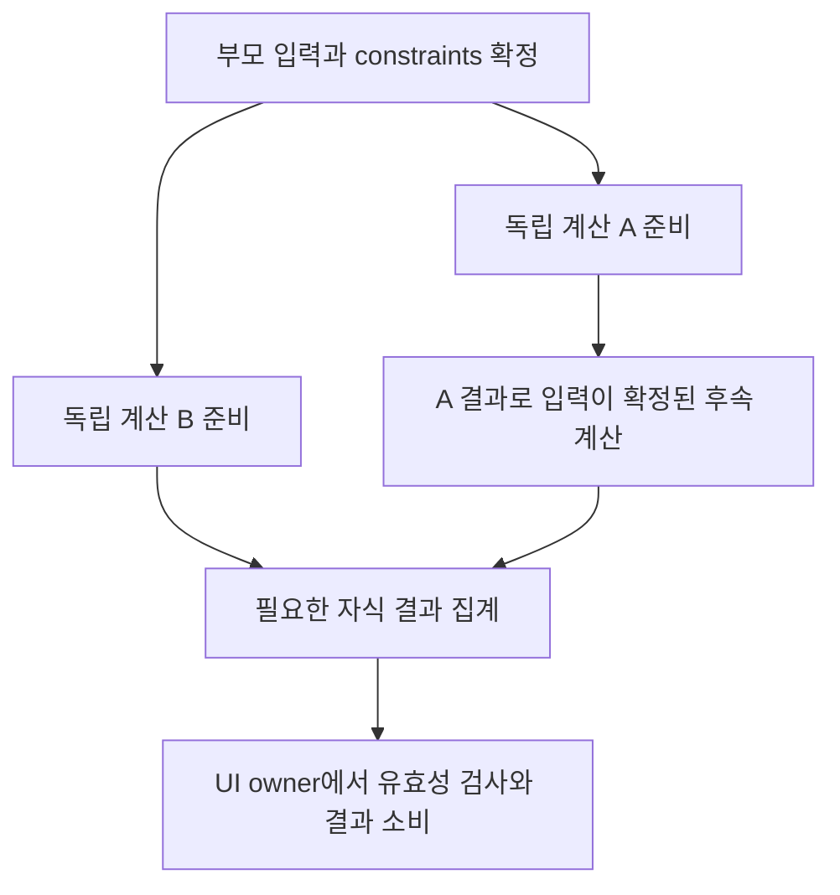

# SkiaSharp 4.154 전환·WebGPU 추가·WASM 병렬 레이아웃 통합 작업계획

작성: 2026-09-08.

**현재 작업 기준:** 2026-09-08 사용자가 현재 구조가 이전보다 체감상 낫다고
평가하고, 이 구조를 기반으로 후속 작업하도록 선택했다. 메인에서 단일 threaded
.NET runtime을 초기화하고, 같은 runtime의 JSWebWorker에서 기존 framework/layout/
Skia direct 렌더링을 수행하는 구성을 **현재 기준선 S1**로 채택한다.
후속 최적화와 원복의 출발점은 S1이다. 소유권·전용 MessagePort·종료 계약은
[ADR-003](Doroti/docs/adr/ADR-003-web-main-runtime-render-worker.md)을 따른다.

**이번 요청 범위:** SkiaSharp를 `4.154.0-preview.1.26454.9`로 전환하는 계획과
WebGPU 경로 추가 계획을 기존 병렬 레이아웃 계획에 통합한다. 이번 변경은 문서만
수정하며 패키지 전환·제품 코드·GPU/병렬 계산 구현과 실행 검증은 후속 작업이다.
`WasmEnableThreads=true`, `runtimeLocation="main"`을 유지하고, 먼저 기존
`worker-direct-webgl`에서 버전 전환을 검증한 뒤 명시적 선택 모드
`worker-direct-webgpu`를 추가한다. WebGPU 기본값 전환은 이번 계획에 포함하지 않는다.

**통합 순서:** S1 보존 → U0–U3 패키지 전환/기존 WebGL 회귀 → G0–G4 WebGPU
추가/독립 판정 → T1–T7 병렬 레이아웃 조사·구현/독립 판정 → J0 조합 검증.
G 단계가 막혀도 U 단계가 통과했다면 WebGL에서 T 단계를 계속할 수 있다.
패키지·렌더러·계산 방식의 효과를 한 비교에 섞지 않는다. 상세는 7·13–15절이다.

**사용자 관찰:** 기존 구조보다 체감이 좋아졌다는 피드백을 기준 구조 선택의
근거로 기록한다. 정량적 지연·FPS·메모리 개선율은 아직 측정하지 않았으며,
전체 물리 기기·입력 기능의 수용 완료와도 구분한다.

**현재 검증 결과:** 메인 runtime + shared-runtime 렌더 Worker로 전환한 최종
trimmed Release publish에서 first content·resize·스크롤·선택 상태·테마/열 복귀·
종료·잘못된 protocol 거부가 PASS다. shared heap과 실제 렌더 thread를 확인했고
runtime 오류는 0건이다. **T0 기준 구조의 부팅·입력은 PASS**, 추가 계산 스레드의
실제 중첩 검증(T0b)은 미완료다.
최초 Worker-root FAIL은 10절에 보존하고 후속 결과는 12절에 기록한다.

S1은 [보관된 work.md](history/26-09-08/work.original.md) 9.12절의
**HAMT + indexed**에 현재 메인 runtime + 렌더 Worker 구성을 적용한 상태다.
9.13절 C2/C3/C4 실험은
미채택·제품 원복 상태이며 기존 패치, 최초 실패, notComparable/PARTIAL 결과를
보존한다. 병렬 레이아웃 계획은 앞선 사용자 요청에 따라 이전의 “추가 Worker 제외”
범위를 확장한 것이다. 이번 통합은 렌더러 추가도 별도 단계로 포함한다.
AOT·가상화 확대는 제외하고, 렌더러 변경과 병렬 계산은 독립 검증 후에만 조합한다.

## 1. 목표와 핵심 가설

현재 S1의 부팅·입력·소유권 계약을 유지하면서 세 가지 변경을 순서대로 검증한다.
첫째는 모든 사용 host의 SkiaSharp 패키지 정합성을 유지하는 4.154 전환,
둘째는 공식 Graphite/Dawn API를 사용하는 WebGPU 추가, 셋째는 순수 layout 계산의
병렬화다. WebGPU가 C# build/layout 비용을 직접 줄인다고 가정하지 않는다.
패키지 전환 후 고정한 WebGL 기준선 L에서 렌더 Worker의 실제 비용을 조사하고,
가치 있는 순수 계산을 찾은 뒤 아래 graph를 단계적으로 적용한다.
후보가 없거나 전체 비용이 늘면 해당 실험 직전의 검증된 기준선을 유지한다.

부모 계산이 끝나 자식의 입력과 의존성이 확정되면, 동시에 실행 가능한
작업의 폭이 넓어진다. 독립적인 계산이 끝날 때마다 후속 작업을 준비 상태로
만드는 **의존성 기반 작업 그래프**를 구성한다. 트리 깊이별 전체 barrier는
두지 않는다. A의 자식은 B가 끝나지 않았더라도 자신의 의존성이 풀리면 실행한다.

목표는 동일한 입력·논리 노드·State 수명·관찰 가능한 callback 계약을 유지하면서
실제 geometry 계산의 임계 경로를 줄이는 것이다. worker 수나 노드 수만으로
속도 향상을 주장하지 않는다. 비용이 큰 독립 계산을 찾지 못하면 병렬 적용을
중단하고 진단 결과를 남긴다.

가설은 다음 세 가지를 별도로 검증한다.

1. 실제 sample workload에 동시에 준비되는 충분히 큰 순수 계산이 존재한다.
2. 입력 추출·작업 그래프 구성·동기화·결과 반영 비용보다 병렬 계산 이득이 크다.
3. 기존 동작과 같은 작업을 유지한 Web 실행에서 개선이 반복된다.

## 2. 현재 소스와 제약

| 확인한 소스/증거 | 설계에 미치는 영향 |
| --- | --- |
| `Rendering/object.cs`: `PipelineOwner.flushLayout`, `_nodesNeedingLayout`, `_enableMutationsToDirtySubtrees` | dirty 목록은 단순 독립 작업 목록이 아니다. layout 중 새 dirty가 합류하고 재정렬된다. 목록을 Parallel.ForEach로 바꾸지 않는다. |
| `Widgets/layout_builder.cs`: `_rebuildWithConstraints`, `performLayout`의 `runLayoutCallback()` | layout 중 build와 트리 변경이 발생한다. 임의 Widget.build/RenderObject.performLayout은 worker 작업으로 보내지 않는다. |
| `Rendering/flex.cs`: `_computeSizes` | non-flex 결과로 남은 공간을 구한 뒤 flex constraints가 결정된다. parent→child 간선만으로는 부족하고 형제 결과 의존성도 필요하다. |
| `Rendering/section_list.cs`: 자식 생성·layout·extent 갱신 | 보이는 섹션의 수명과 anchor 정책은 유지한다. 29개 섹션이나 좌우 열이라는 이유만으로 독립성을 인정하지 않는다. |
| `Rendering/box.cs`: intrinsic/dry/baseline 캐시와 virtual compute | dry layout도 캐시·override·재진입 계약이 있다. “dry”라는 이름을 순수·스레드 안전의 증거로 쓰지 않는다. |
| `Ui/PlatformDispatcher.cs`: execution-context dispatcher와 frame dispatch | AsyncLocal이 worker로 전달되더라도 UI 접근 권한을 부여한 것이 아니다. owner 권한을 별도로 검사한다. |
| `docs/adr/ADR-002-ui-raster-thread-model.md` | Widget/Element/RenderObject 변경은 UI owner, backend canvas/GPU/present는 해당 renderer owner가 담당한다. immutable scene 전송 계약을 유지한다. |
| `DorotiTestbedApp/web/src/doroti_bootstrap.ts`, Web csproj | `runtimeLocation="main"`, `WasmEnableThreads=true`가 현재 Testbed 기준이다. |
| `Host.Web/Web/doroti.web.managed-worker.ts`, `BrowserManagedRenderThread.cs` | 메인에서 runtime 1개 초기화, shared-runtime JSWebWorker에 렌더 역할 연결. 전용 MessagePort와 trim 보존된 JSWebWorker adapter 유지. |
| `Host.Web/Web/doroti.raster.worker.ts` | 현재 S1은 기존 runtime을 받아 framework/layout/Skia를 실행한다. 파일에 남은 독립 Worker runtime 생성 경로는 S1의 부팅 경로가 아니다. |
| `Host.Web/BrowserHostContracts.cs`, `Host.Web/Web/doroti.web.ts` | timer의 JS frame 요청을 캡처한 owner context로 전달하고 `disposed`까지 DOM endpoint 유지. 후속 계산 완료·취소에도 이 경계를 유지한다. |
| [work.md 보관본](history/26-09-08/work.original.md) 9.13절 | C2 cache 호출은 해당 resize에서 0회였다. 열 전환 2쌍은 LayoutWork 1208/1295로 달랐다. 해당 수치를 동일 작업 병렬화 기준선으로 재사용하지 않는다. |

현재 제품 환경: net10.0/browser-wasm, runtime/SDK pack 10.0.11,
SkiaSharp.NativeAssets.WebAssembly 4.152.0-rc.1.26426.14. 설치된 SkiaSharp
targets는 WasmEnableThreads=true에서 `mt`, SIMD=true에서 `mt,simd` archive를
선택한다. 실제 evaluated NativeFileReference와 native link 명령도 검증한다.

전환 대상 `4.154.0-preview.1.26454.9`의 태그 소스와 배포 NuGet에는 Graphite
C# API, Dawn 구현을 포함한 WASM `3.1.56/mt`·`mt,simd` archive와
`emdawnwebgpu` 연결 코드가 존재한다. 이는 지원 기반 확인이며 Doroti 실행 PASS가
아니다. 13절에 확인 범위와 패키지 전환 gate, 14절에 WebGPU 연결 제약을 기록한다.

## 3. 소유권과 실행 구조

### 3.1 현재 두 실행 영역과 추가할 계산 영역

| 영역 | 책임 | 금지 |
| --- | --- | --- |
| 브라우저 메인 (현재) | .NET runtime 1개 초기화, DOM/input/IME/semantics endpoint, 렌더 역할과 전용 port 통신 | runtime 초기화 위치를 UI 트리 변경 권한으로 해석 |
| 렌더 JSWebWorker (현재 UI owner + renderer owner) | build/lifecycle/GlobalKey, constraints 확정, snapshot, 결과 검증·반영, dirty/semantics 계산, Skia/GPU/present | live UI 객체·canvas/context를 계산 스레드에 전달, 중간 geometry 표시 |
| managed 계산 스레드 2개 (추가 예정) | 같은 runtime/shared heap에서 불변 입력과 전용 출력 영역으로 순수 kernel 실행, 완료 신호 | Widget/Element/RenderObject 접근·변경, JS/DOM 호출, GPU/공유 Paragraph handle 사용 |

이 문서의 **UI owner는 브라우저 메인이 아니라 현재 렌더 JSWebWorker**다.
layout과 raster의 소유 스레드는 그대로 두고 순수 계산만 추가 영역으로 분리한다.
첫 병렬 executor의 동시 실행 한도는 **계산 스레드 2개**다. 렌더 Worker와
runtime 내부 pthread까지 포함한 전체 브라우저 Worker 수가 2개라는 뜻은 아니다.
CPU core 수를 그대로 worker 수로 사용하거나 계산 스레드마다 runtime을 복제하지 않는다.

메인↔렌더 통신의 전용 MessagePort, strict protocol, owner context의 JS interop,
`closed`→`disposed` 종료 순서를 유지한다. 계산 완료는 렌더 owner로 전달하고
메인 DOM 스레드에서 geometry를 반영하지 않는다. 순수 계산용 실행 API는 T0b에서
확정하며 JS-affine 렌더 역할을 일반 Task.Run으로 대체하지 않는다.

### 3.2 계산 그래프

제안 데이터는 임시 이름이며 T2에서 확정한다.

- `LayoutInputSnapshot`: 필요한 수치·불변 값, logical node ID, constraints,
  node/tree/input revision, font/text-scale/direction generation.
- `LayoutJob`: kernel ID, input/output 범위, 아직 끝나지 않은 의존성 수,
  후속 job 범위, frame generation. live 객체·delegate closure를 payload로 넣지 않는다.
- `LayoutResult`: 계산된 geometry/측정값과 원본 revision, 완료/오류 상태.
- UI owner만 가지는 대응표: logical ID → 현재 RenderObject 및 반영 위치.

부모의 순수 constraints 계산 완료 → 입력이 확정된 자식 job 준비 → 독립 자식
계산 병렬 실행 → 필요한 자식 결과가 모인 부모 집계 job 준비 순서로 실행한다.
Flex의 non-flex 집계→flex 공간 분배처럼 형제 결과를 기다리는 의존성을 명시한다.
부모 job이 worker를 점유한 채 자식 job 완료를 기다리게 하지 않는다.



위 흐름은 제안하는 순수 계산 graph다. A1은 B의 완료를 기다리지 않으며,
live Widget/RenderObject callback을 이 graph의 worker node로 옮긴다는 뜻은 아니다.

초기 큐는 bounded ready queue와 완료 큐로 충분하다. 노드마다 Task/closure를
만들거나 즉시 work-stealing·전면 pooling을 도입하지 않는다. 작업량이 작은
인접 kernel은 batch로 묶되 의존성이 아직 풀리지 않은 계산을 함께 시작하지 않는다.
큐 포화 시 UI owner가 계산을 돕는 방식 또는 새 batch 발행 제한을 명시적으로
선택하고, 길이 상한·메모리 상한·fairness·취소 응답을 검사한다.

### 3.3 기존 동기 layout API와의 연결 — 선행 hard gate

`RenderBox.layout()`은 자식 layout 이후 size를 즉시 읽는 동기 계약이다.
그 내부에 await를 넣거나 Task.Wait/Result/Join으로 worker 결과를 기다리는
것만으로는 이 계획을 구현할 수 없다. JS owner event loop가 막히면 worker
초기화나 owner로 전달되는 interop 작업과 교착할 수 있다.

T2/T3에서 **지원하는 built-in 계산 경로만** 순수 kernel로 추출한다. 기존
owner 측 layout 진입·virtual callback은 유지하고, 내부의 순수 계산 helper가
준비된 결과를 소비하도록 하는 경계를 먼저 증명한다. 일반 custom override나
LayoutBuilder가 발견되면 해당 구간은 기존 동기 owner 경로의 불투명한 경계로
취급한다. `compute*`/layout을 미리 한번 호출하고 본 실행에서 다시 호출하는
“사전 계산”으로 계약을 맞추지 않는다.

입력이 확정되지 않은 계산을 추측 실행하지 않는다. 결과의 사전 준비가 가능한
명시적 frame 준비 경계와 재개 지점을 정의하되, public API의 반환 의미와
observable callback 순서를 바꾸지 않는다. 이를 만족하는 integration boundary를
찾지 못하면 T3를 종료하지 않고 구조안을 수정한다. 전체 트리를 snapshot하는
추가 순회와 owner의 serial callback 비용 역시 성능 비용에 포함한다.

### 3.4 대상 선정

| 후보 | 적용 조건 | 초기 판단 |
| --- | --- | --- |
| 알려진 built-in box/flex의 순수 수치 연산 묶음 | 입력 확정, child 결과 의존성 명시, 충분한 self time | 첫 조사 대상. 계산이 너무 작으면 채택하지 않음 |
| 고정 constraints 아래 독립 subtree의 순수 계산 | subtree 내 side effect와 native handle 없이 snapshot으로 표현 가능 | 비용·경계 확인 후 후보 |
| text shaping/paragraph 측정 batch | 별도 thread-owned font/paragraph 상태와 동일 font generation·결과 계약 증명 | 큰 비용이면 별도 후속 후보. 기존 Skia 객체 공유 금지 |
| 임의 Widget.build / custom performLayout / LayoutBuilder | 일반 callback의 순수성·공유 상태 접근을 보장할 수 없음 | 초기 병렬 대상에서 제외; owner에서 원래 순서 실행 |

일반 C# virtual override를 sealed 처리하거나 base 구현으로 우회하지 않는다.
지원 kernel과 정확히 대응하는 구현만 허용하며 알 수 없는 subclass는 직렬 경로로
처리한다. 이 선택은 UI 기능의 fallback이 아니라 명시적인 계산 실행 전략이며,
선택 이유와 대상 수를 진단에 남긴다. renderer fallback을 도입하지 않는다.

## 4. 변경·취소·메모리 계약

1. 같은 frame snapshot에 대해 dependency 순서와 exactly-once 완료를 보장한다.
   ready/completed 상태는 정해진 atomic publication과 acquire/release 규칙으로
   연결한다. 서로 다른 worker가 동일 output slot을 쓰지 않는다.
2. resize/theme/font/image/State 변화로 입력 revision이 달라지면 결과를 반영하지
   않는다. 실제 owner 호출이 필요로 하는 최신 입력을 검증하며, 오래된 결과의
   callback이나 semantics 반영은 금지한다.
3. generation 취소는 협력적으로 처리한다. callback·UI lifecycle을 취소해
   생략하지 않는다. 취소 전 실제 실행한 kernel 수·CPU·버려진 bytes를 기록하고
   추가 작업을 숨겨 “동일 작업” 또는 성능 개선으로 부르지 않는다.
4. 버퍼는 모든 reader/writer의 완료를 확인한 뒤 반납한다. 취소 즉시 pool에
   반환하지 않는다. 공유 참조·오류 객체의 장기 보존과 ABA/reuse 문제를 검사한다.
5. 예외는 owner에게 전달하고 기존 오류 보고·트리 일관성을 유지한다. 실패 결과를
   정상 geometry로 바꾸지 않는다. 런타임/worker 종료 시 미완료 작업을 정리한다.
6. geometry만 같아서는 부족하다. layout 경계, parentUsesSize, dirty 등록/해제,
   GlobalKey 수명, scroll extent/anchor, hit-test, focus, semantics를 함께 검증한다.

## 5. 현재 런타임 설정과 후속 빌드·호스팅

현재 유지할 설정:

```xml
<!-- DorotiTestbedApp/web/DorotiTestbedApp.Web.csproj -->
<WasmBuildNative>true</WasmBuildNative>
<WasmEnableThreads>true</WasmEnableThreads>
```

`WasmBuildNative`는 managed AOT가 아니다. RunAOTCompilation은 이번에 켜지
않으며 SIMD도 변경하지 않는다. U 단계는 WebGL을 유지하고 G 단계에서만 명시적
WebGPU 모드를 추가한다. Web target 패키지나
모든 앱 템플릿에 스레딩을 일괄 강제하지 않고 이 Testbed 실행 헤드에서 시작한다.

- 검증된 S1 산출물은 `.doroti/threads-fix/repaired-wwwroot`이며 source/asset hash는
  [manifest](history/26-09-08/wasm-main-runtime-manifest.json)에 있다. 후속 실험은
  고유 label의 `--artifacts-path .doroti/work3/<stage>/<label>/artifacts`와 별도 served
  디렉터리를 사용한다. S1 및 최초 FAIL 산출물에 덮어쓰지 않는다.
- 런타임 pack이 `Microsoft.NETCore.App.Runtime.Mono.multithread.browser-wasm`
  계열인지, JS thread module과 shared WebAssembly.Memory가 실제 로드됐는지 확인한다.
  csproj/evaluated property true만으로 runtime 활성화를 PASS 처리하지 않는다.
- shared memory를 사용하는 origin에는 COOP `same-origin`, COEP `require-corp`
  또는 명시적으로 검증한 대안과 secure context가 필요하다. 문서와 Worker에서
  `crossOriginIsolated`를 확인한다. 로컬 loopback과 운영 HTTPS 환경을 구분한다.
- 다른 origin의 이미지·폰트·스크립트가 COEP/CORS/CORP 조건을 충족하는지 확인한다.
  헤더를 끄거나 보안 옵션을 무시한 브라우저 실행으로 통과시키지 않는다.
- 기존 JSExport/JSImport는 허용된 runtime owner에서 호출한다. 계산 스레드가
  native canvas/Paragraph handle을 사용할 수 있다고 추정하지 않는다.
- 별도 작은 thread smoke에서는 managed thread ID뿐 아니라 두 계산의 실행
  구간 중첩·정확한 결과·owner 복귀를 검사한다. Worker 수/ProcessorCount만으로
  레이아웃 병렬화 또는 CPU 동시 실행 이득을 입증하지 않는다.
- 스레딩 부팅 실패와 runtime platform 예외는 T0 hard gate다. 실패 시 원인을
  기록하고, 플래그를 몰래 false로 바꾸거나 document renderer로 우회하지 않는다.

## 6. 구성 파일과 책임

| 제안 위치 | 책임 |
| --- | --- |
| `DorotiTestbedApp/web/DorotiTestbedApp.Web.csproj`, `web/src/doroti_bootstrap.ts` | 현재 threads=true/main runtime 설정 유지 |
| `Doroti/src/Doroti.Host.Web/BrowserManagedRenderThread.cs`, `Web/doroti.web.managed-worker.ts` | 단일 runtime과 JS-affine 렌더 역할 부팅·전용 port 계약 유지 |
| `Doroti/src/Doroti.Host.Web/BrowserHostContracts.cs`, `Web/doroti.web.ts`, `Web/doroti.raster.worker.ts` | 렌더 owner 복귀·frame 요청·종료 순서와 계산 작업 수명 연결 |
| `Doroti/src/Doroti.Framework.LayoutCompute/` (신규 제안) | UI 라이브 객체에 의존하지 않는 값 타입 입력/결과, kernel, dependency graph, 직렬 실행기 |
| 같은 모듈의 실행기 또는 작은 공용 Runtime 모듈 | bounded queue, 두 계산 스레드, 완료/취소/버퍼 수명. thread API 허용 프로젝트 참조는 실제 SDK에 맞춰 확정 |
| `Doroti/src/Doroti.Framework.Rendering/` | 지원 경로의 snapshot/결과 bridge와 owner integration; reviewed source marker 유지 |
| `Doroti/src/Doroti.Framework.Widgets/` | 불투명 build/LayoutBuilder 경계의 보존. 임의 build 병렬 실행은 추가하지 않음 |
| `Doroti/src/Doroti.Ui/` 및 Web host | generation, frame 준비·재개, owner 권한과 shutdown 연결 |
| `Doroti/validation/layout-compute/` (신규 제안) | 순수 kernel·graph·재진입/오류/취소/수명·직렬/병렬 계약 |
| `Doroti/validation/web-playwright/` | 격리 origin 확인, thread bootstrap, 같은 입력 성능/회귀 |
| `history/26-09-08/` 및 후속 실행 날짜 | 최초 실패, source/asset hashes, run ledger, 채택/미채택 및 미검증 증거 |
| `Doroti/Directory.Packages.props`, `Doroti/src/Doroti.Runner.Sdk/Sdk/Sdk.props` | SkiaSharp 계열 중앙 버전과 생성 앱 기본 버전 전환; 전이 의존성 정합성 |
| `Doroti/src/Doroti.Target.Web.browser-wasm/` manifest/build, 플랫폼별 lock·진단 | 패키지/런타임 asset 버전 일치, 기존 WebGL interop와 Dawn 링크 공존 |
| `Doroti/src/Doroti.Host.Web/DorotiWebWorkerSurface.cs` 및 신규 Graphite surface/JS 모듈 | Worker 소유 WebGPU 장치·texture·recorder·제출·종료 구현 |
| `Doroti/src/Doroti.Skia.Rendering/`, `Doroti.Skia.RuntimeEffects/`, Web Skia capabilities | Graphite 이미지 업로드·GPU picture 캐시·effect·readback 공통 지원 |
| `Doroti/src/Doroti.Host.Web/Web/doroti.loader.ts`, `types/doroti-loader/index.d.ts` 및 presenter 선택부 | WebGPU 선택 계약·지원 탐지·진단·오류 및 생성 앱 설정 문서 |

ADR-002와 ADR-003의 UI 변경·렌더 소유권을 유지한다. frame 준비/재개를 추가할 경우
ADR에 렌더 Worker의 작업 발행·완료·재개 경계를 명시한다. public layout/callback 계약을 바꾸는
방향이 필요하면 기존 호환 최적화와 구분해 계획을 수정한 뒤 진행한다.

## 7. 통합 실행 순서와 병렬 레이아웃 단계

| 순서 | 작업 | 다음 단계 진입 조건 | 현재 상태 |
| --- | --- | --- | --- |
| U0–U3 | 13절: S1 보존, 패키지 전환, WebGL 및 타 host 회귀 | U3 판정 후 새 WebGL 기준선 S2 고정 | 미착수; U0가 다음 작업 |
| G0–G4 | 14절: 같은 runtime의 Worker WebGPU smoke, surface/공통 렌더러 연결, 기능·성능 판정 | G0 실패 시 후속 GPU 구현 승격 중단; G 결과를 보존하고 T는 WebGL에서 가능 | 미착수 |
| T1–T7 및 T0b | 아래 기존 병렬 레이아웃 단계 | L을 고정한 뒤 순수 계산 비용·동기 계약·실제 중첩 입증 | 미착수 |
| J0 | 15절: 독립 통과한 WebGPU와 병렬 graph 조합 | 기능·수명·전체 지연 재검증; 개별 결과로 조합 PASS 추정 금지 | 미착수 |

아래 T 단계에서 **L은 해당 실험의 고정 WebGL 기준선**이다. 기본은 U3 통과 후
S2이며 U 전환 실패로 원복한 경우에만 S1이다. 실행 ledger에 L의 버전·hash를
명시한다. T0의 과거 S1 PASS는 S2 또는 WebGPU 부팅 PASS로 전용하지 않는다.

| 단계 | 실행 | 종료 조건 | 현재 상태 |
| --- | --- | --- | --- |
| T0 기준 구조 | 메인 runtime + 렌더 Worker, threads=true, Skia mt/interop/headers/부팅 검사 | first content·입력·오류·shared memory와 role 수명 확인; 지원 한계 기록 | PASS, S1으로 채택; 12절 증거 |
| T0b 계산 스레드 기반 | L의 같은 runtime에서 bounded 2-thread 순수 계산 smoke | 정확한 결과·두 계산의 실제 중첩·렌더 owner 복귀·취소/종료 확인 | 미착수; T4 통합 전 필수 |
| T1 L 비용과 의존성 | current HEAD/dirty와 L 고정; 실제 resize의 self time·준비 가능한 계산 폭·임계 경로 조사 | 메인 전달 지연과 렌더 build/layout/paint/encode 구분, 병렬화 가능한 비중과 최초 후보 1개 확정 | U/G 판정 후 |
| T2 순수 kernel 추출 | 불변 입력→결과, 명시적 의존성, 직렬 executor | 기존 경로 대비 logical target/횟수/필수 순서·geometry 차이 0; 직렬 추출 자체 비용 보고 | 미착수 |
| T3 owner 연결 | 기존 동기 layout 계약을 지키는 사전 준비/결과 소비 경계, unsupported 구간 유지 | callback 추가/생략/순서 변화 0, 계산 스레드의 live UI 접근 0, owner event loop 교착 0 | 미착수 |
| T4 2-thread executor | bounded ready/completion 큐, dependency counter, batching, 오류/취소/shutdown | 직렬 graph와 결과 동일, 실제 계산 중첩 확인, bounded memory, 취소 후 참조 해제 | 미착수 |
| T5 실제 Web 통합 비교 | 동일 메인 runtime + 렌더 Worker에서 L / 직렬 graph A / 2-thread B | L→A의 추출 비용과 A→B의 병렬화 효과, L→B의 전체 지연·비대상 회귀 판정 | 미착수 |
| T6 플랫폼·내구성 | generator/수동 소스 소유 방식, 다른 host 직렬 동작, Web boot/asset/기기 검사 | 플랫폼별 PASS/FAIL/notVerified, 전체 메모리/사용자 수용 구분 | 미착수 |
| T7 채택과 기록 | 마지막 변경 후 결과·편차·원본 실패·패치·기본 설정 정리 | 개선 미확인 후보는 L로 원복/미채택; 패키지/G 단계 판정과 분리 | 미착수 |

U/G 판정 이후 layout 실행은 **L 고정 → T1 비용 조사 → 후보 선정 → T0b/T2 →
T3 → T4 → T5 → T6/T7**다. 현재 다음 실행은 13절 U0이며 과거 T1 우선 순서를 대체한다.

1. 현재 HEAD/dirty와 L manifest의 차이를 확인하고 실험 소스·산출물·입력·계측
   수준을 고정한다. 기존 부팅 진단을 처음부터 반복하지 않는다. runtime/host가
   바뀌면 영향받는 기존 bootstrap·owner·lifecycle 검사를 다시 실행한다.
2. L에서 메인 input 전달, 렌더 owner callback/build/layout/paint/raster/present
   비용과 지연을 나눠 측정한다. 사용자 체감이 좋아진 원인을 미리 단정하지 않는다.
3. 순수 계산 후보의 비용·의존성·동기 계약 경계를 확인한다. 가치 있는 후보가
   있을 때 T0b smoke와 T2 직렬 추출을 진행한다. T0b 미완료가 T1 조사를 막지는
   않지만 T4의 실제 병렬 executor 통합은 T0b 통과 전 승격하지 않는다.
4. A/B는 같은 L topology 위에서 비교하고, L보다 전체 비용이 좋아지는지도
   확인한다. 계산 owner 복귀·취소·종료와 기존 부팅/입력 회귀를 함께 확인한다.

완료된 Worker-root 오류 재현·메시지 분리·부팅 전환의 순서와 최초 FAIL은
10·12절 및 history 실행 보고서에 남긴다.

T1은 단순 전체 inclusive timer 합계를 사용하지 않는다. 기존 320ms급 callback
전체가 순수 layout 비용이라는 전제를 두지 않는다. 후보 kernel의 비용·count와
snapshot/commit 비용을 분해하고, profile 수집 불가 항목은 notMeasured로 남긴다.

## 8. 검증 설계와 실행 예산

### 8.1 비교군

- **S0 (이전 구조·참고 전용):** 기존 단일 스레드 Worker-root runtime + HAMT/indexed.
  `.doroti/c234/before-wwwroot`를 보존한다. 후속 layout 최적화의 주 비교군이나
  원복 목적지는 아니다. S0↔S1은 runtime 위치와 threading이 함께 바뀌므로 결과를
  threading 단독 효과로 해석하지 않는다.
- **S1 (현재 기준선):** 메인 runtime 1개 + shared-runtime 렌더 JSWebWorker,
  threads=true, HAMT/indexed, 기존 owner 직렬 layout·Skia direct WebGL.
  현재 검증 산출물·manifest를 보존하고 모든 추가 최적화의 출발점으로 삼는다.
- **S2 (전환 후 WebGL):** S1과 같은 topology/직렬 layout/WebGL, SkiaSharp 계열만
  4.154로 전환하고 필요한 호환성 수정을 적용한 후보. S1↔S2는 패키지 전환 전체 효과다.
  U3 통과 전에는 기준선으로 승격하지 않는다.
- **G (WebGPU):** S2와 같은 Skia 버전/직렬 layout/topology, Graphite/Dawn 렌더링.
  S2↔G로 렌더러 변경 효과를 본다. S1↔G를 WebGPU 단독 효과로 부르지 않는다.
- **L (layout 비교 기준):** 기본 S2, U 실패 후 원복 시 S1. 실험 도중 바꾸지 않는다.
- **A (직렬 graph):** L의 동일 topology + 추출한 graph를 렌더 owner에서 직렬 실행.
  L↔A로 입력 추출·graph·결과 소비 자체의 비용을 확인한다.
- **B (병렬 graph):** L의 동일 topology/graph/kernel + 순수 계산 스레드 2개.
  A↔B로 병렬화 효과, L↔B로 추가 구조를 모두 포함한 최종 개선을 확인한다.
- **J (조합):** S2 기반으로 통과한 G와 B를 결합. S1 기반 B는 S2에서 재검증 전
  조합하지 않는다. J↔G와 J↔B를 각각 비교하며 상호작용을 별도로 기록한다.

각 실험에서 어느 쌍을 비교하는지 먼저 고정한다. AOT·renderer·DPR·font·diagnostics
수준이 다른 산출물을 섞지 않는다. 위에서 지정한 비교 변수 외에 runtime 버전·부팅 위치·Skia threading·입력도
고정한다. A/B의 계산 동시 실행 수와 runtime 내부 Worker 수는 별도로 기록한다.
contract trace와 latency trace는 분리한다.

### 8.2 계약 fixture

동일 logical node ID와 고정 입력 tick에서 직렬/병렬을 비교한다. 완료 순서는
worker별로 달라도 되지만, 필수 callback/반영 순서는 기존 계약을 따른다.
첫 불일치와 trace overflow/drop을 보존하며 comparator를 느슨하게 바꾸지 않는다.

필수 사례: 독립 형제, non-flex→flex 의존성, 깊고 좁은 트리와 넓고 얕은 트리,
child 입력이 뒤늦게 확정되는 경우, dirty-same-constraints, nested LayoutBuilder,
reparent 중 새 dirty, custom override의 직렬 경로, worker 예외·queue 포화·취소와
동시 완료·dispose/shutdown, font/RTL/text-scale/image 크기 변경. 기존 HAMT,
section-index, sample-columns, virtual-dispatch와 155-event fixture를 재사용하되
이들이 전체 Flutter 내부 trace나 물리 기기 수용을 대신하지 않음을 기록한다.

### 8.3 실제 workload

주 workload는 29개 섹션 materialized ID 0–28을 확인하고 같은 화면·anchor로
돌아온 후 같은 열 resize와 열 전환을 구분하는 기존 16입력 시나리오다.
요청 width뿐 아니라 적용된 metrics generation·논리 tick·작업 수를 비교한다.
연속 입력에서 작업량이 달라지면 notComparable로 기록하고 결정적 입력 fixture로
원인을 분리한다. 반복 실행으로 유리한 표본만 남기지 않는다.

대조군은 cold first content, scroll/progress 중 비용 분석에 맞는 최소 항목이다.
owner callback, 최종 generation의 exact-rendered commit, input-to-final latency,
kernel self time, queue wait/실제 중첩, snapshot/commit bytes, worker stack/managed
heap/WASM capacity/process memory를 분리한다. 오래된 결과의 표시, CSS 확대,
worker 알림 간격을 정답 화면 또는 물리 FPS로 세지 않는다.

### 8.4 실행 횟수

모든 test/build/benchmark는 **외부 timeout 20분**, 자동 retry 0, GPU/browser와
build는 순차 실행한다. 과거 설정/부팅 ledger는 보존하고 후속 U/G/T/J는
15절의 통합 ledger로 센다. 초기 실행은 기본 10회 이내, 독립 검증 추가의 이유를 기록한
경우에만 **최대 20회**다. 최초 실패·setup 재시도·warm-up 전용 실행도 포함한다.

후속 비교의 예산 예: 진단/계약 4회 + 주 workload A/B 3쌍 6회 = 10회.
필요 시 최소 계측/대조군·부팅·추가 계약을 포함해 총 20회 이내에서 재배분한다.
회수는 독립 실행 단위이며 한 실행에 수백 번 resize를 넣어 숨기지 않는다.
단위 fixture 내부의 deterministic case 수와 실제 입력 수는 별도로 기록한다.

## 9. 채택 gate와 중단 조건

**필수 기능 gate:** 동일 target/compute/callback 계약 차이 0, State·geometry·
anchor·hit-test·semantics 회귀 0, 계산 스레드의 live UI 접근 0, 오래된 결과 반영 0,
deadlock 0. 함수 반환/콜백을 뒤로 미루거나 대상 계산을 생략해서 얻은 개선은
이번 “같은 작업 병렬화”의 성과로 세지 않는다.

**성능 gate:** 같은 graph A/B의 3쌍에서 전체 지연 개선이 반복되고, snapshot/
동기화/commit을 포함한 비용·메모리·cold 진입·비대상 회귀가 설명돼야 한다.
추출 전 L 대비 개선도 확인한다. 병렬 kernel만 빨라졌으면 componentOnly다.
작은 표본의 p95를 안정적 통계로 주장하지 않는다. 기존 30% 구조 개선과
16.7/33.3/50/100ms 목표는 별도로 유지하며 새 작은 개선으로 PASS를 바꾸지 않는다.

비대상 p95 10% 초과 악화, live/transient memory 10% 초과 증가, 유효 trace 누락,
target 불일치, owner blocking 또는 3쌍에서 개선 미확인은 승격 보류 조건이다.
스레드 풀의 기본 상주 메모리까지 포함한다. 단일 kernel이 충분히 크지 않거나
의존성 때문에 동시에 준비되는 작업량이 작으면 무리하게 worker 수를 늘리지 않는다.

병렬 성능 후보가 실패하면 추가 graph/executor 변경을 걷어내고 **L로 돌아간다**.
메인 runtime 초기화, shared-runtime 렌더 Worker, 전용 port, owner context,
정상 종료 수정과 WasmEnableThreads=true는 유지한다. S0 회귀나 runtime 위치 변경은
원복 절차에 포함하지 않는다. 패키지/WebGPU 원복은 13–15절에서 따로 판정한다. 현재 구조의 사용자 체감
선호와 새 병렬 후보의 정량 수용 여부를 별도로 기록한다.

## 10. 최초 계획 작성·flag 활성화 실행 기록 (후속 수정 전)

이 절은 당시의 FAIL·미완료 상태를 보존한 기록이다. 현재 상태와 다음 작업은
7절을 따르며, 아래 부팅 진단을 다시 수행할 미완료 목록으로 해석하지 않는다.

- [x] 현재 소스·ADR·이전 C2/C3/C4 실패와 비교 한계 검토
- [x] 이 계획 작성: 의존성 graph, owner 경계, 직렬 기준선과 2-thread 후보,
  동기 API hard gate, 취소/메모리/검증·예산 포함
- [x] Testbed Web csproj의 `WasmEnableThreads=true` 설정
- [x] 격리 Release build 및 mt native/runtime asset 확인 — PASS
- [x] COOP/COEP 응답과 document `crossOriginIsolated=true` 확인 — PASS
- [ ] threaded runtime의 first content·입력·오류 없음 — 실행했으나 FAIL
- [ ] 실제 managed 계산 스레드 smoke (후속 T0)
- [ ] T1–T7 병렬 레이아웃 구성 구현·비교·수용 (후속 작업)

이번 활성화 검증 ledger는 **2회**다. 외부 timeout은 각각 20분이며 자동 재시도는
없다. 소스·설정 조회와 정적 asset freeze는 별도 준비 작업이다.

| 회차 | 실행 | 결과 |
| --- | --- | --- |
| 1 | `work3-threads-build`: 별도 artifacts 경로의 Release build | PASS, 2:00.23, warning/error 0. multithread runtime 10.0.11, Skia `mt,simd`, pthread JS 산출물 확인 |
| 2 | `work3-threads-browser`: Chromium 151.0.7922.34, localhost:5192, label `enabled-1` | FAIL. isolation true지만 protocol version `undefined`와 runtime `dispatchEvent` 오류 발생. first content 대기 120초 후 종료 |

브라우저가 first content에 도달하지 않아 resize·wheel 입력, runtime API를 통한
shared heap 확인, managed 계산 중첩은 **notVerified**다. `.NET` pthread 파일의
HTTP 200이나 shared-memory 지원 브라우저라는 사실로 이 항목을 대신하지 않는다.

확인한 host 소스는 `doroti.web.ts`의 `attachWorker`가 받은 메시지를 Doroti
protocol로 decode하고, `doroti.raster.worker.ts`가 Worker 안에서 runtime을
생성하는 구조다. 공식 runtime 소스에는 별도 pthread 제어 메시지와 attach
이벤트 경로가 있다. **메시지 충돌과 Worker-root 초기화 호환성은 진단 가설**이며,
정확한 발신 envelope와 설치 버전의 최소 재현은 T0에서 추가 확인한다.

재현 명령·설정·원본 실패는
[wasm-threads-bootstrap.md](history/26-09-08/wasm-threads-bootstrap.md)와
[wasm-threads-bootstrap-failure.json](history/26-09-08/wasm-threads-bootstrap-failure.json)에
보존한다. 검증용 헤더 서버는 `Doroti/eng/serve-isolated-web.py`, 브라우저 probe는
`Doroti/validation/web-playwright/probe-threaded-bootstrap.mjs`다. 이 서버는 로컬
검증 전용이며 운영 호스팅의 header 설정 완료를 뜻하지 않는다.

`WasmEnableThreads=true`는 유지한다. 이 최초 검증 시점의 새 Web 빌드는 위 부팅 실패가
있으며 정상 실행으로 승격하지 않았다. 기존 단일 스레드 비교 산출물 S0는 별도로
보존했다. 병렬 레이아웃 엔진 구현과 성능 개선은 아직 완료하지 않았다.

## 11. 공식 근거

2026-09-08 확인. .NET 문서는 v10.0.0 설계와 현재 설치 10.0.11 package/targets를
함께 대조한다. main 문서와 issue의 현재 상태는 버전 고정 API 보증이 아니다.

- R1: dotnet/runtime v10.0.0 [WASM 기능·threading·호스팅·interop 제약](https://github.com/dotnet/runtime/blob/v10.0.0/src/mono/wasm/features.md).
- R2: dotnet/runtime v10.0.0 [threaded runtime와 전용 JS 스레드](https://github.com/dotnet/runtime/blob/v10.0.0/src/mono/wasm/threads.md).
- R3: Microsoft [Blazor multithreading 추적](https://github.com/dotnet/aspnetcore/issues/17730), [.NET 10/11 startup 차이 사례](https://github.com/dotnet/runtime/issues/131311). 이슈 하나를 모든 Doroti topology 지원의 증거로 쓰지 않는다.
- R4: MDN [crossOriginIsolated](https://developer.mozilla.org/en-US/docs/Web/API/Window/crossOriginIsolated), [SharedArrayBuffer 조건](https://developer.mozilla.org/en-US/docs/Web/JavaScript/Reference/Global_Objects/SharedArrayBuffer).
- R5: Flutter [Inside Flutter](https://docs.flutter.dev/resources/inside-flutter), 고정 revision `56b8e1a851a594b1a154f8ea93270807dab22b9a`의 로컬 `reference/flutter-master/packages/flutter/lib/src/rendering/{object,flex,box}.dart` 및 `widgets/layout_builder.dart`.
- R6: SkiaSharp [native assets threading 선택](https://github.com/mono/SkiaSharp/blob/main/binding/IncludeNativeAssets.SkiaSharp.targets). 실제 선택 근거는 설치된 `4.152.0-rc.1.26426.14/buildTransitive/netstandard1.0/SkiaSharp.NativeAssets.WebAssembly.targets`.
- R7: dotnet/runtime v10.0.0 [pthread worker 초기화와 attach](https://github.com/dotnet/runtime/blob/v10.0.0/src/mono/browser/runtime/pthreads/worker-thread.ts), [pthread 제어 메시지](https://github.com/dotnet/runtime/blob/v10.0.0/src/mono/browser/runtime/pthreads/shared.ts). 오류 경로 해석용이며 설치 10.0.11의 원인 확정 증거와 구분한다.

## 12. 후속 부팅 수정: 메인 runtime + 렌더 Worker

사용자의 topology 전환 선택에 따라 메인에서 .NET runtime 하나를 초기화하고,
같은 shared heap을 쓰는 JSWebWorker로 기존 framework/layout/Skia 역할을 옮겼다.
`WasmEnableThreads=true`와 `worker-direct-webgl`을 유지한다. DOM/input은 메인,
현재 layout과 raster는 같은 렌더 Worker owner다. 두 계산 스레드의 layout graph는
아직 구현하지 않았다.

- [x] runtime 제어 메시지와 Doroti protocol을 전용 MessagePort로 분리
- [x] owner SynchronizationContext에서 JS frame 요청 실행
- [x] 종료 시 renderer disposal 완료까지 DOM endpoint 유지; `closed`/`disposed` 구분
- [x] 최종 trimmed Release publish와 first content·shared heap·resize·wheel PASS
- [x] 선택 상태 및 좁은 화면의 테마 변경 후 열 복귀 회귀 2건 PASS
- [x] 정상 role 종료 및 잘못된 protocol 거부 통합 검사 2건 PASS
- [ ] 독립 managed 계산의 실제 중첩, T1–T7 및 성능/물리 기기 수용

이번 후속 수정 ledger는 build/진단/검증 명령 **20회**이며, 최초 활성화 2회와
구분한다. 모든 실행은 외부 timeout 20분, retry 0이다. lifecycle/회귀 명령당
2개의 순차 case가 포함되며 실패·중단 실행도 모두 기록했다. 초기 진단 이후
trimmed publish, JS owner, 종료 순서의 독립 검증을 위해 최대 20회까지 확장했다.
상세 결과·최초 실패·source/asset hash는
[실행 보고서](history/26-09-08/wasm-main-runtime-render-worker.md)에 있다.
검증 미리보기는 <http://127.0.0.1:5197/?dorotiTestbedMode=sample>이다.

## 13. SkiaSharp 4.154.0 Preview 1 전환 계획

### 13.1 확인된 기반과 미검증 범위

전환 버전은 정확히 **`4.154.0-preview.1.26454.9`**로 고정한다. 2026-09-08
검토에서 릴리스 태그 소스와 실제 `SkiaSharp`·`SkiaSharp.NativeAssets.WebAssembly`
NuGet을 확인했다. 앞선 “Graphite 바인딩을 직접 추가해야 한다”는 판단은 이 프리뷰에
적용되지 않는다. 열린 이슈의 상태로 태그의 실제 구현을 부정하지 않는다.

| 확인 항목 | 확인 결과 | 아직 증명하지 않은 것 |
| --- | --- | --- |
| 관리 API | 배포 DLL에 `SKGraphiteContext`, `SKGraphiteRecorder`, `SKGraphiteDawnBackendContext`, `CreateDawn`, `IsBackendAvailable` 존재 | Doroti에서의 호출·trim·ABI 호환성 |
| WASM 배포물 | `3.1.56/mt` 및 `mt,simd/libSkiaSharp.a`, `emdawnwebgpu` JS/C++ 포함. `mt,simd`에서 Dawn 구현과 Graphite 진입 심볼 확인 | 현재 SDK 최종 링크와 Worker 안의 실제 장치 생성 |
| 패키지 targets | net9 이상 Dawn 연결·WebGPU export 및 threads/SIMD별 archive 선택 설정 존재 | Doroti 자체 interop/link flags와 함께 평가된 최종 결과 |
| 공식 브라우저 테스트 소스 | Graphite/Dawn 도형 렌더링·비동기 readback 구현 존재 | 해당 upstream 테스트의 실행 PASS, Doroti visible canvas·shared-runtime Worker 수용 |

소스/패키지 기반으로는 **공식 패키지를 이용한 구현이 첫 경로**다. NuGet cache,
생성된 dotnet JS 또는 SkiaSharp 소스를 수정하는 방식을 선행하지 않는다. 호환성
문제가 실제로 확인되면 최소 재현과 원인을 기록하고, 별도 fork가 필요한지는 그때
판단한다. 전체 Doroti 구현·브라우저 실행·성능·물리 기기는 현재 `notVerified`다.

### 13.2 전환 범위와 단계

| 단계 | 실행 내용 | 종료 조건 | 상태 |
| --- | --- | --- | --- |
| U0 목록·기준선 고정 | current HEAD/dirty, S1 manifest/원본 산출물 보존; 모든 직접/전이 Skia·HarfBuzz 참조, SDK 기본값, manifest, lock, 배포 native asset 목록 작성 | 영향받는 host/TFM/RID와 정확한 버전 대응표·산출물 hash 고정; 각 대상 NuGet 가용성 확인 | 다음 작업 |
| U1 패키지·소스 정합성 | 중앙 버전/SDK 기본값 갱신, 정상 restore로 lock 재생성, 필요한 공통 API 호환성 수정 | 구버전 managed/native 혼합 0, dependency downgrade 0, 실제 native/관리 버전 진단 일치 | 미착수 |
| U2 기존 WebGL 검증 | net10.0 threaded trimmed Release publish, 실제 선택 archive·링크·boot assets 검사, S1과 동일 입력 회귀 | WebGL first content/shared heap/owner/resize/scroll/상태/종료 PASS, runtime 오류 0; 다운로드·부팅·메모리 변화 기록 | 미착수 |
| U3 타 host·패키징 판정 | 영향 host의 restore/build 및 실행 가능한 first-content·이미지/텍스트 검사, 생성 앱 restore/build/pack 경로 확인 | 플랫폼별 결과와 한계 기록; 필수 사용 host의 FAIL 해결 전 전체 전환 완료 금지; Web gate 통과 시 범위를 명시해 S2 고정 | 미착수 |

구체적인 갱신 대상:

- `Doroti/Directory.Packages.props`의 SkiaSharp 계열 10개 항목: 기본 패키지,
  NativeAssets.Win32/WebAssembly/Linux, HarfBuzz, Views.Blazor/Views/Views.Maui.Controls,
  Direct3D.Vortice, Vulkan.Silk.NET. 각 패키지의 목표 버전 존재를 U0에서 확인한다.
- `Doroti/src/Doroti.Runner.Sdk/Sdk/Sdk.props`의 `SkiaSharpVersion` 기본값,
  `Doroti/src/Doroti.Target.Web.browser-wasm/doroti-target-manifest.json`,
  `Doroti/src/Doroti.Host.Maui/MauiFrameworkHost.cs`의 진단 버전 및 현재 버전을
  표현하는 release metadata/validation 기대값. 하드코딩 진단은 실제 assembly/native
  값과 맞는지 검증한다. 과거 history·원본 FAIL·과거 버전 설명은 치환하지 않는다.
- Testbed 및 제품/템플릿이 사용하는 `packages*.lock.json`과 전이 native assets.
  HarfBuzzSharp는 SkiaSharp와 버전 체계가 다르므로 `4.154...`로 일괄 치환하지 않고
  목표 nuspec의 요구 버전과 실제 resolution을 따른다. Android/iOS/macOS 등의
  전이 native 패키지도 기록한다. locked restore 정책을 꺼서 불일치를 숨기지 않는다.
- Web publish·정적 asset 무효화·서비스 워커/브라우저 캐시 정책을 확인해 구버전
  WebCIL/DLL과 신버전 native WASM이 섞이지 않게 한다. 기존 `DorotiSkiaInterop.js`
  연결 플래그를 보존하고 Dawn JS/C++ 및 `_wgpuCreateInstance`/texture release export가
  누락·중복되지 않는지 evaluated properties/items와 최종 link response로 확인한다.

U3 대상은 Web, Windows App SDK, MAUI Windows/Android/iOS/macOS, Linux/Qt, CLI 등
**U0에서 실제 Skia 의존성이 확인된 host**다. 각 host의 기존 presenter를 유지하며
Graphite 전환을 일괄 적용하지 않는다. 실행 환경이 없는 플랫폼은 `notVerified`로
남기고 restore/build 성공, 실제 first content, IME/접근성/물리 기기 수용을 구분한다.
Web S2 고정은 다른 플랫폼의 미검증 항목을 PASS로 바꾸지 않는다.

U 단계의 목적은 버전 전환과 기존 기능 유지다. 성능 향상은 필수 전제가 아니며
S1↔S2에서 부팅/프레임/메모리 회귀를 측정한다. 9절의 10% 초과 악화 보류 기준을
함께 사용하되 작은 표본을 안정적 p95로 주장하지 않는다. 필수 기능 실패 또는
설명되지 않은 회귀가 남으면 제품 버전·lock·native asset·관련 호환성 변경을
일관되게 S1으로 원복하고 실패 패치와 결과를 보존한다. WebGPU 실패만으로 통과한
패키지 전환까지 원복하지 않는다.

## 14. `worker-direct-webgpu` 경로 추가 계획

### 14.1 소유권·선택·출력 계약

S2와 같은 단일 main runtime, shared heap, JS-affine 렌더 Worker를 사용한다.
DOM/input/IME/semantics는 메인, framework/layout 및 Graphite 장치·context·recorder·
texture는 렌더 Worker owner에 둔다. GPUDevice/Queue/Texture JS 객체나 네이티브
핸들을 계산 스레드로 전달하지 않는다. shared WASM memory가 JS 객체의 공유를
뜻하지 않으며, emdawnwebgpu의 장치 등록과 네이티브 호출이 같은 owner에서 동작하는지
G0에서 증명한다. Graphite의 병렬 recording 기능은 이번 초기 구현 범위에서 제외한다.

- 설정/URL에 `worker-direct-webgpu`를 명시적으로 추가한다. 기존 WebGL 기본값과
  `auto`의 현재 선택 의미를 유지한다. requested/selected renderer, 실제 backend,
  패키지/native 버전, owner/thread, device/context generation을 진단에 남긴다.
- secure context, `navigator.gpu`, adapter/device 확보, 필요한 features/limits와
  `SKGraphiteContext.IsBackendAvailable(...)`로 Dawn backend 가용성을
  검사한다. 정확한 enum/API 표기는 G0에서 컴파일로 확정한다. 지원 안 됨·장치 생성
  실패는 구체적 오류로 종료하며 WebGL/CanvasKit/Canvas2D로 자동 우회하지 않는다.
  사용자가 WebGL을 선택해 새 세션을 시작하는 것은 별도 명시적 선택이다.
- OffscreenCanvas의 `webgpu` context를 configure하고 현재 출력 texture를 받아
  Graphite backend texture와 surface로 감싼다. texture 획득·제출은 브라우저의
  프레임 수명에 맞추고 이전 프레임의 current texture를 영구 재사용하지 않는다.
  색 형식·alpha·색 공간·surface origin을 WebGL의 bottom-left/RGBA 가정과 분리한다.
- 기존 CSS logical size/물리 backing size, DPR, ResizeEpoch, 최신 generation만
  표시하는 계약을 지킨다. WebGL framebuffer capacity/GL clear 방식을 그대로
  복사하지 않고 WebGPU에서 exact visible 영역·resize·빈 여백 처리를 검증한다.
  공식 테스트의 CPU readback 경로를 정상 화면 출력 경로로 사용하지 않는다.

### 14.2 구현 단계와 선행 gate

| 단계 | 실행 내용 | 종료 조건 | 상태 |
| --- | --- | --- | --- |
| G0 Worker 최소 실증 | S2의 threaded trimmed 환경에서 native Dawn 가용성, 장치/instance/queue 등록, surface, 도형·텍스트·이미지 출력, resize·정상 종료 | 실제 렌더 Worker에서 first pixels와 shared-runtime/owner 확인, async 제출·resource 정리, 오류 0 | 미착수; 후속 통합 선행 gate |
| G1 host 연결 | loader/types/strict protocol/diagnostics와 모드 선택; WebGPU surface와 프레임 제출 구현 | 명시 모드의 visible canvas 출력, 최신 generation만 반영, unsupported·device lost·종료 경로 정의 | 미착수 |
| G2 공통 렌더러 대응 | Graphite 이미지 업로드, picture 캐시, runtime effects/image filters, snapshot/readback 지원 | 텍스트·이미지·클립·블렌드·그림자·shader/effect 기능과 리소스 소유권 보존 | 미착수 |
| G3 기능·수명 회귀 | 아래 corpus를 S2/G에서 비교, fractional DPR·입력·장치 손실·취소·shutdown 검사 | 누락/오래된 화면/상태 소실/owner 위반/미처리 GPU 오류 0; 화면 차이 원인별 판정 | 미착수 |
| G4 성능·채택 기록 | 같은 버전/직렬 layout/입력의 S2↔G, cold/resize/scroll·GPU/CPU 비용 구분 | 실험 모드 기능 수용과 성능 판정 분리; 기본 WebGL 유지, 미검증 기기 명시 | 미착수 |

G0가 실패하면 장치 등록·JS owner·ABI·native link의 최소 원인을 먼저 분리한다.
main 전용 또는 독립 runtime에서만 되는 smoke를 현재 topology PASS로 바꾸지 않는다.
threads=false, runtime 복제, 메인으로 raster 이동으로 우회하지 않는다. 원인이
해결되지 않으면 G1 이후 승격을 보류하고 S2에서 T 비용 조사를 진행한다.

### 14.3 제출·이미지·캐시·종료

프레임 제출은 `Recorder.Snap()` → `Context.InsertRecording()` 결과 검사 →
`Context.Submit()` 순서다. 기존 `GRContext.Flush()` 호출의 단순 이름 교체로
처리하지 않는다. browser Dawn의 `Submit(Sync=true)` 금지를 지키며 owner event
loop를 막는 Wait/Result/동기 GPU 완료 대기를 넣지 않는다. 제출 완료와 물리 표시
완료는 별도 진단이며 GPU queue 완료 신호를 scan-out/FPS 증거로 쓰지 않는다.

- recorder의 image provider와 texture image 변환/캐시를 연결해 raster SKImage·
  glyph atlas·이미지가 누락되지 않게 한다. context/recorder generation과 font/image
  수명에 맞춰 캐시를 무효화하며 매 프레임 중복 업로드를 계측한다.
- `Doroti.Skia.Rendering/SkiaSceneRenderer.cs`의 `canvas.Context` 검사와
  `SKSurface.Create(context, ...)`에 의존하는 picture GPU 캐시에 Graphite 경로를
  추가한다. 기존 fractional phase·raster extent·승격 예산·사용 순서 eviction을
  보존한다. 캐시가 조용히 꺼진 상태를 기능·성능 동등으로 보고하지 않는다.
- `Doroti.Skia.RuntimeEffects`, 이미지 필터와 Web Skia capabilities의 GPU 가정,
  `Picture.toImage`/`Image.toByteData` 등 snapshot/readback을 함께 점검한다.
  public 동기 계약이 필요한 기능은 구현 경계를 먼저 확정하고 임의 비동기 변경이나
  빈 이미지 반환으로 통과시키지 않는다. 미지원 기능은 기능 gate 미완료로 남긴다.
- frame/texture/recording 소유권과 release callback을 명시하고 in-flight 작업을
  정리한 뒤 recorder/context를 해제한다. upstream 테스트가 context를 process
  수명으로 유지하는 것을 Doroti의 정상 종료 구현으로 복사하지 않는다.
  device loss 시 신규 프레임을 중단하고 pending frame을 정확히 한 번 종료한다.
  손실 장치에서 무기한 완료 대기하지 않으며 오류·취소와 안전한 해제 순서를 검증한다.
  초기 정책은 오류 보고 후 해당 역할 종료이고 자동 재시작/다른 renderer 우회는 없다.
- 전용 MessagePort의 `closed`→`disposed`와 DOM endpoint 수명을 지킨다.
  protocol 필드 추가 시 producer/consumer/version 검증을 함께 변경하고 ADR-002/003에
  Graphite 소유권·제출·종료를 후속 구현과 함께 기록한다.

### 14.4 검증과 채택

기능 corpus는 기존 first content, resize, scroll/progress, 선택 상태, 테마 변경과
2열→1열→2열 복귀, focus/한글 IME/semantics, 이미지·텍스트·클립·블렌드·shader,
context/device loss, 입력 중 종료, 잘못된 protocol 거부를 포함한다. 자동 검사와
실제 입력·물리 기기 관찰을 각각 기록한다. 지원 브라우저/OS/GPU 조합별로 결과를
남기며 Chromium 한 환경의 결과를 다른 브라우저 지원 완료로 확대하지 않는다.

DPR 1/1.25/1.5/2의 직접/캐시 화면과 hover/전환 중간 프레임을 확인한다. backend별
AA 차이는 동일성 오차와 구분해 근거·허용 범위를 먼저 기록하고, 글자/이미지 누락,
geometry/색/alpha/상태 회귀를 tolerance 확대로 숨기지 않는다.

성능 비교는 S2↔G의 같은 workload 3쌍을 기본으로 build/layout, CPU draw/record,
submit, 가능한 GPU 시간, input-to-exact-frame 지연, cold shader/pipeline 준비,
다운로드 크기와 WASM/managed/GPU/process 메모리를 구분한다. 측정 불가능한 GPU
시간은 `notMeasured`다. 9절의 회귀 보류 기준을 적용하고 기존 절대 성능 gate는
유지한다. 기능 PASS여도 개선 미확인은 `performanceUnproven`, GPU 부분만 개선은
`componentOnly`로 남긴다. 기능이 통과한 명시적 실험 모드 추가와 기본 renderer
변경은 별개이며, 이 계획의 완료가 WebGPU 기본값 승격을 뜻하지 않는다.

G의 필수 기능 gate 실패 시 실험 산출물·최초 실패를 보존하고 제품 실행은 S2로
돌린다. G 전용 변경과 공통 렌더러 변경을 구분해 원복하고 통과한 U 변경을 유지한다.

## 15. 조합 검증·실행 예산·완료 판정

**J0**는 S2 기반 G와 B가 각자의 gate를 통과한 경우에만 실행한다. 같은 package/
runtime/입력에서 J↔G로 계산 병렬화 영향, J↔B로 GPU backend 영향을 확인한다.
CPU/GPU 경쟁, queue 지연, 취소 revision, 오래된 texture 표시, 종료 시 GPU와
계산 버퍼 수명을 재검증한다. 조합에서만 실패하면 조합을 미채택으로 남기고
독립 통과한 모드와 그 근거를 유지한다. T에서 가치 있는 후보가 없으면 T는 근거를
남겨 미채택으로 종료하고 J0는 `notApplicable`; WebGPU 추가 완료와 구분한다.

후속 실행은 U/G/T/J 구분 열을 가진 **통합 ledger**로 센다. 과거 10절 2회와
12절 20회를 새 예산으로 재해석하지 않는다. 앞으로의 한 실행 묶음은 기본 10회,
독립 host/기능 검증 확장 이유를 기록한 경우 최대 20회이며 단계마다 예산을 새로
받은 것처럼 20회씩 반복하지 않는다. 모든 test/build/benchmark는 외부 timeout
20분, retry 0이다. warm-up·실패·중단·setup 재시도도 포함하고 GPU/browser와 build는
순차 실행한다. 원인 없는 반복 대신 진단으로 전환한다.

전체 플랫폼과 여러 비교군을 한 묶음에 완료할 수 없으면 완료 범위/잔여 gate와
다음 묶음의 대상·횟수를 기록한다. 예산 한도를 이유로 검증을 생략하고 PASS로
올리지 않는다. 성능 3쌍과 DPR/기능 corpus의 입력·case 수는 별도로 명시하며,
서로 다른 native 링크/publish나 browser 세션을 하나의 명령으로 감싸 횟수를 숨기지 않는다.

각 결과에는 단계, HEAD/dirty, package/native/runtime 버전, renderer, owner,
source/asset hash, command·timeout·elapsed, 최초 실패, 기능/성능/물리 수용 상태를
남긴다. 패키지·renderer·계산 방식을 바꾼 후에는 영향받는 검사를 다시 실행한다.

- [x] 기존 S1/최초 FAIL/T 계획을 보존하며 U/G/J 계획 통합
- [x] 목표 태그·배포 NuGet의 Graphite/Dawn/WASM 지원 기반 검토
- [ ] U0–U3: SkiaSharp 계열 전환 및 플랫폼별 회귀/범위 판정
- [ ] G0–G4: 같은 렌더 Worker의 WebGPU 경로 구현·기능/성능 판정
- [ ] T0b/T1–T7: 순수 layout 후보 조사·직렬/병렬 비교·채택 또는 미채택
- [ ] J0: 독립 통과 후보 조합 수용 또는 미적용 근거 기록

이번 문서 수정에서는 제품 패키지·코드를 변경하거나 build/browser/benchmark를
실행하지 않는다. 문서 구조·상충 지시·상대 링크·diff 검사만 수행한다.

### 15.1 버전 고정 근거

아래는 2026-09-08 확인한 자료다. 릴리스 요약에 m154 업데이트만 적혀 있어도
실제 태그에 포함된 API와 배포물을 함께 판단한다. 소스의 테스트 존재를 실행
결과로 간주하지 않는다.

- R8: [4.154.0 Preview 1 릴리스](https://github.com/mono/SkiaSharp/releases/tag/v4.154.0-preview.1.26454.9), [릴리스 설명](https://mono.github.io/SkiaSharp/docs/releases/4.154.0.html).
- R9: 고정 태그 [SKGraphiteContext](https://github.com/mono/SkiaSharp/blob/v4.154.0-preview.1.26454.9/binding/SkiaSharp/Gpu/Graphite/SKGraphiteContext.cs), [Dawn backend context](https://github.com/mono/SkiaSharp/blob/v4.154.0-preview.1.26454.9/binding/SkiaSharp/Gpu/Graphite/SKGraphiteDawnBackendContext.cs).
- R10: 고정 태그 [WASM native build](https://github.com/mono/SkiaSharp/blob/v4.154.0-preview.1.26454.9/native/wasm/build.cake), [NuGet 연결 targets](https://github.com/mono/SkiaSharp/blob/v4.154.0-preview.1.26454.9/binding/SkiaSharp.NativeAssets.WebAssembly/buildTransitive/SkiaSharp.targets).
- R11: 고정 태그 [브라우저 Graphite/Dawn renderer 테스트](https://github.com/mono/SkiaSharp/blob/v4.154.0-preview.1.26454.9/tests/Tests/SkiaSharp/Visual/Renderers/GraphiteDawnRenderer.cs), [release 수명 테스트](https://github.com/mono/SkiaSharp/blob/v4.154.0-preview.1.26454.9/tests/Tests/SkiaSharp/SKGraphiteReleaseDawnTests.cs).
- R12: 실제 검토한 [SkiaSharp NuGet](https://www.nuget.org/packages/SkiaSharp/4.154.0-preview.1.26454.9), [WebAssembly native NuGet](https://www.nuget.org/packages/SkiaSharp.NativeAssets.WebAssembly/4.154.0-preview.1.26454.9). U0에서 전체 패키지 가용성과 다운로드 hash를 다시 고정한다.
